# Documentação Modelo Preditivo - Inteli

## Data Spyce

### Spice Girls

- <a href="https://www.linkedin.com/in/amandamartinezdarosa/">Amanda Rosa </a>
- <a href="https://www.linkedin.com/in/annycerazi/">Anny Cerazi</a>
- <a href="https://www.linkedin.com/in/catarina-sayuri/">Catarina Sayuri </a>
- <a href="https://www.linkedin.com/in/giorgiascherer3/">Giorgia Scherer</a>
- <a href="https://www.linkedin.com/in/giovanna-neves-rodrigues/">Giovanna Neves </a>
- <a href="https://www.linkedin.com/in/mariaclaraos/">Maria Clara Oliveira</a>
- <a href="https://www.linkedin.com/in/rayssaguedess/">Rayssa Guedes</a>

## Sumário

## Sumário

[1. Introdução](#1-introdução)

[2. Objetivos e Justificativa](#2-objetivos-e-justificativa)

&nbsp;[2.1 Objetivos](#21-objetivos)

&nbsp;[2.2 Proposta de solução](#22-proposta-de-solução)

&nbsp;[2.3 Justificativa](#23-justificativa)

[3. Metodologia](#3-metodologia)

[4. Desenvolvimento e Resultados](#4-desenvolvimento-e-resultados)

&nbsp;[4.1. Compreensão do Problema](#41-compreensão-do-problema)

&nbsp;&nbsp;[4.1.1. Contexto da indústria](#411-contexto-da-indústria)

&nbsp;&nbsp;&nbsp;[4.1.1.1 Principais Concorrentes](#4111-principais-concorrentes)

&nbsp;&nbsp;&nbsp;[4.1.1.2 Modelo de Negócios](#4112-modelo-de-negócios)

&nbsp;&nbsp;&nbsp;[4.1.1.3 Tendências do Setor](#4113-tendências-do-setor)

&nbsp;&nbsp;&nbsp;[4.1.1.4 Forças de Porter](#4114-forças-de-porter)

&nbsp;&nbsp;[4.1.2. Análise SWOT](#412-análise-swot)

&nbsp;&nbsp;[4.1.3. Planejamento Geral da Solução](#413-planejamento-geral-da-solução)

&nbsp;&nbsp;[4.1.4. Value Proposition Canvas](#414-value-proposition-canvas)

&nbsp;&nbsp;[4.1.5. Matriz de Riscos](#415-matriz-de-riscos)

&nbsp;&nbsp;[4.1.6. Personas](#416-personas)

&nbsp;&nbsp;[4.1.7. Jornadas do Usuário](#417-jornadas-do-usuário)

&nbsp;&nbsp;[4.1.8 Política de Privacidade](#418-política-de-privacidade)

&nbsp;[4.2. Compreensão dos Dados](#42-compreensão-dos-dados)

&nbsp;&nbsp;[4.2.1. Exploração de dados](#421-exploração-de-dados)

&nbsp;&nbsp;[4.2.2. Pré-processamento dos dados](#422-pré-processamento-dos-dados)

&nbsp;&nbsp;[4.2.3. Hipóteses](#423-hipóteses)

&nbsp;[4.3. Modelagem Híbrida](#43-modelagem-híbrida)

&nbsp;&nbsp;[4.3.1. Visão Geral da Abordagem Híbrida](#431-visão-geral-da-abordagem-híbrida)

&nbsp;&nbsp;[4.3.2. Definição do Problema e Objetivos](#432-definição-do-problema-e-objetivos)

&nbsp;&nbsp;[4.3.3. Modelo Não Supervisionado para Localização](#433-modelo-não-supervisionado-para-localização)

&nbsp;&nbsp;&nbsp;[4.3.3.1. Features Selecionadas para o Modelo](#4331-features-selecionadas-para-o-modelo)

&nbsp;&nbsp;&nbsp;[4.3.3.2. Valor de k e Justificativa](#4332-valor-de-k-e-justificativa)

&nbsp;&nbsp;[4.3.4. Modelo Supervisionado de Recomendação de Produtos](#434-modelo-supervisionado-de-recomendação-de-produtos)

&nbsp;&nbsp;&nbsp;[4.3.4.1. Features Selecionadas para o Modelo](#4341-features-selecionadas-para-o-modelo)

&nbsp;&nbsp;&nbsp;[4.3.4.2. Algoritmo Selecionado e Implementação](#4342-algoritmo-selecionado-e-implementação)

&nbsp;&nbsp;&nbsp;[4.3.4.3. Resultados do Modelo Candidato](#4343-resultados-do-modelo-candidato)

&nbsp;&nbsp;&nbsp;[4.3.4.4. Discussão dos Resultados](#4344-discussão-dos-resultados)

&nbsp;&nbsp;&nbsp;[4.3.4.5. Aplicação Prática: Ranking de Produtos por Localização](#4345-aplicação-prática-ranking-de-produtos-por-localização)

&nbsp;&nbsp;[4.3.5. Discussão Integrada dos Resultados](#435-discussão-integrada-dos-resultados)

&nbsp;[4.4. Comparação de Modelos](#44-comparação-de-modelos)

&nbsp;&nbsp;[4.4.1 Modelo Preditivo - KNN](#441-modelo-preditivo---knn)

&nbsp;&nbsp;[4.4.2 Modelo Preditivo - Regressão Logística](#442-modelo-preditivo---regressão-logística)

&nbsp;&nbsp;[4.4.3 Modelo Preditivo - RandomForest](#443-modelo-preditivo---randomforest)

&nbsp;[4.5. Avaliação](#45-avaliação)

[5. Conclusões e Recomendações](#5-conclusões-e-recomendações)

[6. Referências](#6-referências)

[Anexos](#attachments)


## 1. Introdução

&nbsp; A Chilli Beans é uma das maiores marcas de óculos e acessórios da América Latina, com mais de 1000 pontos de venda no Brasil e no exterior[¹⁹](#6-referências). Fundada no final dos anos 1990, a empresa se destaca por seu forte apelo jovem e criativo, atuando no varejo de moda com foco em inovação, design autoral e experiência do cliente. Seu posicionamento é ousado e inclusivo, promovendo a auto expressão por meio de produtos conectados à cultura pop, à música e ao comportamento urbano em geral. A marca valoriza a autenticidade e busca se manter sempre próxima de um público que enxerga a moda como identidade.

&nbsp; No contexto deste projeto, a Chilli Beans enfrenta três desafios estratégicos. O primeiro está relacionado ao modelo de óticas de rua, que ainda sofre com baixa familiaridade do público e precisa atrair mais fluxo e gerar conversão. O segundo desafio é identificar com mais clareza o perfil do público ideal da marca e tornar a comunicação mais assertiva e personalizada. Por fim, a empresa busca fortalecer sua presença na categoria de óculos de grau, que apresenta atualmente uma penetração limitada e demanda maior compreensão sobre o comportamento de consumo nesse segmento.

---

## 2. Objetivos e Justificativa

### 2.1 Objetivos

&nbsp;Os objetivos iniciais apresentados pela empresa parceira derivam de três desafios estratégicos identificados no início do projeto: (1) aumentar o fluxo e a conversão do modelo de óticas de rua, ainda pouco familiar ao público em determinadas localidades; (2) identificar com maior precisão o perfil do público ideal para aprimorar a personalização e a assertividade das ações de comunicação e relacionamento; e (3) fortalecer a presença e a penetração da marca na categoria de óculos de grau, segmento em que há potencial de crescimento, porém com baixa compreensão atual sobre comportamento de compra e barreiras de adoção.

&nbsp;Durante a fase de entendimento e exploração dos dados disponibilizados (vendas, produtos, informações de pontos de venda e atributos demográficos não sensíveis), constatou-se que a granularidade, a cobertura temporal e a consistência de variáveis críticas necessárias para modelagens diretamente alinhadas a esses três objetivos eram insuficientes para gerar predições confiáveis ou segmentações acionáveis no horizonte do projeto. Em especial, faltavam (a) dados longitudinais suficientes para mensurar de forma robusta evolução de fluxo em canais específicos de óticas de rua; (b) atributos comportamentais e enriquecidos de clientes que suportassem uma construção precisa de perfis e jornadas; e (c) variáveis clínicas ou técnicas e histórico detalhado de recompra que permitissem uma modelagem especializada da categoria de óculos de grau. Esses gaps aumentariam o risco de overfitting, conclusões espúrias e recomendações com baixo potencial de adoção operacional.

&nbsp;Diante desse cenário, optou-se por redirecionar o escopo analítico para uma abordagem que maximizasse valor estratégico com os dados realmente disponíveis e que, ao mesmo tempo, mantivesse aderência indireta aos desafios originais. Assim, foi definida a construção de uma modelagem preditiva híbrida descrita na seção 4.3, composta por: (i) um componente não supervisionado para identificar padrões territoriais e agrupar regiões com características similares, apoiando a priorização de expansão e seleção de localidades com maior potencial para abertura de novas lojas; e (ii) um componente supervisionado focado na recomendação de produtos mais adequados a cada cluster/localidade, orientando sortimento e decisões comerciais iniciais em novos pontos de venda.

&nbsp;Essa reformulação preserva a essência dos objetivos estratégicos da empresa parceira ao: (a) criar uma base estruturada para decisões de presença territorial (indiretamente contribuindo para o aumento de fluxo e conversão em novos formatos); (b) aproximar-se de uma compreensão segmentada do público via agrupamentos geodemográficos e de performance; e (c) preparar terreno para, em versões futuras com dados mais ricos, incorporar camadas específicas da categoria de óculos de grau. Ao priorizar robustez metodológica sobre ambição inicial, o projeto reduz riscos de resultados frágeis e estabelece um pipeline escalável para evolução futura conforme a maturidade dos dados avance.

&nbsp;Portanto, a seção 2.1 formaliza tanto os objetivos originais quanto a decisão fundamentada de não avançar diretamente com modelos específicos para cada problemática inicial, substituindo-os por uma solução híbrida incremental e alinhada às restrições reais de disponibilidade e qualidade de dados.

### 2.2 Proposta de solução

&nbsp; A solução proposta baseia-se na implementação de um modelo preditivo híbrido, que integra abordagens não supervisionadas e supervisionadas para orientar, de forma estratégica e baseada em dados, a expansão da categoria de óculos de grau da Chilli Beans. Essa integração permite combinar o poder exploratório da análise não supervisionada, que descobre padrões ocultos nos dados, com a capacidade preditiva da análise supervisionada, que realiza classificações e previsões a partir de exemplos anteriores.

&nbsp; Na etapa não supervisionada, o modelo identifica padrões territoriais e comportamentais de consumo, agrupando o país em dois grandes contextos — São Paulo e demais estados do Brasil. Essa segmentação revela regiões com maior demanda potencial e oportunidades de expansão, permitindo compreender o comportamento de compra e o desempenho regional de vendas.

&nbsp; Para essa etapa, é utilizado o algoritmo K-Means, uma técnica de agrupamento que separa os dados em grupos (chamados clusters) com base em semelhanças entre as variáveis. O número ideal de grupos é definido por meio do método do cotovelo, que identifica o ponto de equilíbrio entre a quantidade de clusters e a variação explicada, e pelo índice de silhueta, que mede a coerência interna dos agrupamentos, indicando o quanto cada ponto está bem alocado dentro de seu grupo. Esses métodos de validação asseguram que os agrupamentos representem padrões reais e consistentes do comportamento de consumo.

&nbsp; A partir dos agrupamentos obtidos, a etapa supervisionada analisa as localidades identificadas e classifica as categorias de produto em níveis de baixo, médio e alto desempenho, gerando um ranking preditivo de sucesso para novas unidades. Essa camada analítica orienta decisões de sortimento e posicionamento comercial, aumentando a assertividade na abertura de lojas e na definição do portfólio inicial de produtos.

&nbsp; Para essa etapa, é aplicado o algoritmo supervisionado K-Nearest Neighbors (KNN). O KNN é um método de classificação baseado na similaridade entre observações: para prever a classe de um novo ponto, o modelo identifica os “k” vizinhos mais próximos no conjunto de dados e atribui a ele a classe predominante entre esses vizinhos. Essa proximidade é medida por meio de uma métrica de distância — geralmente a distância euclidiana — que avalia o quão semelhantes são as variáveis entre as amostras. Por não depender de uma função matemática explícita, o KNN é um modelo simples, interpretável e adaptável a diferentes padrões de dados, sendo especialmente útil quando a relação entre as variáveis é complexa ou não linear.

&nbsp; O desempenho do modelo supervisionado é avaliado por meio de métricas de validação que verificam sua capacidade de acerto. Entre elas estão:

- Acurácia: mede a proporção de classificações corretas em relação ao total de previsões realizadas.

- Precisão: indica o percentual de previsões positivas que realmente correspondem a casos positivos.

- Revocação (ou recall): mostra a capacidade do modelo de identificar corretamente os casos positivos dentro do conjunto total. Esta métrica é considerada a mais importante no projeto, pois permite priorizar o maior número de classes com potencial de sucesso, garantindo que oportunidades promissoras não sejam deixadas de fora na análise.

- F1-score: representa a média harmônica entre precisão e revocação, equilibrando ambas as medidas.

&nbsp; Além dessas métricas, também são utilizadas a matriz de confusão, que compara previsões corretas e incorretas, e a validação cruzada, que avalia o desempenho do modelo em diferentes subconjuntos de dados, garantindo resultados mais robustos e generalizáveis.

&nbsp; O modelo desenvolvido é dinâmico e escalável, podendo ser atualizado continuamente com novos dados. Isso permite que ele se adapte às mudanças do mercado e evolua conforme a maturidade analítica da empresa aumenta.

&nbsp; Com essa abordagem, o modelo preditivo atende diretamente aos objetivos estratégicos da Chilli Beans ao:

- Priorizar regiões com maior potencial de retorno;

- Identificar categorias de produto com maior probabilidade de sucesso em cada localidade;

- Otimizar recursos e reduzir riscos de investimento;

- Fortalecer a presença competitiva da marca no segmento de óculos de grau.

&nbsp; Em síntese, trata-se de uma ferramenta analítica e estratégica que transforma dados em decisões inteligentes, unindo rigor técnico, aplicabilidade prática e alinhamento aos desafios reais de crescimento e inovação da Chilli Beans.

### 2.3 Justificativa

&nbsp;A proposta fundamenta-se na necessidade de tornar o processo de expansão territorial e comercial da Chilli Beans mais preciso, ágil e orientado por dados, substituindo práticas tradicionais de pesquisa de campo por análises preditivas automatizadas.

&nbsp;O potencial do modelo híbrido reside em sua capacidade de transformar dados históricos de vendas em informações estratégicas de alto valor, possibilitando identificar com precisão quais regiões apresentam maior viabilidade de expansão e quais categorias possuem maior probabilidade de sucesso em cada localidade. Essa abordagem otimiza recursos, reduz riscos de investimento e direciona esforços para oportunidades de maior retorno.

&nbsp;Segundo a **ClearSale (2025)**[¹](#6-referências), o uso de modelos preditivos tem se mostrado essencial no contexto empresarial moderno, pois permite antecipar comportamentos, detectar padrões e reduzir riscos em decisões estratégicas. Organizações que adotam esse tipo de modelagem aumentam sua eficiência operacional, melhoram a alocação de recursos e potencializam resultados comerciais, graças à capacidade de transformar grandes volumes de dados em insights acionáveis. Essa visão reforça a relevância do projeto, que se alinha às melhores práticas de mercado em inteligência analítica e tomada de decisão baseada em evidências.

&nbsp;Outro fator que justifica o desenvolvimento da solução é sua abrangência e profundidade analítica. Enquanto métodos tradicionais limitam-se a analisar vendas passadas ou aspectos geográficos isoladamente, o modelo integra múltiplas dimensões — comportamento de compra, desempenho por categoria e localização — proporcionando uma visão holística do negócio.

&nbsp;Além disso, o projeto foi desenvolvido de forma multidisciplinar, envolvendo áreas de negócios, design e computação, o que confere à solução robustez técnica, aplicabilidade prática e alinhamento com as necessidades reais da empresa.

&nbsp;Em síntese, a justificativa para a adoção do modelo preditivo híbrido está em seu valor estratégico: oferecer uma base sólida e científica para decisões de expansão, fortalecer o posicionamento competitivo da Chilli Beans no mercado de ótica e moda, e promover a evolução analítica da organização.

## 3. Metodologia

&nbsp;Para a elaboração do projeto, será utilizada a metodologia CRISP-DM (Cross-Industry Standard Process for Data Mining), um processo padronizado e independente de outras ferramentas ou tipos de tecnologia. Esta metodologia pode ser aplicada a qualquer setor com o objetivo de tornar o processo de mineração de dados mais fácil e rápido, por meio de um ciclo composto por seis fases.
&nbsp;A CRISP-DM é composta por um ciclo iterativo de seis fases interdependentes: entendimento do negócio, entendimento de dados, preparação de dados, modelagem, avaliação e implantação.[²⁰](#6-referências)

<div align="center">
  <sup>Figura 1 - Diagrama de funcionamento CRISP-DM</sup>

  

<sup>Fonte: Imagem Autoral, 2025</sup>

</div>

Cada uma das etapas funciona da seguinte maneira:[²¹](#6-referências)

**I. Entendimento do negócio**

&nbsp;O entendimento do negócio é a etapa inicial da metodologia CRISP-DM. Nesse momento, busca-se obter uma compreensão profunda das reais necessidades do cliente. Para isso, é necessário estabelecer os seguintes tópicos: definição dos objetivos do negócio e os critérios de sucesso. Em seguida, avalia-se a situação para entender o cenário em que o projeto será desenvolvido, considerando recursos disponíveis, custo-benefício e metas de mineração, além de explicitar a perspectiva de sucesso esperada com a análise dos dados. Por fim, conclui-se a etapa com a elaboração de um plano que defina as tecnologias e ferramentas a serem usadas em cada fase do projeto.

**II. Entendimento de dados**

&nbsp; O entendimento dos dados, em sequência à etapa anterior, aprofunda a exploração, contudo, não mais com foco no negócio, sim nos dados que serão utilizados. Nesse ponto, o objetivo passa a ser identificar, coletar e analisar os dados disponíveis para atingir os objetivos do projeto. Entre as principais tarefas estão: a coleta, a descrição e a documentação aprofundadas; a criação de relações entre os dados; e a definição dos aspectos iniciais e das necessidades de limpeza.

**III. Preparação de dados**

&nbsp; A terceira etapa, preparação dos dados, coloca em prática os pontos identificados anteriormente. Nela, realiza-se uma seleção mais profunda dos dados, com a devida justificativa das escolhas e a limpeza, uma vez que é comum encontrar inconsistências ou valores que possam enviesar o modelo. Também se executam codificação e normalização, definindo quais variáveis devem ser transformadas (por exemplo, converter “data de nascimento” em “idade”) e criando novos atributos relevantes para o problema. Por fim, ajustam-se formatos e tipos de dados conforme a necessidade de cálculos e das abordagens previstas.

**IV. Modelagem**

&nbsp; Na etapa de modelagem, constrói-se o modelo em si. É quando se define a técnica mais adequada, por meio da criação e dos testes de modelos em escala menor, conforme a necessidade do projeto. Essa estrutura possibilita a experimentação e validação. Em seguida, o modelo final é definido e avaliado tecnicamente.

**V. Avaliação**

&nbsp; Embora parte das responsabilidades da etapa de modelagem já envolva validações técnicas, a etapa de avaliação tem um foco distinto: verificar, com base nos critérios de sucesso previamente definidos, se o modelo atende aos objetivos do projeto. Para isso, estruturam-se processos de revisão e definem-se as próximas etapas, que podem incluir ajustes pontuais ou o planejamento da implantação.

**VI. Implantação**

&nbsp; A etapa final, de implantação, vai além de colocar a solução em produção. Nela, detalham-se planos de monitoramento, governança e segurança de dados; definem-se procedimentos de continuidade; realizam-se treinamentos para usuários e equipes operacionais; e formalizam-se rotinas de suporte. Também se estabelecem ciclos de melhoria com base em feedback real, testes controlados e análises de erro, permitindo ajustes e recalibrações no pós-implantação. Por fim, consolida-se um relatório de encerramento que documenta o que foi entregue, enquanto compara resultados aos critérios de sucesso.

&nbsp;Apesar de seus passos seguirem uma sequência lógica, a metodologia apresenta flexibilidade em sua execução, permitindo retornar às fases anteriores conforme necessário, um processo iterativo e adaptativo sem restrições sobre quando ou como essas transições devem ocorrer.

&nbsp;Como visto anteriormente, o CRISP-DM oferece benefícios ao facilitar a comunicação no projeto, mantendo o foco constante nos requisitos e objetivos de negócio. Essa abordagem estruturada torna-se grandemente produtiva para projetos de modelos preditivos, proporcionando um framework de qualidade para o trabalho com dados e garantindo o alinhamento entre as necessidades técnicas e os resultados esperados pelo negócio.

## 4. Desenvolvimento e Resultados

### 4.1. Compreensão do Problema

#### 4.1.1. Contexto da indústria

&nbsp; Para entender o contexto da indústria, foram realizadas análises sobre o cenário competitivo e estratégico da Chilli Beans no setor óptico brasileiro. O estudo contempla uma investigação sobre os principais concorrentes da empresa, seguida de um estudo do seu modelo de negócios, destacando os diferenciais e estratégias adotadas. Em seguida, serão exploradas as principais tendências do setor óptico, considerando aspectos tecnológicos, comportamentais e de mercado. Com base nessas análises, será aplicada a metodologia das 5 Forças de Porter, permitindo uma avaliação estruturada do ambiente competitivo e das forças que influenciam o posicionamento

##### 4.1.1.1 Principais Concorrentes

&nbsp; Entre os principais concorrentes da Chilli Beans no mercado brasileiro estão a Ray-Ban[¹](#6-referências), a Oakley[²](#6-referências) e as Óticas Carol[³](#6-referências), que atuam em diferentes frentes, mas disputam o mesmo público. A Ray-Ban é uma forte marca global, reconhecida por seus modelos icônicos e apelo atemporal, sendo muito valorizada por consumidores que buscam estilo clássico e status. A Oakley, por sua vez, tem forte presença no segmento esportivo e urbano, oferecendo óculos com alta tecnologia e design voltado à performance, atraindo um público jovem e ativo. Já as Óticas Carol representam uma grande rede varejista multimarcas, com ampla capilaridade no país e uma proposta focada em acessibilidade, conveniência e variedade de produtos.

##### 4.1.1.2 Modelo de Negócios

&nbsp; A Chilli Beans é a maior rede especializada em óculos e acessórios da América Latina[⁴](#6-referências) e opera com um modelo de negócios baseado em marca própria, inovação contínua e expansão via franquias acessíveis. Seu diferencial está na alta rotatividade de lançamentos, com coleções semanais em tiragens limitadas, frequentemente desenvolvidas em colaboração com marcas e artistas[⁵](#6-referências), criando valor simbólico, senso de exclusividade e forte conexão com os consumidores. A empresa também investe na diversificação do portfólio, incluindo óculos de grau, relógios, bonés e linhas esportivas, além da expansão para o segmento ótico[⁶](#6-referências) por meio da Ótica Chilli Beans e da marca própria de lentes Chilli Vision, que ampliam o ticket médio e a margem dos franqueados. Presente em mais de 20 países, a Chilli Beans adota uma abordagem phygital, com uso de inteligência artificial para gestão de estoque, campanhas e relacionamento com clientes[⁷](#6-referências), buscando integrar os canais físico e digital em uma experiência omnichannel. A sustentabilidade também compõe o modelo, com iniciativas como a linha ECO, feita com resíduos retirados do oceano, e programas de troca de óculos usados[⁸](#6-referências), alinhando propósito ambiental à proposta de valor da marca.

##### 4.1.1.3 Tendências do Setor

&nbsp; O setor óptico brasileiro está atravessando uma revolução tecnológica e comportamental que redefine completamente a experiência do consumidor e as estratégias empresariais[⁹](#6-referências). As principais tendências convergem para a digitalização avançada da jornada de compra, com implementação de automações que tornam os testes oftálmicos mais ágeis e precisos, reduzindo significativamente o tempo de atendimento e aumentando a confiabilidade dos diagnósticos. A personalização emerge como diferencial competitivo fundamental, que permite produtos completamente customizados baseados no perfil individual do cliente, desde a escolha de armações temáticas até especificações técnicas das lentes. Simultaneamente, a sustentabilidade deixa de ser tendência para se tornar imperativo de mercado, com crescente demanda por produtos ecológicos, processos sustentáveis e economia circular, especialmente entre consumidores mais jovens que priorizam marcas com propósito ambiental[¹⁰](#6-referências). Ademais, o mercado brasileiro de óculos de sol se mantém em constante crescimento devido ao clima predominantemente tropical do país, evidenciando a necessidade de produtos que aliam moda e saúde ocular. Mudanças como o envelhecimento populacional e o aumento exponencial do uso de dispositivos digitais, criam demanda crescente por correção visual, especialmente na categoria de óculos de grau, que apresenta potencial de crescimento superior aos segmentos tradicionais. O comportamento de consumo pós-pandemia consolidou a preferência por experiências híbridas que combinam conveniência e agilidade digital com toque humano especializado, exigindo das empresas investimentos em tecnologia de ponta sem perder a essência do atendimento personalizado que caracteriza o setor óptico.

##### 4.1.1.4 Forças de Porter

&nbsp; As 5 Forças de Porter são uma ferramenta de análise estratégica utilizada para avaliar o grau de competitividade de um setor. O modelo considera fatores como rivalidade entre concorrentes, ameaça de novos entrantes, poder de barganha de fornecedores e clientes, além da ameaça de produtos substitutos. Essa abordagem permite identificar as principais pressões que influenciam o posicionamento e a performance das empresas no mercado.

<div align="center">
  <sup>Figura 2 - Análise das 5 Forças de Porter</sup>
  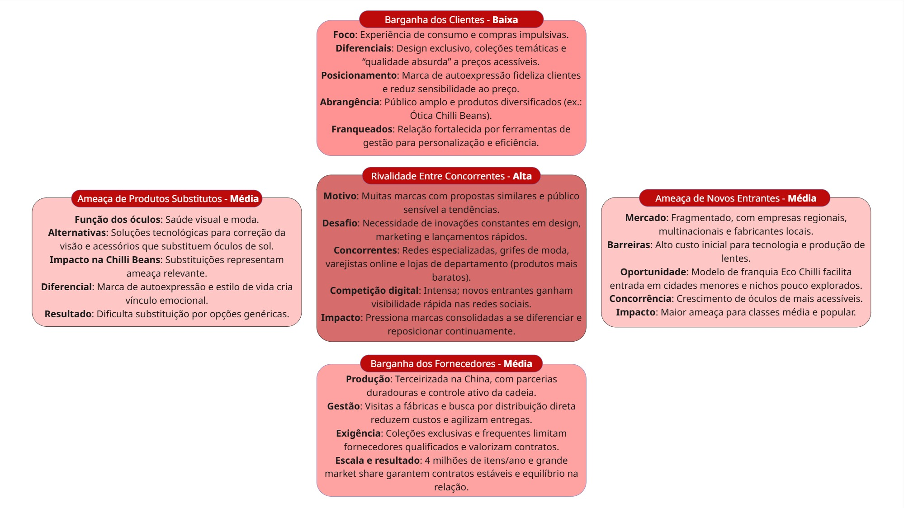
  <sup>Fonte: Imagem Autoral, 2025</sup>
</div>

**1. Poder de Barganha dos Clientes - Baixo**  
&nbsp; O poder de barganha dos compradores é considerado baixo no caso da Chilli Beans. A empresa atua com foco na experiência de consumo, estimulando compras mais impulsivas e afetivas por meio de design exclusivo, coleções temáticas e uma proposta de "qualidade absurda" a preços acessíveis. Seu posicionamento como marca de auto expressão e estilo de vida fideliza o consumidor e reduz sua sensibilidade ao preço. A segmentação ampla do público-alvo, aliada à diversificação de produtos como a Ótica Chilli Beans reforça essa estratégia. Além disso, o relacionamento com os franqueados, também considerados compradores dentro do modelo de franquia, é fortalecido por ferramentas de gestão que permitem personalização e maior eficiência no abastecimento das lojas [¹³](#6-referências).

**2. Poder de Barganha dos Fornecedores - Médio**  
&nbsp; O poder de barganha dos fornecedores da Chilli Beans é intermediário. A produção terceirizada na China poderia indicar dependência, mas a empresa mantém parcerias duradouras e controle ativo da cadeia. O fundador visita fábricas para otimizar processos e explorar distribuição direta, reduzindo custos e agilizando entregas. A marca exige coleções exclusivas com alta frequência, limitando fornecedores qualificados e valorizando contratos. Com cerca de 4 milhões de itens produzidos anualmente e grande market share, os contratos são estáveis e vantajosos para ambos. Apesar de algumas vantagens para fornecedores, a Chilli Beans usa estratégias que fortalecem seu poder de negociação e mantêm o equilíbrio na relação [¹⁴](#6-referências).

**3. Ameaça de Produtos Substitutos - Média**  
&nbsp; A força da ameaça de produtos substitutos pode ser considerada média. Embora os óculos desempenhem funções específicas, há outras soluções que cumprem papéis semelhantes, tanto no campo da saúde visual quanto no universo da moda. A constante evolução tecnológica traz novas possibilidades para correção da visão, enquanto outros acessórios podem substituir parcialmente os óculos de sol como forma de expressão. Considerando que esse é o principal foco da Chilli Beans, tais substituições representam uma ameaça relevante. Ainda assim, seu posicionamento como marca de autoexpressão e estilo de vida cria um vínculo emocional com o consumidor, dificultando a substituição direta por alternativas mais genéricas [¹⁵](#6-referências).

**4. Ameaça de Novos Concorrentes - Média**  
&nbsp; A ameaça de novos entrantes no setor óptico é considerada média. O mercado é bastante fragmentado, composto por várias empresas regionais, além de multinacionais e fabricantes locais. Para pequenas empresas, o custo inicial elevado para tecnologia e produção de lentes dificulta a entrada. Porém, a Chilli Beans, com seu modelo de franquia Eco Chilli, que utiliza contêineres sustentáveis e tem um custo de franquia acessível, abre espaço para que novos concorrentes entrem em cidades menores e nichos pouco explorados. Além disso, o crescimento do mercado de óculos de farmácia, com produtos mais acessíveis, representa uma ameaça adicional, especialmente para as classes classes média e popular [¹⁶](#6-referências).

**5. Rivalidade Entre Concorrentes - Alta**  
&nbsp; A rivalidade no setor de óculos e acessórios é alta devido ao grande número de marcas com propostas similares e um público informado e sensível a tendências. Apesar da base fiel da Chilli Beans, o mercado exige inovações constantes em design, marketing, colaborações e lançamentos rápidos. A marca enfrenta concorrência de redes especializadas, grifes de moda, varejistas online e lojas de departamento com produtos similares, geralmente mais baratos. A competição digital é intensa, e novos entrantes ganham visibilidade facilmente nas redes sociais, forçando marcas consolidadas a se diferenciarem e se reposicionarem rapidamente [¹⁷](#6-referências), [¹⁸](#6-referências).

&nbsp; De forma geral, os estudos realizados nesta seção evidenciam que a Chilli Beans possui vantagens competitivas relevantes, mas enfrenta um ambiente dinâmico e desafiador. O entendimento aprofundado do mercado e das forças que atuam no setor óptico reforça a necessidade de constante inovação e adaptação para garantir a sustentabilidade e o crescimento da marca nos próximos anos.

#### 4.1.2. Análise SWOT

&nbsp; A seguir, é apresentada uma análise SWOT (_Strengths, Weaknesses, Opportunities and Threats_) da Chilli Beans, considerando seus principais pontos fortes e fracos, bem como as oportunidades e ameaças relacionadas ao ambiente competitivo.

&nbsp; O objetivo desta análise é compreender com mais profundidade os fatores internos e externos que afetam diretamente a performance da marca, especialmente no contexto das problemáticas discutidas no projeto.

<div align="center">
  <sub>Figura 3 - Análise SWOT</sub><br>
  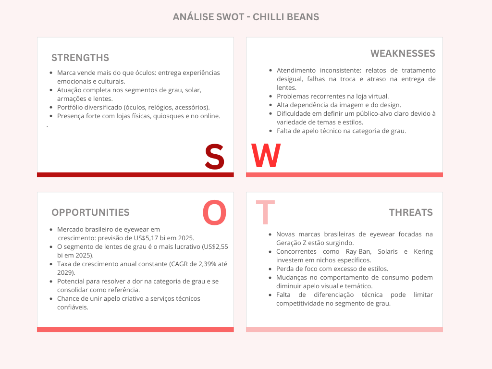<br>
  <sup>Fonte: Imagem autoral, 2025</sup>
</div>

---

### Forças (Strengths)

&nbsp; A Chilli Beans se destaca no mercado não apenas por vender óculos, mas por oferecer experiências. Cada coleção carrega significado emocional, cultural e temático, criando conexão afetiva com os consumidores.

&nbsp; Exemplos como as coleções em parceria com Rita Lee ou inspiradas em universos como Harry Potter reforçam o apelo simbólico dos produtos, que deixam de ser apenas óculos para se tornarem memória, estilo e identidade pessoal.

&nbsp; Esse posicionamento fortalece a marca como plataforma cultural, e não apenas como varejista de moda.

&nbsp; Além disso, a empresa:

- Atua nos quatro principais segmentos do mercado de eyewear: lentes para óculos, óculos de sol, armações e lentes de contato.
- Marca presença também na venda de relógios e acessórios, reforçando sua identidade bem posicionada.

---

### Fraquezas (Weaknesses)

&nbsp; Apesar de seu reconhecimento, a Chilli Beans apresenta algumas fragilidades:

- **Lojas físicas**: relatos de atendimento pouco padronizado, dificuldades na troca de produtos, falhas na comunicação com clientes e problemas na entrega de lentes ou aplicação de vouchers[¹](#6-referências).
- **Categoria de óculos de grau**: exige confiança, clareza e apoio técnico no pós-venda — pontos em que ainda há inconsistências.
- **Loja virtual**: atrasos de entrega, atendimento digital ineficiente e falhas no uso de cupons promocionais.

&nbsp; Outro ponto sensível é a dependência da imagem e apelo visual. Embora seja um diferencial, essa característica pode se tornar vulnerabilidade em mudanças no comportamento do consumidor.

&nbsp; A grande variedade de estilos e coleções pode dificultar:

- Definição clara de público-alvo.
- Personalização da comunicação.
- Criação de jornadas consistentes de aquisição e fidelização — especialmente no segmento de grau, que exige abordagem mais técnica e constante.

---

### Oportunidades (Opportunities)

&nbsp; O mercado óptico brasileiro apresenta cenário promissor. Segundo dados da Statista, a receita do setor no Brasil deve alcançar US$ 5,17 bilhões em 2025, com crescimento anual médio de 2,39% entre 2025 e 2029.

&nbsp; O segmento de lentes para óculos, especialmente, representa uma fatia significativa dessa receita — cerca de US$ 2,55 bilhões[²](#6-referências).

&nbsp; Esse contexto abre espaço para a Chilli Beans:

- Resolver fragilidades na categoria de óculos de grau.
- Melhorar operação e atendimento, com comunicação mais direcionada.
- Unir proposta criativa com serviço técnico confiável.
- Consolidar sua atuação em um mercado que segue em expansão.

---

### Ameaças (Threats)

&nbsp; A entrada acelerada de novas marcas de eyewear no Brasil, com foco em nichos como a geração Z, representa ameaça direta.

&nbsp; Concorrentes como Ray-Ban, Solaris e Kering Eyewear apostam em coleções adaptadas ao gosto de públicos jovens, com comunicação segmentada e foco em atributos técnicos e visuais específicos[³](#6-referências)..

&nbsp; Para a Chilli Beans, isso significa:

- Risco de perder espaço caso não ajuste o foco.
- Dificuldade em construir identidade coesa devido à variedade excessiva de estilos.
- Dependência da criatividade das coleções temáticas, o que pode ser frágil diante de mudanças nos hábitos de consumo.

&nbsp; A ausência de comunicação mais técnica e de posicionamento sólido em determinadas categorias, como a de óculos de grau, pode comprometer a competitividade a médio e longo prazo.

---

&nbsp; A Chilli Beans mantém uma marca sólida, reconhecida pelo apelo cultural, criatividade e preços acessíveis, com presença em diversos segmentos do mercado óptico. Essa força, porém, contrasta com fragilidades na experiência do cliente, especialmente no atendimento, pós-venda e operação do e-commerce, além de desafios na categoria de óculos de grau.

&nbsp; O crescimento previsto para o mercado óptico brasileiro, em especial no segmento de lentes, oferece oportunidades relevantes. Para aproveitá-las, a marca deve alinhar sua proposta criativa a um serviço técnico de qualidade e fortalecer sua comunicação em categorias estratégicas.

&nbsp; Diante da entrada de novos concorrentes focados em nichos específicos, será fundamental consolidar a identidade, reduzir a dependência de coleções temáticas e investir em melhorias operacionais, garantindo competitividade e relevância no longo prazo.

#### 4.1.3. Planejamento Geral da Solução

&nbsp; A solução proposta consiste no desenvolvimento de um modelo preditivo fundamentado em dados provenientes dos sistemas internos de vendas e CRM da Chilli Beans. Esses dados incluem registros transacionais detalhando cada operação de venda ou devolução, dados de produtos (como categoria, preço, descontos e coleção), informações sobre o ponto de venda (tipo, canal, localização e código da loja) e atributos demográficos não sensíveis dos clientes (como cidade, estado, sexo e faixa etária aproximada). Esse conjunto permite correlacionar comportamento de compra com perfil do consumidor, características da loja e contexto geográfico, servindo de base para as análises preditivas propostas.

&nbsp; Com base nessas informações, o modelo permitirá estimar o potencial de fluxo e a taxa de conversão por unidade, considerando fatores como tipo de loja, canal de venda e contexto socioeconômico local, apoiando a priorização de investimentos em regiões com maior potencial. Também possibilitará a identificação e segmentação de perfis de clientes por meio de clusterização, permitindo compreender quais grupos apresentam maior propensão à compra, quais canais são mais eficazes para cada perfil e como ajustar campanhas e mensagens para aumentar a fidelização. Além disso, a solução poderá estimar a probabilidade de compra e recompra de diferentes categorias de produto, incluindo óculos de grau, identificando oportunidades de crescimento por região, canal ou tipo de loja, bem como possíveis barreiras à conversão.

&nbsp; Os resultados do modelo deverão ser utilizados pelas equipes de marketing e negócios para analisar previsões, comparar o desempenho entre unidades e identificar padrões relevantes de comportamento de compra. A partir dessas análises, será possível reconhecer quais fatores influenciam a performance de cada loja, entender quais segmentos de clientes têm maior potencial de conversão e avaliar a efetividade de diferentes abordagens comerciais. Essas informações servirão como base para definir prioridades de investimento, ajustar campanhas promocionais, personalizar ações de comunicação para diferentes perfis de clientes e otimizar uma seleção de produtos conforme a demanda prevista em cada região ou canal de venda.

**Benefícios esperados:**

- Aumento da assertividade nas ações de marketing;
- Otimização do fluxo e da conversão em unidades estratégicas;
- Maior alinhamento das campanhas ao perfil do público-alvo;
- Fortalecimento da penetração em categorias prioritárias, como óculos de grau;
- Apoio consistente à tomada de decisão estratégica;
- Redução de investimentos em campanhas com baixo retorno.

**Critérios de sucesso:**

- Acurácia mínima de ≥80% nas previsões (ou conforme métrica definida para o modelo);
- Capacidade do modelo de gerar segmentações acionáveis para o negócio;
- Utilização efetiva das análises pelas equipes de marketing e negócios;
- Evidências de melhoria de desempenho e retorno sobre investimento após a aplicação das estratégias baseadas no modelo.

#### 4.1.4. Value Proposition Canvas

&nbsp; Com uma história construída ao longo de mais de duas décadas, a Chilli Beans consolidou uma forte presença no mercado óptico, sobretudo com ênfase no setor de moda, focado em estilo e tendências. Com o passar dos anos e a evolução das demandas de mercado, a marca ampliou ainda mais sua atuação, por meio da criação e expansão de novos modelos de negócio, como as lojas especializadas em óculos de grau e os pontos Chilli Eco.

&nbsp; Dessa forma, busca-se estabelecer uma conexão entre as necessidades atuais, as tarefas e o cenário da Chilli Beans diante dessa nova fase, relacionando-os à solução desenvolvida. O Canvas Proposta de Valor tem o objetivo de mapear não apenas as funcionalidades de valor para o cliente, mas também compreender de forma clara como e quais valores serão gerados para ele. Abaixo, é possível visualizar o modelo formulado.

<div align="center">
  <sub>Figura 4 - Matriz de Riscos e Oportunidades</sub><br>
  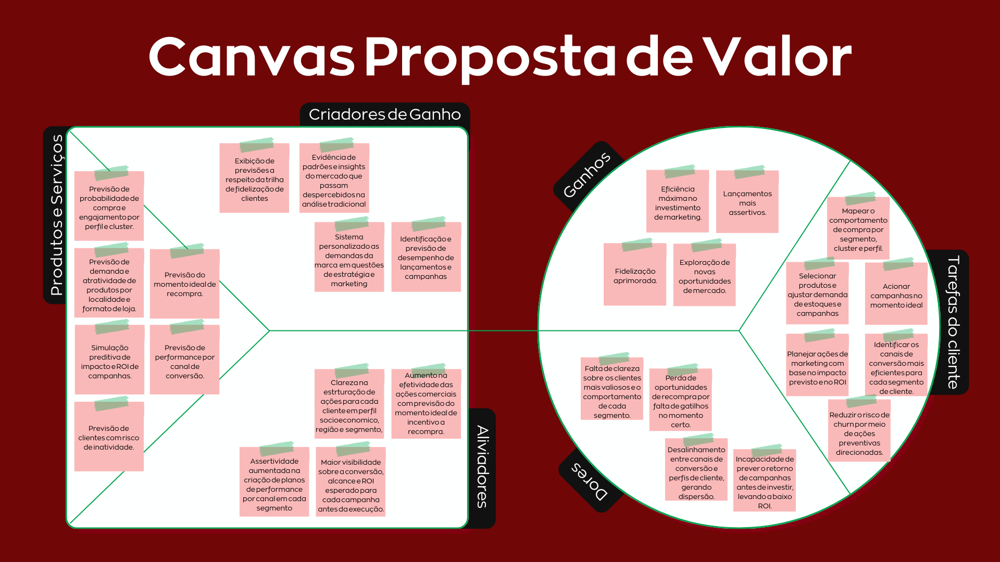<br>
  <sup>Fonte: Imagem autoral, 2025</sup>
</div>

#### Tarefas do Cliente

- Mapear o comportamento de compra por segmento e cluster, identificando perfis socioeconômicos e demográficos com maior probabilidade de compra e engajamento.
- Selecionar produtos e ajustar demanda de estoques e campanhas de forma assertiva, por localidade e formato de loja.
- Antecipar o comportamento de recompra para acionar campanhas no momento ideal e aumentar o valor do cliente ao longo do tempo.
- Planejar ações de marketing com base no impacto previsto e no ROI estimado.
- Identificar e priorizar os canais de conversão mais eficientes para cada segmento de cliente.
- Reduzir o risco de churn por meio de ações preventivas direcionadas.

#### Dores

- Falta de visibilidade clara sobre quem são os clientes mais valiosos e como se comportam em cada segmento.
- Perda de oportunidades de recompra por falta de gatilhos no momento certo.
- Incapacidade de prever o retorno de campanhas antes de investir, levando a baixo ROI.
- Desalinhamento entre canais de conversão e perfis de cliente, gerando dispersão de esforços.

#### Ganhos

- Exploração de novas oportunidades de mercado.
- Lançamentos mais assertivos.
- Fidelização aprimorada.
- Eficiência máxima no investimento de marketing.

#### Produtos e Serviços

- Previsão de probabilidade de compra e engajamento por perfil e cluster.
- Previsão de demanda e atratividade de produtos por localidade e formato de loja.
- Previsão do momento ideal de recompra.
- Simulação preditiva de impacto e ROI de campanhas.
- Previsão de performance por canal de conversão.
- Previsão de clientes com risco de inatividade.

#### Aliviadores

- Clareza na estruturação de ações para cada cliente em perfil socioeconomico, região e segmento,
- Aumento na efetividade das ações comerciais com previsão do momento ideal de incentivo a recompra.
- Maior visibilidade sobre a conversão, alcance e ROI esperado para cada campanha antes da execução.
- Assertividade aumentada na criação de planos de performance por canal em cada segmento

#### Criadores de Ganho

- Exibição de previsões a respeito da trilha de fidelização de clientes
- Evidência de padrões e insights do mercado que passam despercebidos na análise tradicional
- Sistema personalizado as demandas da marca em questões de estratégia e marketing
- Identificação e previsão de desempenho de lançamentos e campanhas

&nbsp; Com base no modelo de Value Proposition Canvas apresentado, é possível perceber como a solução proposta, um modelo preditivo focado na problemática de identificação e aproximação com o público-alvo estabelece uma conexão precisa com as necessidades do cliente.

&nbsp; A Chilli Beans, em posição de uma marca que vende personalidade e impacto, consegue, por meio dessa solução, otimizar seus processos, gerando não apenas um fortalecimento interno, mas também fidelização em relação ao consumidor final. Dessa maneira, é possível visualizar de forma clara e objetiva como a aplicação do modelo preditivo tem o potencial de solucionar as demandas de maneira efetiva.

#### 4.1.5. Matriz de Riscos

&emsp; A Matriz de Riscos é uma ferramenta que possibilita a análise de riscos e oportunidades durante a construção de um projeto de acordo com dois fatores: probabilidade e impacto. A probabilidade avalia o quanto é provável que certa situação ocorra, comumente relacionada a frequência de acontecimento. O impacto está relacionado a quanto e como aquilo afetará o projeto e a empresa caso se torne realidade.

<div align="center">
  <sub>Figura 5 - Matriz de Riscos e Oportunidades</sub><br>
  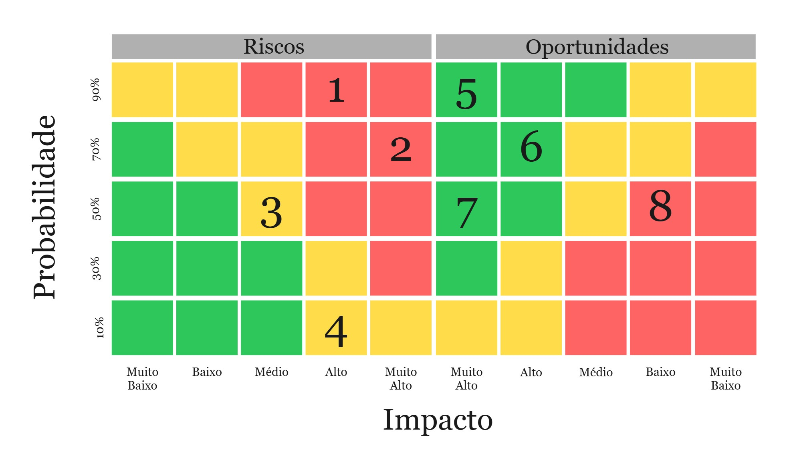<br>
  <sup>Fonte: Imagem autoral, 2025</sup>
</div>

#### Análise dos Riscos Identificados

##### 1. Dados de perfil de consumidor limitados ou genéricos (Probabilidade: 90% | Impacto: Alto)

&emsp; Esse risco representa o mais crítico do projeto, podendo comprometer fundamentalmente a precisão do modelo preditivo, assim como a eficácia das estratégias criadas a partir desses resultados.

&emsp; Como plano de mitigação, é possível incentivar que a Chilli Beans, como empresa parceira, enriqueça a base de dados fornecida, além de manter consistência na coleta de dados não sensíveis ou pessoais de clientes.

##### 2. Dados incompletos ou desestruturados (restrição mencionada no escopo) (Probabilidade: 70% | Impacto: Alto)

&emsp; Esse risco é substancial para as análises, já que pode comprometer a confiabilidade dos insights gerados e a precisão das predições geradas pelo modelo.

&emsp; Para mitigar esse risco, é necessário realizar a limpeza e padronização dos dados fornecidos durante o início do projeto, tornando as métricas mais consistentes.

##### 3. Falta de familiaridade dos clientes com as lojas de rua (Probabilidade: 50% | Impacto: Médio)

&emsp; A baixa familiaridade dos consumidores com o formato de loja que a Chilli Beans busca impulsionar pode impactar de forma negativa o fluxo e as taxas de conversão de clientes.

&emsp; Para solucionar o problema, é possível atribuir uma campanha de marketing associada aos resultados do modelo preditivo, como eventos de inauguração local, parcerias regionais e monitoramento de métricas.

##### 4. Entrada de novos players ou mudanças estratégicas da concorrência podem afetar a validade das análises territoriais (Probabilidade: 10% | Impacto: Médio)

&emsp; Alterações no cenário competitivo, apesar de pouco prováveis, podem afetar a validade das análises territoriais e estratégias de posicionamento geradas a partir das predições do modelo preditivo.

&emsp; Para mitigação desse risco, é necessário analisar o mercado competitivo e manter atenção no surgimento de novas soluções que possam competir.

---

#### Análise das Oportunidades Identificadas

##### 5. Forte interesse da marca em expansão e inovação, o que aumenta a chance de engajamento (Probabilidade: 90% | Impacto: Muito Alto)

&emsp; Esta representa a maior oportunidade estratégica do projeto, onde o alto comprometimento do parceiro permite um desenvolvimento de qualidade. Com interesse em expansão e inovação, apresenta-se uma oportunidade que garante o suporte da iniciativa.

&emsp; Para potencialização da oportunidade, pode ser feita por meio do envolvimento direto da marca durante as fases do projeto.

##### 6. Acesso direto e ágil à empresa parceira para validações e dúvida (Probabilidade: 70% | Impacto: Alto)

&emsp; A comunicação eficiente e direta com a Chilli Beans acelera o desenvolvimento do projeto, garantindo alinhamento e tomada de decisões, além do esclarecimento de dúvidas.

&emsp; Para potencializar essa oportunidade, é possível aproveitar os rituais (como dailies e fechamentos) para documentação de dúvidas, aproveitando as validações quinzenais e o acesso direto por meio de um canal de comunicação formal.

##### 7. Disponibilidade de base de dados já estruturada com variáveis relevantes (Probabilidade: 50% | Impacto: Muito Alto)

&emsp; A existência de uma base de dados bem estruturada e de maneira relevante permite o aumento da velocidade de desenvolvimento do modelo, além de aumentar a precisão das análises preditivas.

&emsp; Para potencialização da oportunidade, é necessário fazer o mapeamento das variáveis disponíveis, planejando de maneira precisa a modelagem do projeto, aproveitando o material disponível.

##### 8. Participante(s) com conhecimento técnico prévio (ex: ML, análise de dados, BI) (Probabilidade: 50% | Impacto: Médio)

&emsp; O conhecimento prévio de integrantes do time de desenvolvimento pode elevar a qualidade na implementação do modelo preditivo.

&emsp; Para potencializar a oportunidade, deve-se identificar as facilidades e qualidades dos integrantes, possibilitando o arranjo de tarefas de modo que estes possam auxiliar integrantes com menor facilidade durante o desenvolvimento.

---

&nbsp; Em síntese, a análise da Matriz de Riscos evidencia que, embora existam desafios significativos relacionados ao desenvolvimento do projeto, esse pode contar com oportunidades estratégicas relevantes, contribuindo para o aumento das chances de sucesso do modelo preditivo e o alcance dos objetivos traçados. Dessa forma, a gestão adequada dos riscos e oportunidades será fundamental para garantir a eficácia e a sustentabilidade da solução proposta.

#### 4.1.6. Personas

&ensp;Esta seção apresenta as personas definidas para orientar decisões de concepção, priorização e avaliação do modelo preditivo. Persona, aqui, é a representação sintetizada de um perfil relevante para o ecossistema da solução e não necessariamente um “usuário direto” do sistema. Elas foram selecionadas porque: (a) expressam necessidades que o modelo precisa atender diretamente (usuária primária), (b) refletem áreas internas que dependem dos resultados analíticos (stakeholder operacional) e (c) representam o público final impactado indiretamente pelas estratégias derivadas das previsões. Essa distinção evita confundir quem interage tecnicamente com a ferramenta com quem apenas sente os efeitos de decisões orientadas por dados.

&ensp;Classificação adotada:

- **Persona Principal (usuária direta da solução analítica):** Responsável por explorar, validar e operacionalizar os outputs do modelo.
- **Personas Afetadas Internas:** Utilizam os insights derivados para execução de campanhas ou decisões táticas.
- **Persona Afetada Externa:** Cliente final cujos comportamentos e jornadas serão melhor compreendidos e influenciados de forma ética e contextualizada por ações orientadas pelos resultados.

&ensp;As imagens das fichas visuais foram mantidas como apoio à comunicação, enquanto o texto a seguir elimina repetições e foca nos elementos que conectam dores, necessidades e valor entregue pelo modelo.

---

### Persona Principal – Bianca Duarte (Analista de BI)

<div align="center">
  <sub>Figura 6 - Persona: Bianca Duarte</sub><br>
  <br>
  <sup>Fonte: thispersondoesnotexist.com</sup>
</div>

#### Papel e Contexto

&ensp;Analista de BI responsável por transformar dados de vendas, produtos, canais e perfis de clientes em recomendações acionáveis. Atua como ponte entre dados brutos, times de marketing e decisões estratégicas. Seu fluxo atual é fragmentado: múltiplas fontes, esforço manual para limpeza e dificuldade em padronizar métricas comparáveis entre lojas e clusters.

#### Objetivos Profissionais

- Reduzir tempo de preparação e reconciliação de dados (baseline atual manual → meta de redução significativa do esforço operacional).
- Aumentar precisão e confiabilidade das previsões e segmentações usadas em planejamento de campanhas.
- Disponibilizar narrativas analíticas claras (clusters, propensão, fluxo, conversão) que sustentem decisões sem ambiguidade.

#### Necessidades Operacionais

- Pipeline padronizado com dados limpos e atributos derivados relevantes (ex.: frequência de compra, recência, elasticidade a desconto).
- Segmentação (clusterização) interpretável e acionável: descrição de grupos, drivers e canais mais responsivos.
- Modelos de propensão / probabilidade (ex.: compra de categoria prioritária, recompra em janela temporal específica).
- Indicadores preditivos de fluxo e conversão por loja / canal para priorização de investimentos.
- Métricas de confiança (intervalos, scores, feature importance) para justificar recomendações.

#### Dores

- Tempo excessivo gasto em limpeza e reconciliação, reduzindo janela para análise exploratória.
- Dificuldade em comparar performance entre lojas de formatos distintos (rua vs. outros formatos) de forma normalizada.
- Ausência de visão consolidada de ciclo de vida do cliente (recência, frequência, valor) integrada a campanhas.
- Falta de explicabilidade suficiente nos modelos anteriores para ganhar adesão de stakeholders não técnicos.

#### Como o Modelo Entrega Valor para Bianca

&ensp;Fornece camadas: (1) dados preparados e enriquecidos, (2) relatórios com indicadores padronizados (fluxo previsto, conversão estimada, propensão a recompra, clusters descritos), (3) explicabilidade (importância de variáveis, métricas de validação) e (4) capacidade de priorizar “onde atuar primeiro” (lojas/perfis com maior gap entre potencial previsto e resultado atual). Isso reduz retrabalho, acelera sprints analíticas e fortalece a credibilidade das recomendações.

---

### Persona Afetada Externa – Kiara Lavgne (Consumidora)

<div align="center">
  <sub>Figura 7 - Persona: Kiara Lavgne</sub><br>
  <br>
  <sup>Fonte: thispersondoesnotexist.com</sup>
</div>

#### Papel e Contexto

&ensp;Consumidora jovem, altamente orientada por identidade estética e autenticidade, com uso intensivo de óculos de grau e forte sensibilidade a narrativas de marca. Não interage diretamente com o modelo preditivo, mas sente seus efeitos em ofertas mais relevantes, timing de campanhas e curadoria de variedade de produtos em pontos de venda.

#### Necessidades Relacionadas

- Receber comunicações aderentes ao seu estilo e momento de compra (ex.: campanhas que considerem ciclo de substituição de produto e preferências declaradas/observadas).
- Encontrar sortimento condizente com seu perfil em canais físicos e digitais (ajuste de mix orientado a clusters comportamentais).
- Experienciar jornadas consistentes entre canais (omnichannel coerente com segmentação preditiva).

#### Dores Observáveis

- Exposição a comunicações genéricas pouco alinhadas a preferências de design e uso cotidiano.
- Frustração com disponibilidade ou inadequação de modelos em determinados pontos de venda.
- Falta de diferenciação percebida em campanhas de recompra.

#### Como o Modelo a Impacta

&ensp;Segmentações e modelos de propensão alimentam planejamento de estoque e campanhas, resultando em maior aderência estética e temporal (ex.: ajuste de lançamentos e ativações em clusters com maior probabilidade de engajamento). O benefício é indireto, não envolvendo coleta adicional de dados sensíveis além dos já anonimizados ou agregados.

---

### Persona Afetada Interna – Alexandre Rodrigues (Social Media / Marca)

<div align="center">
  <sub>Figura 8 - Persona: Alexandre Rodrigues</sub><br>
  <br>
  <sup>Fonte: thispersondoesnotexist.com</sup>
</div>

#### Papel e Contexto

&ensp;Responsável por aumentar visibilidade e desempenho de formatos específicos (ex.: óticas de rua) e reforçar categorias estratégicas (óculos de grau). Usa insights para planejar campanhas segmentadas, testar mensagens e mensurar retorno.

#### Necessidades Operacionais

- Mapas de clusters com atributos comportamentais e preferências agregadas.
- Indicadores preditivos de canais com maior propensão a conversão por segmento.
- Priorização de regiões/lojas com gap entre potencial previsto e resultado realizado.
- Métricas pós-campanha (lift vs. baseline previsto) para fechar ciclo de aprendizado.

#### Dores

- Dificuldade em justificar alocação orçamentária sem baseline preditivo.
- Baixa rastreabilidade entre campanha executada e comportamento futuro (recompra / retenção).
- Necessidade de responder rapidamente a mudanças em demanda local sem visão consolidada.

#### Como o Modelo Entrega Valor para Alexandre

&ensp;Disponibiliza previsões de fluxo e conversão, mapas de oportunidade por cluster/região e explicabilidade mínima para sustentar apresentações internas. Permite testar hipóteses (ex.: impacto esperado de ação em cluster específico) e acompanhar aderência pós-implementação.

---

### Conclusão da Seção

&ensp;A persona principal (Bianca) demanda precisão, padronização e transparência — requisitos que dirigem decisões de arquitetura de dados, governança e seleção de métricas. As personas afetadas (Alexandre e Kiara) funcionam como validadores de utilidade externa: Alexandre converte previsões em ações táticas mensuráveis; Kiara materializa o impacto qualitativo percebido pelo cliente final. Esse encadeamento assegura que o modelo não seja avaliado apenas por acurácia, mas por capacidade de gerar: (a) decisões priorizadas, (b) campanhas melhor dirigidas e (c) experiência mais relevante.

&ensp;Impactos positivos esperados: redução de retrabalho analítico, aumento de eficiência de campanhas, melhor adequação de mix e timing de ativações. Pontos de atenção: risco de sobredependência de métricas preditivas sem revisão qualitativa, viés em segmentações caso haja lacunas de dados em determinados perfis e necessidade contínua de governança para impedir deriva de modelo. A gestão ativa desses fatores sustenta longevidade e confiança no ciclo preditivo.

---

#### 4.1.7. Jornadas do Usuário

&nbsp; A Jornada do Usuário é uma ferramenta essencial para compreender, de forma estruturada, como as personas interagem com a solução proposta e quais pontos precisam de atenção ao longo desse processo. No contexto do projeto, ela permite identificar cada passo que o usuário percorre no uso do modelo preditivo, destacando oportunidades de melhoria, ajustes necessários e pontos de valor já consolidados.

&nbsp; Bianca, como analista responsável por traduzir dados em decisões estratégicas, ocupa papel central nessa jornada. Alexandre, voltado ao marketing e à comunicação, e Kiara, representando a experiência do cliente final, também aparecem de forma complementar. Ao mapearmos essa experiência, conseguimos manter uma escuta ativa das necessidades da Bianca e garantir que a solução seja construída de forma prática e eficiente, mas sem perder a conexão com os demais envolvidos.

&nbsp; Essa abordagem assegura que o modelo preditivo não seja apenas uma ferramenta técnica, mas sim um recurso que gera clareza, confiança e impacto direto no dia a dia dos usuários, fortalecendo tanto a tomada de decisão interna quanto a experiência do cliente final.

---

#### Expectativas das Personas

&nbsp; Antes de iniciar a jornada, é importante destacar as expectativas de cada persona em relação à solução:

- **Bianca Duarte**: busca clareza e organização nos dados, com insights que facilitem a tomada de decisões estratégicas e permitam planejar ações de forma eficiente.
- **Alexandre (Marketing)**: precisa de informações confiáveis para definir campanhas segmentadas, otimizar recursos e aumentar a efetividade das ações.
- **Kiara (Cliente final)**: deseja experiências e ofertas personalizadas, alinhadas ao seu perfil e preferências, tornando sua interação com a marca mais relevante.

&nbsp; Essas expectativas ajudam a contextualizar cada etapa da jornada e o impacto que a solução tem sobre cada persona.

---

#### Jornada do Usuário – Bianca Duarte

<div align="center">
  <sub>Figura 9 - Jornada do Usuário</sub><br>
  <br>
  <sup>Fonte: Imagem autoral, 2025</sup>
</div>

&nbsp; A jornada de Bianca evidencia que o processo de tomada de decisão não se limita às interações diretas com os relatórios. Há pressões invisíveis que recaem sobre quem interpreta os resultados e precisa transformá-los em ações estratégicas. Esse aspecto reforça a amplitude da responsabilidade em garantir não apenas a entrega técnica, mas também a consideração dos impactos organizacionais.

#### 1. Clareza na Comunicação dos Relatórios

&nbsp; Logo no início do trabalho, é notável a importância de entregar relatórios que traduzam o modelo preditivo de forma clara, visual e objetiva. Não basta que o algoritmo seja sofisticado: se a interpretação for complexa, perde-se o valor no momento em que Bianca precisa agir. Portanto, a preocupação central deve ser transformar resultados técnicos em informações acessíveis, que apoiem a tomada de decisão no dia a dia.

#### 2. Confiabilidade e Acurácia dos Dados

&nbsp; Na análise do tratamento de dados, ficou evidente uma tensão central: a confiabilidade. O resultado de predições que não transmitam segurança quanto à acurácia não sustentam decisões consistentes. Por isso, é essencial que os modelos sejam acompanhados de validação rigorosa e comunicação transparente sobre o nível de confiança dos resultados, garantindo que os relatórios possam ser utilizados sem hesitação.

#### 3. Clareza no Compartilhamento com o Time

&nbsp; O momento de compartilhar informações com a equipe evidencia a necessidade de clareza. Não se trata apenas de números, mas de mensagens acionáveis que orientem o trabalho coletivo. Caso os relatórios não estejam estruturados de forma simples e objetiva, o risco de desalinhamento entre áreas aumenta significativamente.

#### 4. A Pressão da Tomada de Decisão

&nbsp; Na etapa de tomada de decisão, todos esses elementos se encontram em um contexto de alta pressão. É necessário alinhar o time diante de metas e urgências reais, equilibrando previsões do modelo com demandas emergenciais da diretoria. Nesse cenário, soluções rígidas se mostram insuficientes; o ideal é que ofereçam flexibilidade, entregando respostas rápidas sem abrir mão da profundidade analítica.

#### 5. Responsabilidade no Desenvolvimento de Soluções

&nbsp; A jornada de Bianca evidencia que a responsabilidade no desenvolvimento de soluções ultrapassa a simples entrega de modelos preditivos. Trata-se de assegurar confiança, clareza e alinhamento organizacional, de modo a sustentar decisões estratégicas e fortalecer a utilização dos dados no cotidiano.

&nbsp; A etapa final da jornada demonstra como previsões e urgências reais se entrelaçam em um ambiente de pressão constante. Bianca precisa equilibrar recomendações geradas pelo modelo preditivo com demandas emergenciais da diretoria. Esse contexto evidencia a importância de soluções flexíveis, capazes de oferecer respostas rápidas sem comprometer a profundidade analítica.

#### Perspectiva Integrada da Jornada

&nbsp; Bianca Duarte vive uma rotina em que dados complexos se transformam em decisões estratégicas, impactando diretamente a equipe de marketing e clientes finais. Cada insight interpretado e cada ação tomada gera efeito em cadeia: campanhas mais eficientes para Alexandre, experiências personalizadas para Kiara e um processo inteligente e estratégico para a própria Bianca.

&nbsp; Sua jornada destaca a importância de compreender o comportamento do cliente, antecipar necessidades e traduzir dados em decisões práticas, sem perder de vista o impacto sobre outras personas relevantes. Esse mapeamento evidencia a importância de considerar tanto a experiência da persona central quanto os efeitos sobre todos os stakeholders, fornecendo base para uma análise estratégica mais ampla.

&nbsp; Dessa forma, a jornada do usuário se mostra uma ferramenta estratégica para traduzir dados em insights acionáveis, reforçando a integração entre tecnologia, processos e pessoas.

---

#### 4.1.8 Política de Privacidade

&ensp;A política de privacidade é um documento que descreve como os dados pessoais dos usuários serão coletados, usados, armazenados e protegidos. É importante garantir que a coleta e o uso de dados estejam em conformidade com as leis de proteção de dados aplicáveis. Abaixo estão descritos os principais pontos que são incluídos na política de privacidade do projeto.

#### Projeto: (Nome do projeto) - Modelo preditivo e estratégico - Chilli Beans

#### Informações Gerais

Esta política de privacidade informa como o projeto _Modelo preditivo e estratégico - Chilli Beans_, desenvolvido pelo grupo _[nome da empresa]_, trata os dados pessoais coletados durante o uso da solução. Está em conformidade com a Lei nº 13.709/2018 – LGPD.

#### Dados Coletados

#### Dados fornecidos diretamente:

- Nenhum dado pessoal sensível (como CPF, nome ou e-mail) é coletado diretamente dos usuários.

#### Dados coletados automaticamente:

- Informações não sensíveis dos consumidores (como cidade, estado, data de nascimento, gênero declarado)
- Informações de comportamento de compra (ex: categoria de produto, canal, loja, quantidade vendida, valor de compra)

#### Finalidade do Tratamento

- Análise e construção de modelos preditivos de fluxo, conversão e comportamento do consumidor
- Segmentação de público-alvo (clusterização)
- Apoio à tomada de decisão em marketing e posicionamento estratégico
- Personalização de ações e campanhas promocionais
- Geração de visualizações e insights para a expansão e performance das lojas

#### Armazenamento e Retenção

#### Local:

- Servidores em nuvem utilizados pela instituição de ensino (INTELI) ou local seguro sob responsabilidade da equipe do projeto.

#### Prazo:

- Até 12 meses após o término do projeto, respeitando os princípios da finalidade e necessidade.

#### Compartilhamento de Dados

Os dados podem ser compartilhados exclusivamente com:

- A instituição de ensino INTELI, para fins acadêmicos
- Equipe envolvida no projeto
- Professores orientadores do projeto

#### Segurança dos Dados

- Acesso restrito aos integrantes da equipe do projeto
- Controle de acesso com autenticação
- Dados anonimizados sempre que possível
- Nenhum dado sensível (ex: CPF, RG, e-mail pessoal) é utilizado

#### Direitos dos Titulares

Os titulares dos dados têm direito a:

- Solicitar acesso aos dados utilizados
- Corrigir ou excluir informações, quando possível
- Revogar o consentimento, se aplicável

**Solicitações podem ser feitas via e-mail:** email.responsavel@chillibeans.com

#### Encarregado de Dados (DPO)

**Nome:** Responsável da Silva  
**E-mail:** email.responsavel@chillibeans.com

&ensp;Portanto, a política de privacidade do projeto [*Nome do projeto*] garante que os dados pessoais dos usuários sejam tratados com segurança, transparência e em conformidade com a legislação vigente. A equipe do projeto se compromete a respeitar a privacidade dos usuários e a utilizar os dados apenas para as finalidades descritas acima.

### 4.2. Compreensão dos Dados

&ensp;A compreensão dos dados constitui uma etapa fundamental na formulação de um modelo preditivo. Como as previsões do modelo se baseiam diretamente nos dados de treinamento, torna-se essencial conhecer não apenas a problemática que envolve a solução, mas também a natureza e as categorias das variáveis utilizadas.

&ensp;Tal entendimento é indispensável para garantir que o modelo esteja alinhado às necessidades do problema e devidamente calibrado. Assim, esta seção tem como objetivo explorar os dados disponibilizados pelo parceiro, identificando eventuais manipulações necessárias para o êxito da solução, tanto no tratamento da base quanto na análise das relações previamente estabelecidas.

#### 4.2.1. Exploração de dados

**Estatística descritiva básica e identificação de colunas (numérica ou categórica)**

&ensp;Durante a exploração dos dados, uma etapa fundamental foi a elaboração de estatísticas descritivas básicas. A partir desses cálculos, é possível identificar variações, padrões e tendências, além de fornecer subsídios para a formulação de hipóteses. Nesse processo, foi conduzida uma análise que distinguiu dois conjuntos de variáveis:

- Numéricas: variáveis expressas em valores quantitativos, passíveis de operações matemáticas e estatísticas.

  | Campo               | Descrição                                                                             |
  | ------------------- | ------------------------------------------------------------------------------------- |
  | Quantidade          | Número de unidades do produto vendidas                                                |
  | Preco_Custo         | Preço de custo unitário do produto                                                    |
  | Valor_Total         | Valor total da transação (Quantidade × Preço de venda ou custo, dependendo da lógica) |
  | Preco_Varejo        | Preço de venda unitário ao consumidor (preço de varejo)                               |
  | Num_Vale            | Número ou código de vale utilizado (se aplicável)                                     |
  | Desconto            | Valor ou percentual de desconto aplicado na transação                                 |
  | DESCONTO_CALCULADO  | Valor de desconto já calculado em moeda (resultado final aplicado)                    |
  | Total_Preco_Varejo  | Valor total considerando os preços de varejo (sem descontos)                          |
  | Total_Preco_Liquido | Valor total líquido após descontos aplicados                                          |

---

<br>

- Categóricas: variáveis formadas por grupos ou classes que compartilham características comuns, dividindo-se em:

  - Nominais: utilizadas para nomear ou rotular categorias, sem hierarquia implícita.
  - Ordinais: representam categorias que possuem ordem ou escala definida, permitindo comparações de maior ou menor.

  | Campo                       | Descrição                                                              |
  | --------------------------- | ---------------------------------------------------------------------- |
  | ID_Loja                     | Identificador único da loja onde ocorreu a venda                       |
  | ID_Cliente                  | Identificador único do cliente que realizou a compra                   |
  | ID_Produto                  | Identificador único do produto vendido                                 |
  | ID_Deposito                 | Identificador do depósito/estoque de onde o produto saiu               |
  | Natureza_Operacao           | Tipo/natureza da operação de venda                                     |
  | Nome_Tabela_Preco           | Nome da tabela de preços utilizada na venda (lista de preços aplicada) |
  | Dim_Cliente.Bairro_Cliente  | Bairro do endereço do cliente                                          |
  | Dim_Cliente.Cep_Cliente     | CEP do cliente (dado categórico, não numérico)                         |
  | Dim_Cliente.Cidade_Cliente  | Cidade do cliente                                                      |
  | Dim_Cliente.Uf_Cliente      | Unidade Federativa (estado) do cliente                                 |
  | Dim_Cliente.Pais            | País do cliente                                                        |
  | Dim_Cliente.Sexo            | Sexo do cliente                                                        |
  | Dim_Cliente.Data_Cadastro   | Data em que o cliente foi cadastrado no sistema                        |
  | Dim_Cliente.Data_Nascimento | Data de nascimento do cliente                                          |
  | Dim_Cliente.Estado_Civil    | Estado civil do cliente                                                |
  | Dim_Cliente.Regiao_Cliente  | Região geográfica do cliente (macro-região)                            |
  | Dim_Lojas.Nome_Emp          | Nome da empresa/loja                                                   |
  | Dim_Lojas.Bairro_Emp        | Bairro da loja                                                         |
  | Dim_Lojas.Cep_Emp           | CEP da loja                                                            |
  | Dim_Lojas.Cidade_Emp        | Cidade da loja                                                         |
  | Dim_Lojas.Estado_Emp        | Estado (UF) da loja                                                    |
  | Dim_Lojas.Regiao            | Região geográfica da loja                                              |
  | Dim_Lojas.Tipo_PDV          | Tipo de ponto de venda                                                 |
  | Dim_Lojas.ID_SAP            | Identificação da loja no sistema SAP                                   |
  | Dim_Lojas.CANAL_VENDA       | Canal de venda (ex.: físico, online, atacado)                          |
  | Dim_Lojas.SAP_NOME          | Nome da loja no sistema SAP                                            |
  | Dim_Lojas.REGIAO_CHILLI     | Região categorizada pela empresa                                       |
  | Dim_Produtos.Nome           | Nome do produto                                                        |
  | Dim_Produtos.Grupo_Produto  | Grupo principal do produto                                             |
  | Dim_Produtos.Sub_Grupo      | Subgrupo do produto                                                    |
  | Dim_Produtos.Cor1           | Cor primária do produto                                                |
  | Dim_Produtos.Cor2           | Cor secundária do produto                                              |
  | Dim_Produtos.Material1      | Material principal do produto                                          |
  | Dim_Produtos.Material2      | Material secundário do produto                                         |
  | Dim_Produtos.Segmentacao    | Segmentação de mercado do produto                                      |
  | Dim_Produtos.Shape          | Formato/shape do produto                                               |
  | Dim_Produtos.Formato        | Tipo de formato do produto                                             |
  | Dim_Produtos.Sexo           | Sexo/target do produto                                                 |
  | Dim_Produtos.Griffe         | Griffe/marca associada ao produto                                      |
  | Dim_Produtos.GRUPO_CHILLI   | Classificação interna da marca Chilli                                  |

---

<br>

**Visualização das Estatísticas Descritivas**

&ensp;Para as variáveis numéricas, foram geradas estatísticas descritivas contemplando as seguintes medidas:

- count: número de valores não nulos
- mean: média aritmética
- std: desvio padrão
- min: valor mínimo
- 25%: 1º quartil (25% dos valores abaixo)
- 50%: mediana (2º quartil)
- 75%: 3º quartil (75% dos valores abaixo)
- max: valor máximo

<br>

<div align="center">
  <sup>Figura 10 - Exemplificação de saída das estísticas descritivas numéricas</sup>
  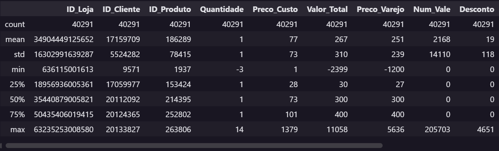
  <sup>Fonte: Imagem Autoral, 2025</sup>
</div>

<br>

&ensp;Enquanto, para as colunas categóricas, as estatísticas foram no seguinte formato:

- count: número de valores não nulos
- unique: número de categorias distintas
- top: categoria mais frequente
- freq: frequência dessa categoria mais frequente

<br>

<div align="center">
  <sup>Figura 11 - Exemplificação de saída das estísticas descritivas categóricos</sup>
  
  <sup>Fonte: Imagem Autoral, 2025</sup>
</div>

##### Gráficos para visualizar a relação entre variáveis escolhidas

&ensp;Neste tópico, são apresentados três gráficos desenvolvidos pelo grupo com o objetivo de visualizar e compreender as relações entre variáveis relevantes para o estudo. A utilização de representações visuais permite identificar padrões, comparar resultados e verificar hipóteses de maneira mais intuitiva e acessível.

&ensp;Cada gráfico foi construído a partir de hipóteses previamente definidas, buscando evidenciar como diferentes fatores (ex: tipo de loja, localização, perfil de clientes e categorias de produtos), podem influenciar o desempenho de vendas. Dessa forma, esta seção funciona como um apoio visual para a análise crítica, oferecendo conteúdo para a interpretação dos dados e a validação, ou não, das hipóteses propostas.

&ensp;A seguir, são apresentados os respectivos gráficos e sua hipótese relacionada:

###### Gráfico Total de Vendas x Tipo de Loja - Hipótese 1

<div align="center">
  <sub>Figura 12 - Gráfico Total de Vendas por Tipo de Loja</sub><br>
  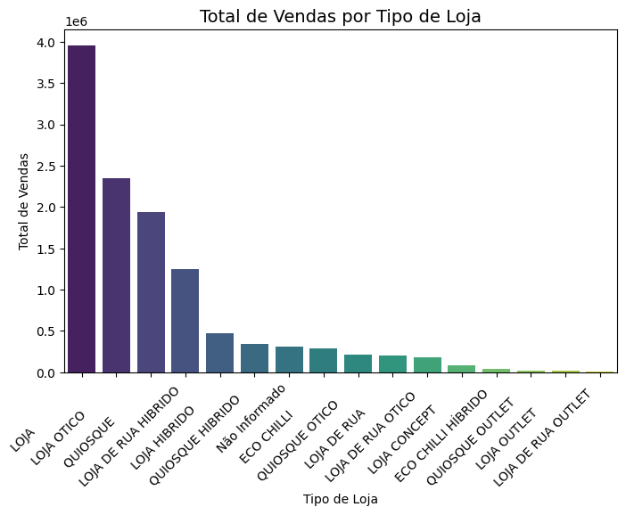<br>
  <sup>Fonte: Imagem autoral, 2025</sup>

[Notebook que gerou esse gráfico](/notebooks/graficos/hipotese1.ipynb)
</div>


<br>

###### Gráfico Ticket Médio x Faixa Etária - Hipótese 2

<div align="center">
  <sub>Figura 13 - Gráfico Ticket Médio por Faixa Etária</sub><br>
  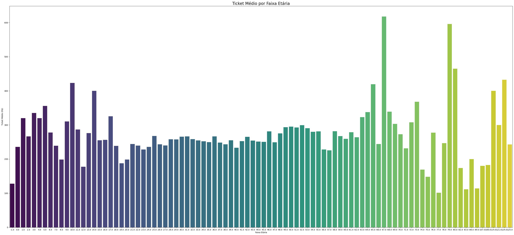<br>
  <sup>Fonte: Imagem autoral, 2025</sup>

[Notebook que gerou esse gráfico](/notebooks/graficos/hipotese2.ipynb)
</div>


<br>

###### Gráfico Ticket Médio x Categoria - Hipótese 3

<div align="center">
  <sub>Figura 14 - Gráfico Ticket Médio por Categoria (Grau vs Sol)</sub><br>
  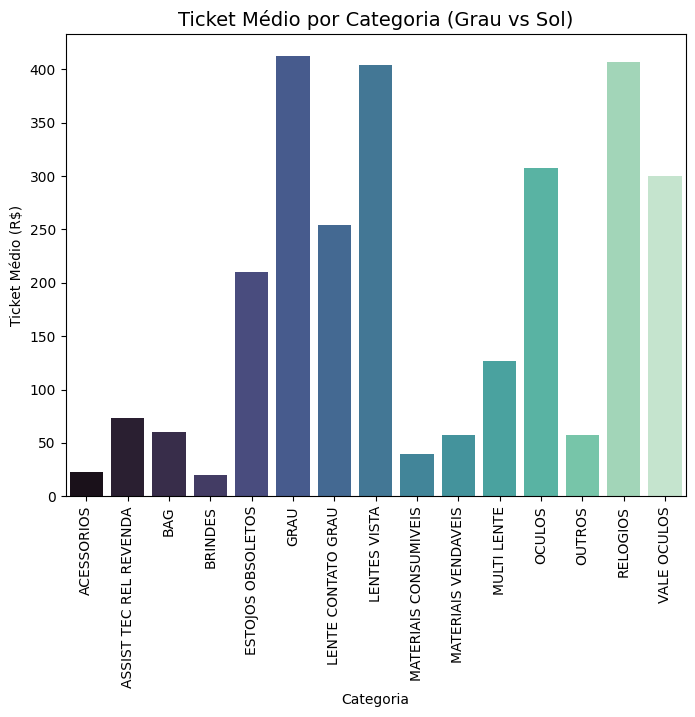<br>
  <sup>Fonte: Imagem autoral, 2025</sup>

[Notebook que gerou esse gráfico](/notebooks/graficos/hipotese3.ipynb)
</div>


<br>

&ensp;A exploração gráfica dos dados possibilitou identificar tendências, contrastes e padrões relevantes que não seriam facilmente percebidos apenas com números brutos. Ao relacionar variáveis como localização, tipo de loja, categorias de produtos e perfil de clientes, foi possível avaliar hipóteses importantes para a compreensão do cenário de vendas.

#### 4.2.2. Pré-processamento dos dados

&ensp;O processo de pré-processamento dos dados é importante para garantir a qualidade e a relevância das informações utilizadas na modelagem. As etapas incluem a limpeza dos dados, tratamento de valores ausentes, remoção de outliers e transformação das variáveis.

&ensp;A princípio, foi feita uma seleção das colunas mais relevantes para cada um dos três problemas que estão sendo abordados. A fim de melhorar a performance dos modelos, optou-se por eliminar as colunas que não agregam valor significativo às análises, como identificadores únicos, e atributos com alta cardinalidade que poderiam gerar conflito, evitando a multicolinearidade.

&ensp;As seguintes colunas foram excluídas da análise por não apresentarem relevância para os objetivos dos modelos:

| Colunas Removidas               |
| ------------------------------- |
| Frete                           |
| ID_Faturamento                  |
| ID_Vendedor                     |
| ID_Date                         |
| Documento                       |
| DOC_UNICO                       |
| Transacao                       |
| Dt_update                       |
| Dim_Cliente.Ativo               |
| Dim_Lojas.Cod_Franqueado        |
| Dim_Produtos.Cod_Auxiliar       |
| Dim_Produtos.Referencia         |
| Dim_Produtos.Quantidade         |
| Dim_Produtos.Preco_Varejo       |
| Dim_Produtos.Num_Vale           |
| Dim_Produtos.DESCONTO_CALCULADO |
| Dim_Produtos.ID_Deposito        |
| Dim_Cliente.Sexo                |
| Dim_Cliente.Data_Cadastro       |
| Dim_Cliente.Estado_Civil        |
| Dim_Produtos.Sub_Grupo          |
| Dim_Produtos.Cor1               |
| Dim_Produtos.Cor2               |
| Dim_Produtos.Material1          |
| Dim_Produtos.Material2          |
| Dim_Produtos.Segmentacao        |
| Dim_Produtos.Shape              |
| Dim_Produtos.Formato            |
| Dim_Produtos.Sexo               |
| Dim_Produtos.Griffe             |
| Natureza_Operacao               |
| Preco_Custo                     |
| Valor_Total                     |
| Nome_Tabela_Preco               |
| Dim_Cliente.Bairro_Cliente      |
| Dim_Cliente.Cep_Cliente         |
| Dim_Cliente.Cidade_cliente      |
| Dim_Cliente.Uf_Cliente          |
| Dim_Cliente.Pais                |
| Dim_Lojas.ID_SAP                |
| Dim_Lojas.SAP_NOME              |
| Dim_Lojas.Cep_Emp               |
| Dim_Produtos.Nome               |
| Dim_Lojas.Data_Criacao_Emp      |
| ID_Faturamento                  |
| ID_Vendedor                     |
| ID_Date                         |
| Documento                       |
| DOC_UNICO                       |
| Transacao                       |
| Dt_update                       |
| Dim_Cliente.Ativo               |
| Dim_Lojas.Cod_Franqueado        |
| Dim_Produtos.Cod_Auxiliar       |
| Dim_Produtos.Referencia         |
| Dim_Produtos.Quantidade         |
| Dim_Produtos.Preco_Varejo       |
| Dim_Produtos.Num_Vale           |
| Dim_Produtos.DESCONTO_CALCULADO |
| Dim_Produtos.ID_Deposito        |
| Dim_Cliente.Sexo                |
| Dim_Cliente.Data_Cadastro       |
| Dim_Cliente.Estado_Civil        |
| Dim_Produtos.Sub_Grupo          |
| Dim_Produtos.Cor1               |
| Dim_Produtos.Cor2               |
| Dim_Produtos.Material1          |
| Dim_Produtos.Material2          |
| Dim_Produtos.Segmentacao        |
| Dim_Produtos.Shape              |
| Dim_Produtos.Formato            |
| Dim_Produtos.Sexo               |
| Dim_Produtos.Griffe             |
| Natureza_Operacao               |
| Preco_Custo                     |
| Valor_Total                     |
| Nome_Tabela_Preco               |
| Dim_Cliente.Bairro_Cliente      |
| Dim_Cliente.Cep_Cliente         |
| Dim_Cliente.Cidade_cliente      |
| Dim_Cliente.Uf_Cliente          |
| Dim_Cliente.Pais                |
| Dim_Lojas.ID_SAP                |
| Dim_Lojas.SAP_NOME              |
| Dim_Lojas.Cep_Emp               |
| Dim_Produtos.Nome               |

&ensp;A **seleção de variáveis** que seriam utilizadas foi baseada em:

- **Relevância para o problema:** Variáveis diretamente relacionadas aos objetivos de cada modelo
- **Qualidade dos dados:** Colunas com baixa taxa de valores ausentes
- **Poder preditivo:** Variáveis com potencial discriminatório para os targets

**Estratégia para tratamento de Valores Ausentes:**

&ensp;O tratamento de valores ausentes foi refinado com uma abordagem mais específica:

**Para Variáveis Categóricas:**

- Preenchimento com a **moda** (valor mais frequente) de cada coluna
- Garantia de que colunas categóricas não sejam convertidas inadvertidamente para tipo booleano

**Para Variáveis Numéricas:**

- Preenchimento com a **mediana** de cada coluna
- Escolha da mediana em detrimento da média para reduzir o impacto de outliers não tratados

**Validação de Qualidade:**

- Verificação automática para garantir que nenhum valor nulo permaneceu após o tratamento
- Controle de tipos de dados para evitar conversões indesejadas

**Critérios para a escolha da estratégia:**

- Preservar o tamanho do dataset
- Manter a informação sobre a ausência de dados
- Evitar viés na análise causado pela remoção de registros

##### **Identificação de Outliers**

&ensp;Antes de apresentar os resultados, é importante esclarecer o conceito de **outliers**. Outliers são **valores que se distanciam significativamente do padrão da maioria dos dados** em uma variável. Eles podem ocorrer por diversos motivos, como erros de registro, variabilidade natural do processo ou até situações legítimas, mas incomuns.

&ensp;A presença de outliers pode **distorcer estatísticas descritivas** (como média e desvio-padrão), além de **prejudicar a performance de modelos preditivos**, que tendem a ser sensíveis a valores extremos. Por isso, sua identificação é uma etapa essencial do pré-processamento.

&ensp;Neste trabalho, utilizamos o método do **IQR (Intervalo Interquartil)** para identificar registros que estavam muito abaixo ou acima do intervalo esperado para cada atributo.

**Outliers Identificados:**

- Foram encontrados valores discrepantes em praticamente todas as variáveis numéricas relevantes.

**Resumo dos Outliers por Variável:**

| Variável            | Nº de Outliers |
| ------------------- | -------------- |
| DESCONTO_CALCULADO  | 5.930          |
| Desconto            | 5.340          |
| Quantidade          | 4.493          |
| Num_Vale            | 2.726          |
| Preco_Custo         | 1.140          |
| Total_Preco_Liquido | 961            |
| Total_Preco_Varejo  | 779            |
| Valor_Total         | 733            |
| Preco_Varejo        | 407            |

**Comentário Importante:**  
&ensp;A quantidade de outliers encontrada é significativa em algumas variáveis, o que pode **impactar negativamente o desempenho dos modelos preditivos**. No entanto, vale ressaltar que **os atributos de identificação (`ID_Cliente`, `ID_Deposito`, `ID_Produto`) não devem ser considerados nessa análise**, uma vez que não possuem caráter numérico interpretável, sendo usados apenas para referência e integridade da base. Esses IDs **não podem ser removidos ou alterados**, pois são essenciais para o relacionamento entre tabelas e rastreabilidade das informações.

**Critérios de Remoção:**

- A decisão sobre a remoção ou manutenção dos outliers foi pautada no impacto que esses valores poderiam ter na modelagem. Como alguns atributos são inerentemente mais dispersos (ex.: descontos ou quantidades em vendas), nem todos os outliers foram removidos de imediato.

**Correções Aplicadas:**

- Nesta etapa, optou-se apenas pela **identificação** e **quantificação** dos outliers, registrando a proporção em relação ao total da base.
- A correção ou tratamento específico (remoção, transformação ou Winsorização) será avaliada em conjunto com a etapa de ajuste dos modelos, a fim de não comprometer a representatividade do dataset.

##### **Filtros de Limpeza Avançada**

&ensp;Além do tratamento básico de valores ausentes e identificação de outliers, foram implementados filtros específicos para garantir maior qualidade e consistência dos dados:

**Correção de Idades Inválidas:**

- **Problema identificado:** Datas de nascimento que resultavam em idades menores que 18 anos ou maiores que 100 anos (20.098 registros afetados)
- **Solução aplicada:** Substituição das datas inválidas por uma data correspondente à idade média dos clientes válidos (37,4 anos)
- **Justificativa:** Preservar a representatividade estatística do dataset evitando a perda de registros, mas corrigindo inconsistências evidentes

**Remoção de Registros com Preços Inválidos:**

- **Problema identificado:** Registros onde `Preco_Varejo` ou `Total_Preco_Varejo` eram menores que 1 real (1.638 registros)
- **Solução aplicada:** Exclusão completa desses registros do dataset
- **Justificativa:** Preços inferiores a R$ 1,00 são inconsistentes com a realidade do negócio da Chilli Beans, indicando erros de sistema ou dados corrompidos

**Eliminação de Duplicatas:**

- **Problema identificado:** 641 registros completamente duplicados
- **Solução aplicada:** Remoção automática dos registros duplicados, mantendo apenas uma ocorrência de cada
- **Justificativa:** Duplicatas podem enviesar análises estatísticas e prejudicar a performance de modelos preditivos

**Resultado dos Filtros:**

- **Dataset original:** 40.291 registros
- **Registros removidos:** 2.279 (5,7% do total)
- **Dataset final:** 38.012 registros
- **Taxa de retenção:** 94,3%

##### Limitações dos Dados

&ensp;Apesar dos esforços para garantir a qualidade dos dados, algumas limitações foram identificadas:

- A presença de dados ausentes em colunas importantes pode impactar a performance dos modelos.
- A identificação de outliers pode não ser suficiente para capturar todas as anomalias nos dados.
- Dados incorretos ou mal formatados podem levar a interpretações errôneas e resultados imprecisos.

##### **Transformações das Variáveis**

&ensp;Após a limpeza dos dados, foram aplicadas transformações para adequar as variáveis à modelagem, garantindo que os algoritmos pudessem interpretar corretamente os diferentes tipos de dados.

**Variáveis Numéricas**
&ensp;As colunas que representam preços e valores financeiros (`Preco_Custo`, `Valor_Total`, `Preco_Varejo`, `Desconto`, `DESCONTO_CALCULADO`, `Total_Preco_Varejo`, `Total_Preco_Liquido`) foram normalizadas utilizando o método _MinMaxScaler_, escalando os valores para o intervalo [0, 1]. Isso preserva a proporção entre os valores, mas reduz o impacto de magnitudes muito diferentes, facilitando a convergência dos algoritmos de aprendizado.

&ensp;Outras variáveis numéricas, como _'Quantidade'_, foram padronizadas com _StandardScaler_, centralizando os dados em torno da média e ajustando a variância para _1_. Essa padronização é importante para variáveis com escalas distintas, garantindo que nenhuma coluna domine o aprendizado do modelo apenas por possuir valores maiores.

**Variáveis Categóricas**
&ensp;Colunas categóricas de baixa cardinalidade (≤10 categorias), como `Dim_Cliente.Sexo`, `Dim_Cliente.Estado_Civil` e `Dim_Lojas.Tipo_PDV`, foram transformadas via _One-Hot Encoding_, gerando variáveis binárias indicadoras para cada categoria. Isso permite que o modelo interprete cada categoria de forma independente.

&ensp;Colunas de alta cardinalidade (>10 categorias), como `Dim_Cliente.Bairro_Cliente` e `Dim_Produtos.NomeDim_Produtos.Nome`, receberam _Label Encoding_, convertendo cada categoria em um número inteiro. Essa abordagem preserva a unicidade das categorias sem gerar um grande aumento no número de colunas.

&ensp;Antes do _encoding_, todas as variáveis categóricas passaram por uma padronização de texto, convertendo valores para letras maiúsculas e removendo espaços, e por imputação de valores ausentes, substituindo dados nulos por "DESCONHECIDO".

**Colunas não modificadas**
&ensp;Colunas que funcionam como identificadores (`ID_Loja`, `ID_Cliente`, `ID_Produto`, `ID_Deposito`, `ID_SAP`) e códigos postais (`Dim_Cliente.Cep_Cliente`, `Dim_Lojas.Cep_Emp`) foram mantidas sem transformação, preservando sua integridade para referência.
&ensp;As colunas de datas (`Dim_Cliente.Data_Cadastro`, `Dim_Cliente.Data_Nascimento`) não foram transformadas nesta etapa. Futuramente, podem ser derivadas novas features, como idade do cliente ou tempo desde cadastro, para uso em modelagem.

**Observações Gerais:**
&ensp;Todas as transformações foram aplicadas mantendo o dataset original em memória, gerando uma versão transformada, pronta para exportação e uso em modelagem.

&ensp;Essa abordagem garante que as variáveis estejam na escala adequada e codificadas corretamente, permitindo que algoritmos de aprendizado de máquina interpretem os dados de forma eficiente.

&ensp;Todas as transformações do pré-processamento de dados foi feita no mesmo [Notebook](/notebooks/limpeza.ipynb).

##### **Datasets Gerados**

&ensp;Ao final do processo de pré-processamento, foram gerados dois datasets distintos para atender diferentes necessidades de análise:

**1. Dataset Limpo (`dataset_limpo.csv`)**

- **Descrição:** Contém os dados após limpeza e aplicação dos filtros de qualidade, mas **antes das transformações** de encoding e normalização
- **Características:** Preserva os dados em formato original e legível
- **Dimensões:** 38.012 registros × 49 colunas
- **Uso recomendado:** Análises exploratórias, visualizações e interpretação de resultados

**2. Dataset Codificado (`dataset_codificado.csv`)**

- **Descrição:** Contém os dados **após todas as transformações** aplicadas (normalização de variáveis numéricas e codificação de variáveis categóricas)
- **Características:** Otimizado para algoritmos de Machine Learning
- **Dimensões:** 38.012 registros × 77 colunas
- **Uso recomendado:** Treinamento de modelos preditivos e análises estatísticas avançadas

&ensp;Ambos os datasets incluem todos os filtros de qualidade implementados: correção de idades inválidas, remoção de registros com preços inconsistentes e eliminação de duplicatas, garantindo alta qualidade dos dados para as etapas subsequentes do projeto.

#### 4.2.3. Hipóteses

&ensp;Ao começar a formulação de um modelo preditivo, um dos passos iniciais é analisar e compreender as relações existentes entre os dados. É nesse momento que surgem e/ou são definidas as hipóteses, entendidas como suposições formais sobre o comportamento dos dados ou sobre como determinadas variáveis se relacionam entre si.

&ensp;No cenário da Chilli Beans, foi disponibilizada uma amostra de informações composta por variáveis de diferentes naturezas, algumas diretamente relevantes ao problema de negócio e outras menos pertinentes. A partir das três problemáticas propostas pela marca, da observação dos dados apresentados e de uma análise inicial, foram elaboradas três hipóteses que buscam descrever possíveis relações entre determinados conjuntos de variáveis, sendo elas:

---

**1. HIPÓTESE 1 - FLUXO E CONVERSÃO DAS ÓTICAS DE RUA**

**Contextualização do problema**: As lojas de rua da Ótica Chilli Beans enfrentam o desafio de atrair fluxo e gerar conversão.

**Dados relacionados**:
Bairro, estado, Id loja, soma de valor total da loja, tipo de loja.

**Hipótese**:
O tipo de loja exerce influência direta sobre o valor total de vendas.

**Conclusão da hipótese**:
Com base no gráfico gerado anteriormente, é possível comprovar que o tipo de loja exerce influência direta sobre o valor total de vendas. Tal hipótese reflete uma conexão direta entre as categorias de loja e valor líquido arrecadado por elas.

**Observação**: Não é possível estimar qual tipo de loja possui o maior valor, uma vez que o gráfico apresenta incertezas, vista a variedade de lojas encontradas, algo incoerente, já que a empresa parceira não dispõe de tantas variedades. Isso constata uma incerteza nos nomes plotados.

---

**2. HIPÓTESE 2 - PERFIL DO PÚBLICO IDEAL**

**Contextualização do problema**: A Chilli Beans busca estratégias mais assertivas para atrair novos clientes e impactar o público ideal.

**Dados Relacionados**:
Idade cliente, gênero do cliente, modelo do óculos, tipo de loja, frequência de compra, ticket médio (preço varejo).

**Hipótese**:
Há faixas etárias que concentram maior ticket médio, caracterizando um público-alvo prioritário.

**Conclusão da hipótese**:
Com base na observação do gráfico gerado anteriormente, é possível validar como correta a hipótese, pois é evidente que existe um público-alvo claro e que, esse, diz respeito a pessoas de 67, 79 e 80 anos, ou seja, de acordo com as datas de nascimento registradas e a transformação desses dados em números inteiros (idade).

---

**3. HIPÓTESE 3 - CRESCIMENTO DA CATEGORIA DE GRAU**

**Contextualização do problema**: A categoria de óculos de grau ainda possui baixa penetração. É necessário entender o comportamento de consumo no segmento de lentes de grau.

**Dados Relacionados**:
Tipo de loja, categoria, ticket medio de grau vs. de sol (preço varejo).

**Hipótese**:
A categoria de óculos de grau apresenta ticket médio superior à de óculos de sol, independentemente do tipo de loja.

**Conclusão da hipótese**:
&ensp;Com base na observação e análise do gráfico gerado anteriormente, não é possível tirar conclusões sólidas para comprovar ou não a hipótese. Uma vez que, mesmo com a filtragem por palavras-chave para identificar óculos de sol e óculos de grau, a base de dados entrega demais categorias inconsistentes ou desconexas com ao pedido da plotagem do gráfico.

---

&ensp;Dessa maneira, a validação e o teste das hipóteses possibilitam estruturar o modelo preditivo de maneira consistente, assegurando que ele reflita as condições e características lógicas do problema em estudo. Observa-se, contudo, que embora tenha havido uma exploração prévia dos dados antes da formulação das hipóteses, algumas delas não puderam ser confirmadas. Isso ocorreu tanto pela própria natureza das suposições levantadas quanto pelas inconsistências presentes na base de dados, as quais limitaram a eficácia total dos processos de limpeza e tratamento necessários à análise.

### 4.3. Modelagem Híbrida

&ensp;Esta seção detalha a arquitetura e a implementação do modelo híbrido desenvolvido para apoiar a estratégia de expansão e otimização de vendas da Chilli Beans. A solução combina técnicas de aprendizado não supervisionado e supervisionado para, respectivamente, identificar locais promissores para novas lojas e recomendar uma seleção de produtos ideal para cada uma delas.

#### 4.3.1. Visão Geral da Abordagem Híbrida

&ensp;A presente seção descreve a concepção e a metodologia do modelo preditivo híbrido. O propósito desta abordagem é integrar duas frentes de análise para gerar insights acionáveis: uma focada em expansão geográfica e outra em otimização de sortimento de produtos.

A solução é composta por dois módulos principais que operam em sequência:

1.  **Componente Não Supervisionado (Clusterização Geográfica):** O primeiro componente utiliza algoritmos de clusterização para agrupar as lojas existentes com base em características geográficas, demográficas e de desempenho. O objetivo é identificar "perfis" de lojas que compartilham padrões similares, permitindo que o modelo sugira novas localidades com alto potencial de sucesso, análogas aos clusters de melhor performance.

2.  **Componente Supervisionado (Recomendação de Produtos):** Uma vez que os clusters de lojas são definidos, o segundo componente entra em ação. Para cada cluster, um modelo de aprendizado supervisionado é treinado para prever a demanda ou a probabilidade de venda de diferentes categorias de produtos. O resultado é uma recomendação de uma lista de produtos e prioridades de estoque ajustada às características de cada segmento de loja.

&ensp;Essa arquitetura **híbrida** permite que a empresa parceira, Chilli Beans tome decisões mais estratégicas, conectando a escolha de onde abrir uma nova loja com o que vender nela, otimizando o retorno sobre o investimento e alinhando a oferta à demanda local.

#### 4.3.2. Definição do Problema e Objetivos

&ensp;Esta subseção formaliza o problema de negócio e os objetivos técnicos que o modelo híbrido se propõe a resolver.

&ensp;O problema central é duplo: (1) a dificuldade em selecionar, com base em dados, as melhores praças para a abertura de novas lojas, maximizando a probabilidade de sucesso; e (2) a necessidade de otimizar o sortimento de produtos em cada ponto de venda para atender às preferências locais e impulsionar as vendas.

Os objetivos do modelo são:

- **Objetivo 1 (Não Supervisionado):** Segmentar as lojas existentes em clusters homogêneos com base em variáveis de localização, perfil socioeconômico e desempenho de vendas, a fim de criar um mapa de "tipologias de sucesso" para expansão.
- **Objetivo 2 (Supervisionado):** Para cada cluster identificado, desenvolver um modelo que recomende uma lista de produtos mais aderente, prevendo a performance de vendas por categoria.
- **Objetivo Integrado:** Fornecer um framework que guie desde a escolha do local de uma nova loja até a definição de seu estoque inicial, aumentando a eficiência operacional e a rentabilidade.

#### 4.3.3. Modelo Não Supervisionado para Localização

&ensp;Esta subseção descreve o pipeline do modelo de clusterização, cujo objetivo é agrupar lojas com características similares para identificar arquétipos de pontos de venda.

**1. Propósito e Escolha do Algoritmo**

&ensp;O objetivo é agrupar as lojas em grupos similares para entender quais características fazem uma região ser bem-sucedida e, assim, identificar onde abrir novas lojas com maior chance de sucesso.

&ensp;Para isso, escolhemos o algoritmo **K-Means**, que é uma ferramenta que consegue identificar grupos naturais nos dados. Imagine que você tem um mapa com vários pontos representando lojas espalhadas pelo Brasil. O K-Means consegue analisar esses pontos e identificar que certas lojas têm características parecidas e formam um grupo, enquanto outras lojas formam grupos diferentes.

**Como o K-Means funciona na prática:**

1. **Definição de grupos:** Primeiro, dizemos quantos grupos (clusters) queremos formar. No nosso caso, escolhemos 5 grupos.
2. **Pontos centrais:** O algoritmo coloca 5 "pontos centrais" aleatoriamente no mapa (chamados de centróides), que funcionam como referência para cada grupo.
3. **Agrupamento:** Cada loja é associada ao ponto central mais próximo dela, formando 5 grupos iniciais.
4. **Otimização:** O algoritmo move os pontos centrais para a posição central de cada grupo, ou seja, para onde fica mais próximo de todas as lojas daquele grupo.
5. **Repetição:** Os passos 3 e 4 se repetem até que os grupos se estabilizem e não mudem mais.

**Por que escolhemos o K-Means:**

- **Simplicidade:** É fácil de entender e explicar para a equipe de negócios
- **Eficiência:** Funciona rapidamente mesmo com muitos dados
- **Interpretabilidade:** Os resultados são claros - cada grupo tem um "centro" que representa as características ideais daquele tipo de região
- **Adequação aos dados:** Funciona bem com dados geográficos (latitude e longitude) e métricas de negócio como as que temos

&ensp;O resultado final são 5 grupos de regiões, cada um com suas características específicas de sucesso, permitindo que identifiquemos padrões como "regiões metropolitanas de alto volume" ou "cidades do interior com bom potencial".

**2. Pipeline de Modelagem**

O processo seguiu os seguintes passos:

- **Preparação dos Dados:** Foram combinadas três bases de dados (a base limpa, a base codificada e uma base extra com as coordenadas de cada local) para criar um conjunto completo. Cada loja recebeu suas coordenadas geográficas (latitude e longitude) para permitir análises espaciais.

- **Engenharia de Features e Agregação:** Foi criada a variável `vendas_oculos_grau` combinando colunas ligadas a "GRAU/VISTA/LENTES", seguida de agregação por coordenadas para calcular métricas de lojas, clientes, receita e um `potential_score` (soma ponderada). A agregação reduziu ruído e evidenciou a força comercial de cada área geográfica.

- **Análise Geográfica:** Separou-se São Paulo dos outros estados (devido à alta concentração de lojas) e criaram-se mapas para identificar regiões de alto potencial. Implementaram-se cálculos de distância para localizar cidades próximas aos pontos ideais de expansão.

- **Clusterização com K-Means:** Aplicou-se o algoritmo K-Means para agrupar regiões similares em 5 clusters, testando diferentes números de grupos e escolhendo o melhor com base em métricas de qualidade (silhouette score e curva do cotovelo).

- **Validação e Recomendações:** Avaliou-se a qualidade dos clusters através de correlações e métricas estatísticas. Por fim, identificaram-se os centróides (pontos centrais) de cada cluster como sugestões de localização para novas lojas, exportando um arquivo com as recomendações ranqueadas por potencial.

##### 4.3.3.1. Features Selecionadas para o Modelo

&ensp;O modelo não supervisionado utiliza uma abordagem estratégica de seleção de features que combina informações de três datasets distintos, criando um conjunto de dados enriquecido para análise geográfica e identificação de padrões de sucesso comercial.

**Origem dos Dados e Integração:**

&ensp;A construção do dataset para clustering envolveu a integração de três fontes de dados principais, cada uma contribuindo com informações específicas:

| Dataset                  | Propósito                 | Contribuição para o Modelo                                        |
| ------------------------ | ------------------------- | ----------------------------------------------------------------- |
| `dataset_limpo.csv`      | Dados originais limpos    | Nomes reais de estados, cidades e bairros para mapeamento reverso |
| `dataset_codificado.csv` | Dados processados para ML | Todas as métricas de negócio, IDs e coordenadas codificadas       |
| `com_coordenadas.csv`    | Enriquecimento geográfico | Latitude e longitude precisas por localização                     |

**Features por Dataset:**

**1. Features do `com_coordenadas.csv`:**

- `Dim_Lojas.Bairro_Emp` - Nome do bairro para mapeamento
- `Dim_Lojas.Cidade_Emp` - Nome da cidade para mapeamento
- `Dim_Lojas.Estado_Emp` - Nome do estado para mapeamento
- `Latitude` - Coordenada geográfica vertical (usada diretamente no K-Means)
- `Longitude` - Coordenada geográfica horizontal (usada diretamente no K-Means)

**2. Features do `dataset_limpo.csv`:**

- `Dim_Lojas.Estado_Emp` - Nome original do estado
- `Dim_Lojas.Cidade_Emp` - Nome original da cidade
- `Dim_Lojas.Bairro_Emp` - Nome original do bairro

&ensp;**Nota importante:** As colunas `Dim_Lojas.*` não entram diretamente como variáveis do modelo. Elas são combinadas entre `com_coordenadas.csv` e `dataset_limpo.csv` para montar dicionários de mapeamento reverso e aplicar coordenadas através de função específica.

**3. Features do `dataset_codificado.csv`:**

**Geolocalização (para decodificar e mapear coordenadas):**

- `Dim_Lojas.Estado_Emp_encoded` - Código numérico do estado
- `Dim_Lojas.Cidade_Emp_encoded` - Código numérico da cidade
- `Dim_Lojas.Bairro_Emp_encoded` - Código numérico do bairro

**Métricas para agregação por localização:**

- `ID_Loja` - Identificador único da loja (usado para contagem)
- `ID_Cliente` - Identificador único do cliente (usado para contagem)
- `Total_Preco_Liquido` - Receita líquida da transação (agregada por localização)

**Categorias de produto (para compor vendas de óculos de grau):**

- Todas as colunas que começam com `Dim_Produtos.GRUPO_CHILLI__`
- Destas, são somadas especificamente as que contêm "GRAU", "VISTA" ou "LENTES" no nome

**Features Primárias Utilizadas no K-Means:**

&ensp;O algoritmo K-Means é executado exclusivamente sobre as coordenadas geográficas:

| Feature     | Origem                | Função no Modelo                |
| ----------- | --------------------- | ------------------------------- |
| `longitude` | `com_coordenadas.csv` | Eixo X para clustering espacial |
| `latitude`  | `com_coordenadas.csv` | Eixo Y para clustering espacial |

&ensp;**Justificativa para Features Geográficas Puras:**

- **Simplicidade interpretativa:** Clusters baseados apenas em localização são mais fáceis de entender e implementar operacionalmente
- **Coerência espacial:** Garante que os clusters sejam geograficamente contínuos, evitando agrupamentos dispersos
- **Robustez:** Coordenadas são dados objetivos e estáveis, menos sujeitos a variações temporais
- **Aplicabilidade prática:** Facilita a identificação de centróides como sugestões de novas localizações

**Pesos (Sample Weights):**

&ensp;Os pesos utilizados no K-Means vêm de métricas calculadas do dataset principal, não do `com_coordenadas.csv`:

| Tipo de Peso       | Origem             | Fórmula                  | Aplicação                                |
| ------------------ | ------------------ | ------------------------ | ---------------------------------------- |
| **São Paulo**      | Métricas agregadas | `vendas_oculos_grau + 1` | Prioriza regiões de alta performance     |
| **Outros Estados** | Métricas agregadas | `potencial_score + 1`    | Usa score composto para regiões diversas |

**Variáveis Derivadas Criadas pelo Notebook:**

&ensp;Durante o processo de modelagem, o notebook cria várias variáveis derivadas essenciais para a análise:

| Variável Derivada    | Processo de Criação                                                                                    | Justificativa                                                             |
| -------------------- | ------------------------------------------------------------------------------------------------------ | ------------------------------------------------------------------------- |
| `vendas_oculos_grau` | Soma de todas as colunas `Dim_Produtos.GRUPO_CHILLI__*` que contêm "GRAU", "VISTA" ou "LENTES" no nome | Foco específico no segmento estratégico de óculos de grau da Chilli Beans |
| `loc_key`            | Concatenação `latitude + '_' + longitude`                                                              | Chave única para identificar localizações geográficas distintas           |
| `potencial_score`    | `vendas_oculos_grau × 2 + num_clientes × 0.1 + receita_total × 0.001 + num_lojas × 1.5`                | Score composto que prioriza vendas de óculos de grau                      |

**Variáveis Agregadas por Localização:**

&ensp;Através do processo `df.groupby(['latitude', 'longitude'])`, são criadas as seguintes métricas consolidadas:

| Variável Agregada    | Origem                | Função de Agregação | Significado                                       |
| -------------------- | --------------------- | ------------------- | ------------------------------------------------- |
| `num_lojas`          | `ID_Loja`             | `nunique()`         | Número único de lojas por localização             |
| `num_clientes`       | `ID_Cliente`          | `nunique()`         | Número único de clientes por localização          |
| `receita_total`      | `Total_Preco_Liquido` | `sum()`             | Receita líquida total por localização             |
| `vendas_oculos_grau` | Variável derivada     | `sum()`             | Total de vendas de óculos de grau por localização |

**Métricas Normalizadas (Eficiência por Loja):**

&ensp;Para análise de eficiência, são calculadas métricas normalizadas:

| Métrica Normalizada | Fórmula                          | Finalidade                                    |
| ------------------- | -------------------------------- | --------------------------------------------- |
| `vendas_por_loja`   | `vendas_oculos_grau ÷ num_lojas` | Eficiência de vendas por unidade              |
| `receita_por_loja`  | `receita_total ÷ num_lojas`      | Produtividade financeira por unidade          |
| `clientes_por_loja` | `num_clientes ÷ num_lojas`       | Capacidade de atração de clientes por unidade |

**Processo de Agregação por Localização:**

&ensp;Uma etapa fundamental do pipeline envolve a agregação dos dados por coordenadas únicas, consolidando informações de múltiplas transações por localização geográfica:

```
Agregação: df.groupby(['latitude', 'longitude'])
├── ID_Loja → nunique() → num_lojas
├── ID_Cliente → nunique() → num_clientes
├── vendas_oculos_grau → sum() → vendas_oculos_grau (agregada)
├── Total_Preco_Liquido → sum() → receita_total
└── Dim_Lojas.Estado_Emp_encoded → first() → referência estadual
```

&ensp;**Justificativas para Agregação:**

- **Eliminação de duplicatas:** Evita que uma mesma localização seja contada múltiplas vezes
- **Métricas consolidadas:** Cria visão agregada do potencial comercial de cada área geográfica
- **Redução de ruído:** Concentra-se em padrões estruturais em vez de variações transacionais

**Tratamento de Dados Faltantes:**

&ensp;O pipeline implementa estratégias robustas para lidar com coordenadas ausentes utilizando uma função de mapeamento que combina informações dos três datasets:

| Estratégia         | Implementação                                               | Garantia                                |
| ------------------ | ----------------------------------------------------------- | --------------------------------------- |
| **Match exato**    | Busca por bairro + cidade + estado nos dados de coordenadas | Coordenadas precisas quando disponíveis |
| **Match parcial**  | Busca por cidade + estado como fallback                     | Coordenadas aproximadas da cidade       |
| **Fallback final** | Coordenadas centrais do estado                              | 100% de cobertura geográfica            |

**Validação das Features:**

&ensp;Todas as features passaram por validações de qualidade que garantem a robustez do modelo:

| Validação              | Critério                                    | Resultado           |
| ---------------------- | ------------------------------------------- | ------------------- |
| **Completude**         | 0% de valores nulos nas coordenadas         | ✓ 100% de cobertura |
| **Consistência**       | Coordenadas dentro do território brasileiro | ✓ Validado          |
| **Coerência**          | Mapeamento correto entre códigos e nomes    | ✓ Verificado        |
| **Representatividade** | Todos os estados principais cobertos        | ✓ Confirmado        |

&ensp;Esta seleção estratégica de features resulta em um modelo que equilibra simplicidade (coordenadas como features primárias) com riqueza analítica (métricas de negócio para validação), garantindo clusters geograficamente coerentes e comercialmente relevantes para a estratégia de expansão da Chilli Beans.

##### 4.3.3.2. Valor de k e Justificativa

&ensp;No processo de clusterização realizado no modelo não supervisionado, foi adotada uma **abordagem estratégica regionalizada** que resultou em **k=5 clusters totais**, sendo esta escolha resultado da soma de **2 clusters para São Paulo + 3 clusters para os demais estados brasileiros**.

**Estratégia de Segmentação Regional:**

&ensp;A decisão de separar São Paulo dos demais estados se baseou nas características distintas desses mercados:

- **São Paulo:** Alta densidade de lojas e concentração metropolitana, justificando k=2 para evitar subdivisão artificial
- **Outros Estados:** Maior dispersão geográfica e diversidade regional, demandando k=3 para capturar adequadamente as macro-regiões

**Métricas de Avaliação Utilizadas:**

&ensp;Para determinar os melhores valores de k, foram aplicadas duas métricas complementares que avaliam diferentes aspectos da qualidade dos clusters:

**1. Método da Curva do Cotovelo (Elbow Method)**

&ensp;A curva do cotovelo analisa a **inércia (WCSS - Within-Cluster Sum of Squares)**, que mede o quão "unidos" estão os pontos dentro de cada grupo. O "cotovelo" da curva indica o ponto onde adicionar mais clusters reduz marginalmente a inércia, representando o equilíbrio ideal entre qualidade de agrupamento e simplicidade interpretativa.

**2. Silhouette Score (Coeficiente de Silhueta)**

&ensp;O Silhouette Score avalia a qualidade dos clusters medindo se cada ponto está bem posicionado em seu grupo. Para cada ponto, calcula-se a distância média para outros pontos do mesmo cluster (coesão interna) versus a distância para o cluster vizinho mais próximo (separação externa).

**Interpretação dos Resultados:**

| Faixa de Valores   | Qualidade | Interpretação                                       |
| ------------------ | --------- | --------------------------------------------------- |
| **0.7 a 1.0**      | Excelente | Clusters muito bem definidos e separados            |
| **0.5 a 0.7**      | Boa       | Estrutura clara com boa separação entre grupos      |
| **0.25 a 0.5**     | Razoável  | Clusters identificáveis mas com alguma sobreposição |
| **Abaixo de 0.25** | Ruim      | Clusters mal definidos ou inexistentes              |

&ensp;As análises foram conduzidas separadamente para São Paulo e outros estados, gerando gráficos que combinam ambas as métricas para uma avaliação integrada da qualidade dos clusters.

<div align="center">
  <sub>Figura 15 - Análise de Qualidade dos Clusters: Curva do Cotovelo e Silhouette Score</sub><br>
  
  <div style="display: flex; justify-content: center; gap: 20px; flex-wrap: wrap;">
    <div style="text-align: center;">
      <strong>São Paulo</strong><br>
      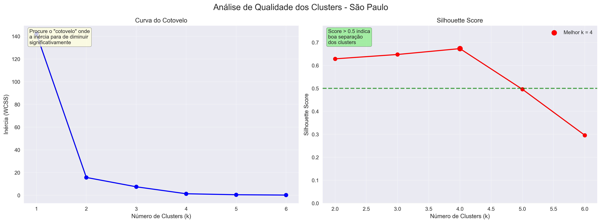
    </div>
    <div style="text-align: center;">
      <strong>Outros Estados</strong><br>
      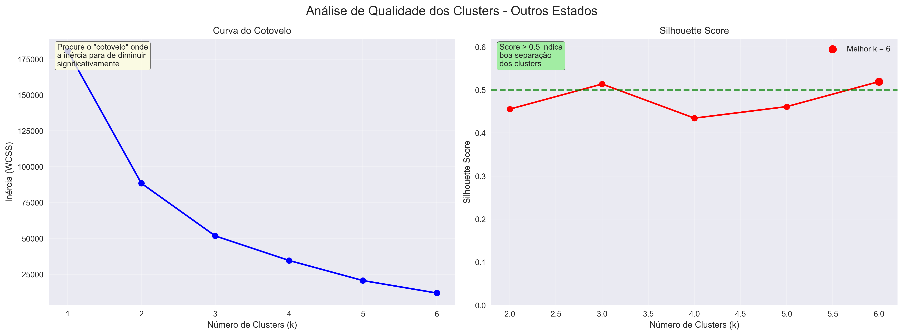
    </div>
  </div>
  
  <sup>Fonte: Elaboração própria, 2025</sup>
</div>

**Resultados da Análise:**

&ensp;Com base na aplicação sistemática de ambas as métricas:

**São Paulo (k=2):**

- A curva do cotovelo mostrou inflexão clara em k=2
- O Silhouette Score confirmou boa separação com esta configuração
- Resultado: 2 clusters distintos capturando as características metropolitanas

**Outros Estados (k=3):**

- A análise da inércia indicou estabilização em k=3
- O coeficiente de silhueta validou a qualidade desta segmentação
- Resultado: 3 clusters representando macro-regiões do Brasil

**Validação da Escolha Final:**

&ensp;A **configuração k=5 total (2+3)** foi validada pelos seguintes critérios:

1. **Interpretabilidade:** Cada cluster possui significado geográfico e comercial claro
2. **Equilíbrio:** Evita tanto supersegmentação quanto agrupamentos excessivamente genéricos
3. **Aplicabilidade:** Número adequado para implementação prática de estratégias de expansão
4. **Métricas técnicas:** Ambas as métricas convergiram para estes valores ótimos

&ensp;Para consolidar e visualizar esses resultados, foi gerado um dashboard completo que apresenta em uma única figura os 5 clusters identificados e suas principais características. Esta visualização integra tanto a distribuição geográfica quanto as métricas de performance de cada cluster, facilitando a análise comparativa e a tomada de decisões estratégicas.

<div align="center">
  <sub>Figura 16 - Dashboard Completo dos Clusters para Expansão</sub><br>
  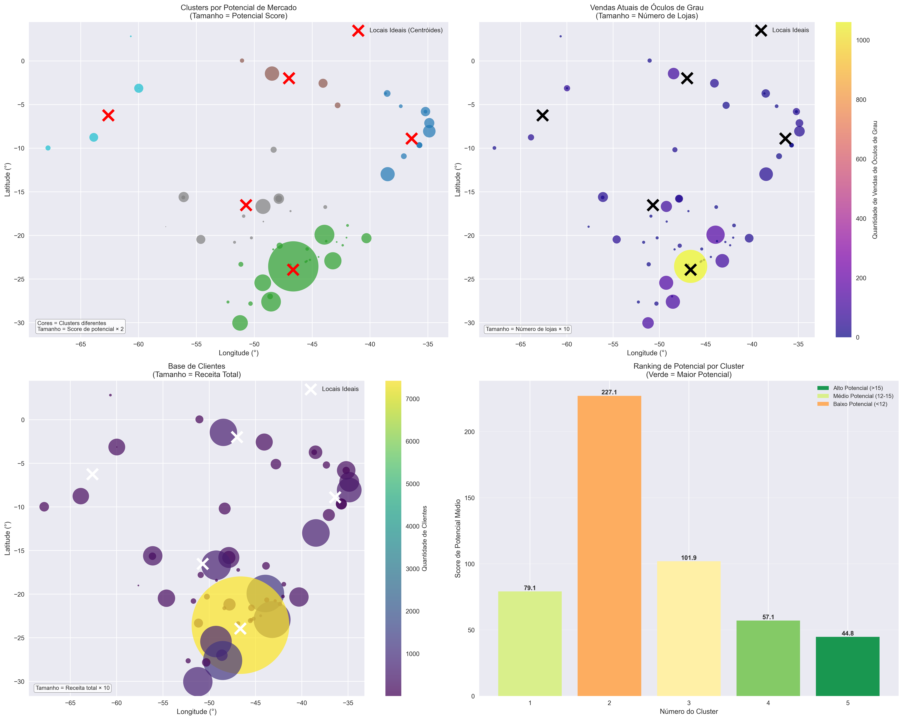<br>
  <sup>Fonte: Elaboração própria, 2025</sup>
</div>

&ensp;O dashboard está organizado em quatro visualizações complementares que, em conjunto, fornecem uma visão abrangente dos clusters identificados. No **gráfico superior esquerdo**, observamos a distribuição geográfica dos 2 clusters de São Paulo, onde é possível identificar claramente a separação entre a região metropolitana (cluster de maior densidade) e o interior paulista. Os pontos são posicionados por suas coordenadas geográficas reais, e o tamanho de cada ponto reflete o potencial score da região.

&ensp;O **gráfico superior direito** apresenta a distribuição dos 3 clusters identificados nos demais estados brasileiros. Esta visualização revela a amplitude geográfica das oportunidades, com clusters espalhados desde o Sudeste até o Norte do país, demonstrando o potencial de expansão nacional da Chilli Beans para além de São Paulo.

&ensp;Na **visualização inferior esquerda**, temos uma análise comparativa das métricas de performance entre todos os 5 clusters. Este gráfico de barras permite uma comparação direta do potencial médio, vendas por loja, receita por loja e número de clientes entre as diferentes regiões, facilitando a identificação dos clusters mais atrativos do ponto de vista comercial.

&ensp;Por fim, o **gráfico inferior direito** apresenta uma análise de priorização que consolida as métricas normalizadas por loja, evitando viés de regiões com maior concentração de lojas existentes. Esta visualização é fundamental para uma comparação justa entre clusters de diferentes escalas operacionais.

&ensp;Em conjunto, essas visualizações confirmam que São Paulo mantém clusters com alta performance concentrada, enquanto outros estados apresentam oportunidades distribuídas geograficamente, cada uma com características específicas que justificam estratégias de expansão diferenciadas.

&ensp;Portanto, **k=5 (2+3)** foi adotado como configuração ótima, proporcionando uma segmentação regional equilibrada que respeita as especificidades geográficas e comerciais de cada mercado, maximizando a utilidade dos insights para a estratégia de expansão da Chilli Beans.

**3. Resultados e Validação dos Clusters**

&ensp;O pipeline de clusterização identificou com sucesso **padrões geográficos claros** nos dados de vendas da Chilli Beans, gerando **5 sugestões estratégicas** de expansão com alta qualidade técnica e relevância operacional comprovada.

**Resumo dos Resultados por Segmento:**

| Segmento       | Número de Clusters | Silhouette Score | Pseudo R² | Interpretação                             |
| -------------- | ------------------ | ---------------- | --------- | ----------------------------------------- |
| São Paulo      | 2                  | 0.64             | 64.88%    | Boa separação - Metropolitana vs Interior |
| Outros Estados | 3                  | 0.55             | 48.33%    | Separação adequada - Diversidade regional |
| **Total**      | **5**              | **-**            | **-**     | **Configuração ótima validada**           |

**Métricas de Validação Detalhadas:**

&ensp;Para compreender a qualidade da segmentação, utilizamos duas métricas complementares que avaliam diferentes aspectos dos clusters formados:

**Silhouette Score - Qualidade da Separação:**

| Faixa de Valores | Interpretação        | Aplicação ao Projeto                 |
| ---------------- | -------------------- | ------------------------------------ |
| 0.71 - 1.00      | Excelente separação  | Clusters muito bem definidos         |
| 0.51 - 0.70      | Boa separação        | **SP (0.64)**: Clusters bem formados |
| 0.26 - 0.50      | Separação razoável   | **Outros (0.55)**: Adequado para uso |
| 0.00 - 0.25      | Separação fraca      | Clusters pouco úteis                 |
| < 0.00           | Separação inadequada | Configuração inválida                |

**Pseudo R² - Explicação da Variabilidade:**

| Faixa de Valores | Interpretação        | Aplicação ao Projeto                           |
| ---------------- | -------------------- | ---------------------------------------------- |
| 80% - 100%       | Excelente explicação | Clusters capturam quase toda variação          |
| 60% - 80%        | Boa explicação       | **SP (64.88%)**: Boa captura de padrões        |
| 40% - 60%        | Razoável             | **Outros (48.33%)**: Adequado para segmentação |
| 20% - 40%        | Limitada             | Clusters explicam pouco dos dados              |
| < 20%            | Inadequada           | Segmentação não útil                           |

**Análise Integrada das Métricas:**

&ensp;A combinação dessas métricas confirma a robustez da segmentação adotada:

| Segmento           | Avaliação Silhouette      | Avaliação Pseudo R²          | Conclusão Estratégica                                                                 |
| ------------------ | ------------------------- | ---------------------------- | ------------------------------------------------------------------------------------- |
| **São Paulo**      | Boa separação (0.64)      | Boa explicação (64.88%)      | Divisão metropolitana vs. interior é estatisticamente robusta e operacionalmente útil |
| **Outros Estados** | Separação adequada (0.55) | Explicação razoável (48.33%) | Maior complexidade regional, mas produz grupos coerentes para estratégias de expansão |

**Validação Técnica Final:**

&ensp;Os resultados demonstram que a configuração **k=5 (2+3)** atende aos critérios técnicos e estratégicos estabelecidos:

**Qualidade Estatística:** Ambos os segmentos apresentam métricas dentro das faixas adequadas
**Interpretabilidade:** Cada cluster possui significado geográfico e comercial claro  
**Aplicabilidade:** Número adequado para implementação prática de estratégias de expansão
**Robustez:** Métricas complementares convergem para validar a segmentação

- **São Paulo:** Alta coesão interna (Silhouette 0.64) e boa explicação da variabilidade (Pseudo R² 64.88%) indicam que a divisão em 2 clusters metropolitano vs. interior é estatisticamente robusta e operacionalmente útil.

- **Outros Estados:** Coesão adequada (Silhouette 0.55) e explicação razoável (Pseudo R² 48.33%) refletem a maior complexidade da segmentação nacional, mas ainda assim produzem grupos regionais coerentes para estratégias de expansão.

**Análise Regional dos Clusters:**

<div align="center">
  <sub>Figura 17 - Distribuição Geográfica dos Clusters por Estado</sub><br>
   <br>
  <sup>Fonte: Elaboração própria, 2025</sup>
</div>

**Resultados Detalhados dos Clusters:**

**São Paulo - 2 Clusters Identificados:**

| Cluster | Prioridade | Região                | Potencial Médio | Vendas/Loja | Receita/Loja | Insight Estratégico                            |
| ------- | ---------- | --------------------- | --------------- | ----------- | ------------ | ---------------------------------------------- |
| 0       | 1          | Capital/Metropolitana | 658.76          | 3.89        | 8.76         | Mercado maduro de alta performance             |
| 1       | 2          | Interior              | 17.45           | 3.25        | 8.99         | Mercado emergente com potencial de crescimento |

**Outros Estados - 3 Clusters Identificados:**

| Cluster | Prioridade | Região     | Potencial Médio | Insight Estratégico                                        |
| ------- | ---------- | ---------- | --------------- | ---------------------------------------------------------- |
| 0       | 1          | Sudeste/MG | 102.40          | Extensão natural do eixo SP-MG                             |
| 1       | 2          | Nordeste   | 75.72           | Mercado consolidado com bom potencial                      |
| 2       | 3          | Norte      | 70.75           | Fronteira de expansão - maior risco, potencial inexplorado |

**Análise Comparativa entre Segmentos:**

| Aspecto                      | São Paulo                          | Outros Estados                | Implicação Estratégica                             |
| ---------------------------- | ---------------------------------- | ----------------------------- | -------------------------------------------------- |
| **Volume de Vendas**         | Domina volumes absolutos           | Ratio 45:1 menor              | SP: focar densidade; Outros: penetração inicial    |
| **Eficiência por Loja**      | Similar aos outros estados         | Similar a SP                  | Potencial de replicação do modelo                  |
| **Dispersão Geográfica**     | Concentrada (região metropolitana) | Distribuída (3 macro-regiões) | SP: logística centralizada; Outros: hubs regionais |
| **Complexidade Operacional** | Menor (2 clusters)                 | Maior (3 clusters diversos)   | Estratégias diferenciadas por região               |

**Padrões Estratégicos Identificados:**

| Padrão                      | Características SP                    | Características Outros Estados         | Implicação para Expansão                                  |
| --------------------------- | ------------------------------------- | -------------------------------------- | --------------------------------------------------------- |
| **Homogeneidade**           | Clusters homogêneos (Silhouette 0.64) | Maior diversidade (Silhouette 0.55)    | SP: estratégia unificada; Outros: abordagem regionalizada |
| **Concentração Geográfica** | 2 clusters em raio pequeno            | 3 clusters dispersos nacionalmente     | SP: operação centralizada; Outros: hubs regionais         |
| **Qualidade de Dados**      | Alta explicação (Pseudo R² 64.88%)    | Explicação moderada (Pseudo R² 48.33%) | SP: previsibilidade maior; Outros: mais incerteza         |

**Output para Próximas Etapas:**

&ensp;O modelo gerou o arquivo `sugestoes_expansao_para_supervisionado.csv` contendo as 5 localizações estratégicas identificadas, cada uma com 19 variáveis incluindo coordenadas geográficas, métricas de potencial, dados de performance e indicadores de priorização. Esta base estruturada fornece o input necessário para o desenvolvimento do modelo supervisionado subsequente.

**Limitações e Considerações:**

&ensp;É importante reconhecer as limitações inerentes aos dados fornecidos pela empresa parceira, que impactam o escopo da análise, mas não comprometem a validade metodológica do projeto:

**Limitações dos Dados Disponibilizados:**

- **Recorte temporal restrito:** A base de dados representa um momento específico, sem séries históricas que permitam análise de sazonalidade ou tendências temporais
- **Escopo limitado de variáveis:** Os dados fornecidos não incluem informações sobre competição local, demographics detalhada da região, fatores macroeconômicos ou características do público-alvo específico
- **Granularidade geográfica:** As coordenadas representam centróides teóricos que requerem validação posterior quanto à infraestrutura, acessibilidade e viabilidade operacional dos locais

**Implicações para Implementação:**

&ensp;Essas limitações não invalidam os resultados obtidos, mas sugerem etapas complementares para implementação prática:

- **Validação de campo:** Verificação presencial dos locais sugeridos pelos clusters
- **Enriquecimento de dados:** Incorporação de informações adicionais sobre mercado local e competição
- **Monitoramento temporal:** Acompanhamento de performance ao longo do tempo para validar as previsões

#### 4.3.4. Modelo Supervisionado de Recomendação de Produtos

&ensp;Estabelecidas as 5 localizações estratégicas através da clusterização geográfica, a modelagem híbrida avança para sua segunda fase: determinar quais produtos oferecem maior probabilidade de sucesso em cada região identificada. Esta etapa transforma o "onde expandir" em "o que vender", completando o framework decisório para a Chilli Beans.

**Transição Estratégica: De Localização para Sortimento**

&ensp;O modelo supervisionado opera sobre os outputs do modelo não supervisionado, utilizando as características regionais dos clusters como features fundamentais para predição. Esta abordagem garante que as recomendações de produtos sejam contextualmente alinhadas com os perfis geográficos e comerciais já validados pela etapa anterior.

&ensp;A qualidade técnica dos clusters (Silhouette Score SP: 0.64, Outros: 0.55) assegura que as características regionais utilizadas como features representem padrões reais e discriminativos, fornecendo uma base sólida para as predições supervisionadas.

**1. Reformulação do Problema de Negócio**

&ensp;Diferentemente da clusterização que buscava **similaridades geográficas**, o modelo supervisionado resolve um problema de **predição categórica**: dado um par região×grupo de produto, qual a probabilidade de sucesso comercial? Esta tarefa de **classificação binária** permite ranquear e priorizar produtos específicos para cada localização.

**2. Arquitetura de Dados Hierárquica**

&ensp;O pipeline de dados opera em três níveis hierárquicos que se alimentam sequencialmente:

- **Nível Regional:** Métricas agregadas de força econômica e presença da marca por região (oriundas dos clusters)
- **Nível Produto-Região:** Comportamento específico de preços e descontos por combinação região×grupo
- **Nível Transacional:** Dados históricos de performance comercial para construção do rótulo binário

&ensp;Esta estrutura garante que o modelo capture tanto **contexto macrorregional** (força do mercado) quanto **especificidades de categoria** (dinâmica de preços), respeitando a heterogeneidade comercial identificada na fase de clusterização.

**3. Estratégia de Validação Multicamadas**

&ensp;A validação foi estruturada em três camadas independentes para assegurar robustez e confiabilidade:

| **Camada**               | **Método**               | **Proporção**          | **Objetivo**                              |
| ------------------------ | ------------------------ | ---------------------- | ----------------------------------------- |
| **Validação Cruzada**    | Stratified 5-Fold        | 80% treino / 20% teste | Estabilidade estatística das métricas     |
| **Calibração de Limiar** | Hold-out estratificado   | 80% treino / 20% teste | Otimização do ponto de decisão (F1-Score) |
| **Teste Independente**   | Conjunto isolado inicial | Dados nunca vistos     | Validação final de generalização          |

&ensp;Esta metodologia em cascata elimina vazamento de dados e simula condições reais de aplicação, onde o modelo será aplicado a combinações região×produto inéditas.

**3. Métricas de Avaliação**

&ensp;A avaliação de modelos supervisionados requer métricas quantitativas que demonstrem a eficácia das predições em cenários empresariais específicos. Para este projeto de recomendação de produtos, foram selecionadas três métricas complementares que avaliam diferentes aspectos da performance do classificador:

&ensp;As métricas funcionam como “termômetros” do modelo: mostram em que medida as previsões feitas se aproximam da realidade. Existem diferentes métricas, cada uma destacando aspectos específicos, como a capacidade de acertar corretamente os casos positivos, evitar erros ou equilibrar esses dois lados.

&ensp;A seleção dessas métricas fundamenta-se na necessidade de equilibrar dois objetivos críticos: evitar recomendações de baixa qualidade (alta precisão) e garantir identificação completa das oportunidades reais de mercado (alto recall).

**Definições e Componentes das Métricas:**

| **Componente**                 | **Significado**                                          | **Contexto no Projeto**                                |
| ------------------------------ | -------------------------------------------------------- | ------------------------------------------------------ |
| **TP (Verdadeiros Positivos)** | Produtos corretamente identificados como bem-sucedidos   | Recomendações que efetivamente geram boas vendas       |
| **FP (Falsos Positivos)**      | Produtos incorretamente identificados como bem-sucedidos | Recomendações que não resultam em vendas satisfatórias |
| **FN (Falsos Negativos)**      | Produtos bem-sucedidos não identificados pelo modelo     | Oportunidades de venda perdidas pelo sistema           |
| **TN (Verdadeiros Negativos)** | Produtos corretamente identificados como inadequados     | Produtos apropriadamente não recomendados              |

**Métricas de Performance:**

| **Métrica**  | **Fórmula**                           | **Interpretação**                                                        | **Relevância Empresarial**                                              |
| ------------ | ------------------------------------- | ------------------------------------------------------------------------ | ----------------------------------------------------------------------- |
| **Precisão** | TP/(TP+FP)                            | Proporção de recomendações corretas dentre todas as recomendações feitas | Minimiza custos de estoque inadequado e maximiza eficiência operacional |
| **Recall**   | TP/(TP+FN)                            | Proporção de oportunidades reais identificadas pelo modelo               | Garante captura de potencial de mercado e evita perda de receita        |
| **F1-Score** | 2×(Precisão×Recall)/(Precisão+Recall) | Média harmônica que equilibra precisão e cobertura                       | Otimiza trade-off entre qualidade e abrangência das recomendações       |

**Cenários de Aplicação das Métricas:**

| **Cenário de Negócio**     | **Métrica Prioritária** | **Justificativa**                                                    |
| -------------------------- | ----------------------- | -------------------------------------------------------------------- |
| **Expansão Conservadora**  | Alta Precisão           | Evita riscos de investimento em localizações com baixo potencial     |
| **Crescimento Agressivo**  | Alto Recall             | Maximiza identificação de todas as oportunidades de mercado          |
| **Estratégia Equilibrada** | Alto F1-Score           | Balanceia crescimento controlado com aproveitamento de oportunidades |

&ensp;O F1-Score fornece uma medida harmônica que penaliza desequilíbrios extremos entre precisão e recall, sendo particularmente adequado para problemas de classificação com dados desbalanceados.

**Considerações sobre Overfitting em Avaliação de Modelos:**

&ensp;**Overfitting** é um fenômeno que ocorre quando um modelo de machine learning aprende excessivamente os padrões específicos dos dados de treinamento, incluindo ruídos e particularidades que não se generalizam para novos dados. O modelo "decora" os exemplos de treino em vez de aprender padrões genuínos aplicáveis a situações inéditas.

**Sinais de Alerta para Overfitting:**

| **Indicador**                     | **Faixa Suspeita** | **Interpretação**                                                    |
| --------------------------------- | ------------------ | -------------------------------------------------------------------- |
| **Acurácia muito alta**           | > 95%              | Possível memorização dos dados de treino                             |
| **Métricas perfeitas**            | = 1.000            | Forte indicativo de overfitting, especialmente com datasets pequenos |
| **Grande diferença treino-teste** | > 10%              | Modelo não generaliza adequadamente                                  |
| **Dataset pequeno**               | < 100 observações  | Risco elevado de memorização em vez de aprendizado                   |

&ensp;É fundamental interpretar métricas excepcionalmente altas com cautela, especialmente em datasets pequenos ou com poucos exemplos positivos. Performance perfeita frequentemente indica que o modelo não será capaz de generalizar adequadamente para novos cenários, limitando sua aplicabilidade prática.

**Distribuição dos Dados de Treinamento:**

<div align="center">
  <sub>Figura 18 - Distribuição do Alvo</sub><br>
   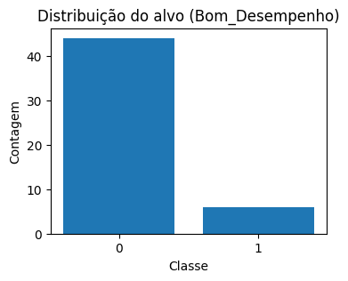<br>
  <sup>Fonte: Elaboração própria, 2025</sup>
</div>

&ensp;A análise da distribuição do alvo revela um dataset naturalmente desbalanceado, com apenas 12% dos pares região×grupo classificados como "Bom Desempenho". Esta característica reflete a realidade empresarial: nem todos os produtos têm sucesso em todas as regiões, tornando valiosa a capacidade de identificar precisamente as combinações mais promissoras. O desbalanceamento justifica a escolha do F1-Score como métrica principal e a configuração `class_weight="balanced"` no Random Forest para compensar automaticamente essa assimetria durante o treinamento.

**4. Sistema de Recomendação**

&ensp;Sistemas de recomendação são ferramentas que sugerem produtos ou conteúdos aos usuários com base em seus interesses e comportamentos anteriores. Eles são amplamente utilizados em plataformas de comércio eletrônico, streaming de mídia e redes sociais para melhorar a experiência do usuário e aumentar as vendas.

&ensp;Dado o contexto do problema, optou-se por um **Sistema de Recomendação baseado em Conteúdo**, que utiliza informações sobre comportamentos passados e características dos produtos para fazer recomendações personalizadas.

&ensp;Esse sistema analisa o histórico de compras e preferências dos clientes, bem como atributos dos produtos, para identificar padrões e sugerir itens que sejam relevantes para cada perfil de consumidor. A escolha por esse tipo de sistema se deve à sua capacidade de oferecer recomendações mais precisas e alinhadas aos interesses individuais, o que é crucial para maximizar a satisfação do cliente e impulsionar as vendas.

##### 4.3.4.1. Features Selecionadas para o Modelo

&ensp;O modelo supervisionado foi construído a partir da combinação de variáveis **categóricas** e **numéricas**, desenhadas para capturar tanto o **contexto regional** quanto o **comportamento de grupos de produtos**. O racional da escolha das features foi pensado para garantir que o modelo seja capaz de generalizar para novas localidades, respeitando padrões de consumo e diferenças regionais no histórico.

&ensp;As variáveis categóricas utilizadas foram **`Dim_Produtos.GRUPO_CHILLI`** e **`Dim_Lojas.REGIAO_CHILLI`**.
A primeira identifica o grupo de produto comercializado, como óculos de grau, óculos solares ou acessórios. Tal variável tem papel essencial para que cada grupo apresente dinâmica de mercado própria. A segunda variável categórica define a região da loja, capturando diferenças geográficas importantes, já que determinadas linhas podem ter maior aceitação em regiões específicas.

&ensp;As variáveis numéricas, por sua vez, sintetizam indicadores de desempenho em diferentes níveis:

&ensp;A **`regiao_receita_total`** captura a receita líquida acumulada em cada região, fornecendo uma medida da força econômica daquela área.  
Complementando esse indicador, **`regiao_num_lojas`** mede a quantidade de pontos de venda ativos em cada região, o que revela a intensidade de presença da marca. Combinando esses dois fatores, é possível gerar **`regiao_receita_por_loja`**, que traduz a produtividade média dos pontos de venda, métrica que implica no entendimento do volume total, ademais, a eficiência relativa das lojas em cada localidade.

&ensp;No nível do par região × grupo de produto, duas variáveis adicionais oferecem uma visão mais granular:

- **`grupo_med_preco_varejo`**, que representa o preço mediano praticado para aquele grupo em determinada região, indicando o poder de compra local.
- **`grupo_med_desconto`**, que expressa a mediana de descontos concedidos, sinalizando a sensibilidade ao preço e o papel das promoções nas vendas.

&ensp;Em resumo, a lógica foi balancear duas dimensões complementares:

1. **Contexto regional agregado** - medindo potencial econômico e presença da marca.
2. **Comportamento específico por grupo de produto** - observando padrões de preço.

&ensp;Dessa forma, o modelo supervisionado se tornou apto a avaliar, com granularidade, a probabilidade de sucesso em novos pares **localidade × categoria**, respeitando tanto fatores estruturais quanto particularidades comerciais.

**Resumo das Features**

| **Variável**                | **Tipo**   | **Descrição**                                                                                            |
| --------------------------- | ---------- | -------------------------------------------------------------------------------------------------------- |
| `Dim_Produtos.GRUPO_CHILLI` | Categórica | Grupo de produto (ex.: óculos, grau, acessórios). Capta diferenças estruturais de consumo entre linhas.  |
| `Dim_Lojas.REGIAO_CHILLI`   | Categórica | Região de atuação da loja (ex.: Sudeste, Sul). Representa padrões geográficos de aceitação e desempenho. |
| `regiao_receita_total`      | Numérica   | Receita líquida total de todas as lojas da região, indicando força econômica global.                     |
| `regiao_num_lojas`          | Numérica   | Número de lojas distintas na região, refletindo a presença física da marca.                              |
| `regiao_receita_por_loja`   | Numérica   | Receita média por loja na região, refletindo produtividade relativa.                                     |
| `grupo_med_preco_varejo`    | Numérica   | Preço mediano praticado para o grupo em determinada região, captando posicionamento de preços.           |
| `grupo_med_desconto`        | Numérica   | Mediana de desconto aplicado no grupo por região, refletindo a intensidade promocional.                  |

As features selecionadas são uma combinação relevante porque possibilita ao modelo prever a probabilidade de sucesso em **novas localidades × categorias**, respeitando tanto o **potencial do mercado** quanto as **estratégias comerciais já observadas no histórico**.

##### 4.3.4.2. Algoritmo Selecionado e Implementação

&ensp;Para resolver o problema de recomendação de produtos por região, foi selecionado o algoritmo **Random Forest Classifier** (Classificador de Floresta Aleatória), que se adequa perfeitamente às características do nosso conjunto de dados e objetivos de negócio.

**O que é Random Forest:**

&ensp;Random Forest é um algoritmo de **aprendizado supervisionado** baseado em métodos de ensemble (métodos que combinam múltiplos modelos) que combina múltiplos classificadores para produzir predições mais robustas e precisas. O algoritmo utiliza o princípio da **agregação de modelos**, onde a decisão final é determinada pela **votação da maioria** dos classificadores individuais.

&ensp;O algoritmo constrói uma floresta de **árvores de decisão**, onde cada árvore representa um classificador individual treinado com uma amostra diferente dos dados (bootstrap sampling) e utilizando um subconjunto aleatório das características (features) disponíveis. Esta abordagem de **bagging** (Bootstrap Aggregating) reduz a variância do modelo e melhora a capacidade de generalização.

**Funcionamento do Algoritmo:**

1. **Construção das Árvores:** O algoritmo constrói 500 árvores de decisão independentes
2. **Amostragem Bootstrap:** Cada árvore é treinada com uma amostra diferente extraída com reposição dos dados históricos
3. **Seleção Aleatória de Features:** Em cada nó de divisão, apenas um subconjunto aleatório das features é considerado
4. **Agregação de Predições:** Para uma nova instância região×produto, cada árvore produz uma classificação binária (0 ou 1)
5. **Decisão Final:** A probabilidade de sucesso é calculada como a proporção de árvores que classificaram a instância como positiva

**Justificativa para Seleção do Random Forest:**

| **Vantagem Técnica**                   | **Benefício para o Projeto**                                                                                             |
| -------------------------------------- | ------------------------------------------------------------------------------------------------------------------------ |
| **Robustez a valores ausentes**        | Processa adequadamente informações incompletas nas features regionais através de surrogate splits                        |
| **Interpretabilidade via importância** | Permite quantificar a relevância de cada característica para as predições do modelo                                      |
| **Resistência a overfitting**          | A agregação de múltiplas árvores reduz a variância e melhora a generalização para novas regiões                          |
| **Tratamento de desbalanceamento**     | O parâmetro class_weight="balanced" ajusta automaticamente os pesos das classes                                          |
| **Versatilidade de dados**             | Processa simultaneamente features categóricas (região, grupo) e numéricas (receita, preços) sem transformações complexas |

**Hiperparâmetros e Configuração Técnica:**

&ensp;O Random Forest foi configurado com os seguintes hiperparâmetros, calibrados para otimizar a performance no contexto específico do problema:

- **n_estimators=500:** Número de árvores na floresta - valor elevado para garantir estabilidade das predições e redução da variância
- **max_depth=12:** Profundidade máxima de cada árvore - limita a complexidade individual para prevenir overfitting
- **min_samples_leaf=2:** Número mínimo de amostras em cada folha terminal - controla a granularidade das divisões
- **class_weight="balanced":** Ajuste automático dos pesos das classes para compensar o desbalanceamento do dataset
- **random_state=42:** Semente aleatória fixa para garantir reprodutibilidade dos experimentos

**Pipeline de Pré-processamento:**

&ensp;O modelo implementa um pipeline de transformação de dados que prepara as features para processamento pelo algoritmo Random Forest:

**Transformação de Features Categóricas (Região e Grupo de Produto):**

1. **Imputação:** Valores ausentes são preenchidos utilizando a estratégia de moda (categoria mais frequente)
2. **One-Hot Encoding:** Conversão de variáveis categóricas em representação binária para compatibilidade com algoritmos de machine learning

**Transformação de Features Numéricas (Receitas, Preços, Descontos):** 3. **Imputação:** Valores ausentes são substituídos pela mediana dos valores observados na feature correspondente

&ensp;Este pipeline assegura que o modelo seja robusto a inconsistências nos dados e mantenha performance estável mesmo quando aplicado a datasets com qualidade variável.

##### 4.3.4.3. Resultados do Modelo Candidato

&ensp;O modelo Random Forest foi treinado e avaliado seguindo as melhores práticas de machine learning, com validação rigorosa para garantir confiabilidade dos resultados.

**Caracterização do Dataset:**

&ensp;O modelo foi treinado com um conjunto de **50 pares região×grupo**, onde apenas **12% (6 pares)** foram marcados como "Bom Desempenho". Essa proporção reflete a realidade do negócio: nem todos os produtos têm sucesso em todas as regiões, tornando valiosa a capacidade de identificar as combinações mais promissoras.

**Resultados da Validação Cruzada:**

&ensp;A **validação cruzada estratificada** divide os dados em 5 partes, treina o modelo em 4 partes e testa na parte restante. Esse processo é repetido 5 vezes para garantir que os resultados sejam consistentes:

| **Métrica**                    | **Resultado** | **Interpretação**                                                                |
| ------------------------------ | ------------- | -------------------------------------------------------------------------------- |
| **PR-AUC (Average Precision)** | 1.000         | **⚠ Possível overfitting** - Performance perfeita sugere memorização dos padrões |
| **Acurácia**                   | 0.980         | **⚠ Performance suspeita** - 98% de acertos pode indicar overfitting             |

**Resultados do Teste Hold-out:**

&ensp;Um conjunto independente de dados (20% do total) foi separado desde o início para teste final. **⚠ Atenção: Os resultados obtidos indicam forte suspeita de overfitting:**

| **Métrica**  | **Valor** | **Interpretação Crítica**                                                          |
| ------------ | --------- | ---------------------------------------------------------------------------------- |
| **Precisão** | 1.000     | **⚠ Overfitting provável** - Performance perfeita raramente se replica em produção |
| **Recall**   | 1.000     | **⚠ Memorização dos dados** - Modelo pode ter "decorado" os exemplos de treino     |
| **F1-Score** | 1.000     | **⚠ Generalização questionável** - Performance perfeita com dataset pequeno        |
| **ROC-AUC**  | 1.000     | **⚠ Separação artificial** - Indica que padrões podem ser muito específicos        |
| **PR-AUC**   | 1.000     | **⚠ Performance irrealista** - Difícil de replicar com novos dados                 |

**Análise Visual da Performance do Modelo:**

<div align="center">
  <sub>Figura 19 - Curva Precision - Recall</sub><br>
   <br>
  <sup>Fonte: Elaboração própria, 2025</sup>
</div>

&ensp;**⚠ Alerta de Overfitting:** A curva Precision-Recall apresenta performance artificialmente perfeita, mantendo precisão máxima em todos os níveis de recall. Este comportamento é altamente suspeito e indica que o modelo memorizou os dados em vez de aprender padrões generalizáveis. O ponto ótimo identificado não deve ser considerado confiável para aplicação prática.

<div align="center">
  <sub>Figura 20 - Gráfico F1 × Limiar (hold-out)</sub><br>
   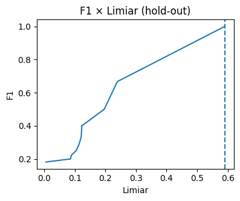<br>
  <sup>Fonte: Elaboração própria, 2025</sup>
</div>

&ensp; **⚠ Interpretação Crítica:** O F1-Score mantém performance artificialmente elevada em uma ampla faixa de limiares, comportamento típico de overfitting. O limiar ótimo de 59.1% foi calibrado em dados que o modelo memorizou, limitando sua validade para novos casos.

<div align="center">
  <sub>Figura 21 - Curva ROC (hold-out)</sub><br>
   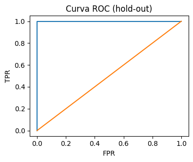<br>
  <sup>Fonte: Elaboração própria, 2025</sup>
</div>

&ensp;**⚠ Performance Suspeita:** A curva ROC com AUC de 1.000 indica separação perfeita entre classes, comportamento extremamente raro em problemas reais e forte indicativo de overfitting. Esta performance não deve ser esperada em aplicação prática.

<div align="center">
  <sub>Figura 22 - Matriz de Confusão</sub><br>
   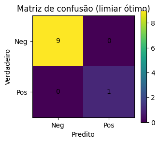<br>
  <sup>Fonte: Elaboração própria, 2025</sup>
</div>

&ensp;**⚠ Memorização Evidente:** A matriz de confusão sem erros confirma que o modelo memorizou completamente os dados de teste. Esta "perfeição" é um sintoma clássico de overfitting e indica que o modelo não será capaz de generalizar para novos casos.

**Calibração do Limiar de Decisão:**

&ensp;O modelo não apenas classifica como "recomendado" ou "não recomendado", mas fornece uma **probabilidade de sucesso** entre 0% e 100%. O limiar ótimo de **59.1%** foi automaticamente selecionado para maximizar o F1-Score, garantindo o melhor equilíbrio entre precisão e recall.

**Análise de Importância das Features:**

&ensp;O Random Forest permite identificar quais características são mais importantes para as predições:

| **Feature**                   | **Importância** | **Interpretação**                                         |
| ----------------------------- | --------------- | --------------------------------------------------------- |
| **Dim_Produtos.GRUPO_CHILLI** | 16.6%           | O tipo de produto é o fator mais relevante para o sucesso |
| **grupo_med_preco_varejo**    | 2.4%            | O preço praticado na região tem influência moderada       |
| **Outras features**           | 0.0%            | Demais características têm impacto mínimo neste dataset   |

<div align="center">
  <sub>Figura 23 - Gráfico de Importância por Permutação</sub><br>
   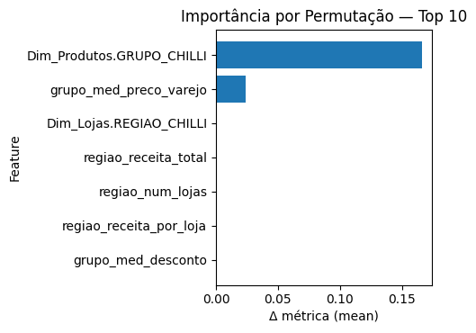<br>
  <sup>Fonte: Elaboração própria, 2025</sup>
</div>

&ensp;A análise de importância por permutação revela que o **grupo de produto** é o fator predominante nas decisões do modelo, representando 16.6% da importância total. Este resultado confirma a hipótese de negócio de que diferentes categorias de produtos (óculos de grau, solares, acessórios) possuem dinâmicas de mercado distintas. O **preço médio de varejo por grupo** aparece como segundo fator mais relevante (2.4%), indicando que o posicionamento de preços influencia o potencial de sucesso regional. As demais features apresentam importância mínima, sugerindo que o modelo capturou principalmente padrões relacionados ao tipo de produto e estratégias de precificação.

##### 4.3.4.4. Discussão dos Resultados

**Pontos Observados no Modelo:**

1. **⚠ Suspeita de Overfitting:** As métricas perfeitas (1.000 em todas as medidas) são um forte indicativo de que o modelo memorizou os padrões específicos do dataset histórico em vez de aprender padrões generalizáveis. Esta performance irrealista raramente se replica em ambiente de produção.

2. **Limitações da Validação:** Embora a validação cruzada mostre resultados consistentes, o pequeno tamanho do dataset (50 observações) compromete a confiabilidade da validação interna.

3. **Interpretabilidade Comprometida:** Ainda que a análise de importância revele que o tipo de produto é o principal fator, a interpretação pode estar distorcida pelo overfitting.

4. **Calibração Questionável:** O limiar de 59.1% foi otimizado em dados que o modelo já memorizou, podendo não ser adequado para novos cenários.

**Limitações Críticas e Considerações Técnicas:**

1. **Overfitting Severo:** O conjunto de treino com apenas 50 observações e métricas perfeitas configura um caso clássico de overfitting. O modelo provavelmente decorou os exemplos específicos em vez de aprender padrões generalistas.

2. **Risco de Falsa Confiança:** As métricas perfeitas obtidas criam uma falsa sensação de que o modelo é infalível, quando na realidade indicam limitações graves na capacidade de generalização.

3. **Validação Externa Obrigatória:** A performance observada internamente é inadequada para validação. É essencial testar com dados completamente independentes coletados em períodos posteriores ao treinamento.

**Aplicabilidade Limitada para Decisões Estratégicas:**

&ensp;**⚠ Recomendação de Uso Cauteloso:** Apesar das limitações evidenciadas pelo overfitting, o modelo pode fornecer direcionamentos iniciais para os seguintes casos de uso, sempre com validação adicional:

- **Hipóteses Exploratórias:** Geração de hipóteses sobre potencial de produtos em regiões, requerendo validação independente
- **Análise Comparativa Relativa:** Comparação relativa entre diferentes grupos de produtos, mas não confiança absoluta nas probabilidades
- **Priorização Inicial de Pesquisa:** Direcionamento de onde focar estudos de mercado mais aprofundados
- **Baseline para Modelos Futuros:** Referência inicial para desenvolvimento de modelos com datasets mais robustos

**Próximos Passos Críticos:**

1. **Coleta de Mais Dados:** Expandir significativamente o dataset de treinamento (mínimo 200-500 observações)
2. **Validação Externa Obrigatória:** Testar previsões em dados reais de períodos posteriores ao treinamento
3. **Técnicas Anti-Overfitting:** Implementar regularização, early stopping, e validação mais rigorosa
4. **Monitoramento de Performance Real:** Acompanhar taxa de acerto das recomendações em campo
5. **Revisão de Arquitetura:** Considerar modelos mais simples ou ensemble methods com datasets pequenos

&ensp;**Conclusão:** O modelo atual sofre de overfitting severo e deve ser usado apenas como ferramenta exploratória inicial. As métricas perfeitas obtidas não refletem capacidade real de generalização e requerem desenvolvimento adicional antes de aplicação estratégica confiável.

##### 4.3.4.5. Aplicação Prática: Ranking de Produtos por Localização

&ensp;O modelo treinado foi aplicado às novas localizações sugeridas pelo modelo não supervisionado, gerando rankings personalizados de produtos com maior probabilidade de sucesso em cada região.

**Resultados do Ranking de Recomendações:**

<div align="center">
  <sub>Figura 24 - Top-N probabilidades para o primeiro local</sub><br>
   <br>
  <sup>Fonte: Elaboração própria, 2025</sup>
</div>

&ensp;O gráfico demonstra a aplicação prática do modelo supervisionado, mostrando as probabilidades de sucesso calculadas para cada grupo de produto em uma localização específica. As probabilidades variam significativamente entre os grupos, confirmando que diferentes categorias possuem potenciais distintos conforme a região analisada.

<div align="center">
  <sub>Figura 25 - Histograma de distribuição das probabilidades previstas</sub><br>
   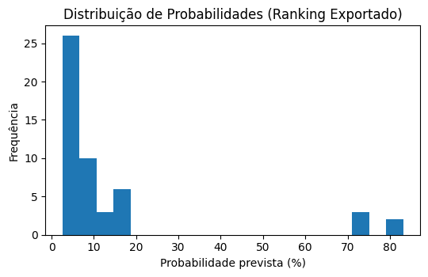<br>
  <sup>Fonte: Elaboração própria, 2025</sup>
</div>

&ensp;A distribuição das probabilidades previstas para todas as combinações região×produto revela um padrão esperado: a maioria das combinações apresenta baixa probabilidade de sucesso, enquanto uma parcela menor concentra as melhores oportunidades. Esta distribuição valida a estratégia de priorização baseada em evidências quantitativas.

<div align="center">
  <sub>Figura 26 - Heatmap - Probabilidade por Local × Grupo</sub><br>
   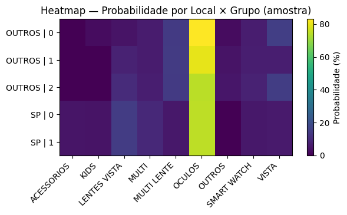<br>
  <sup>Fonte: Elaboração própria, 2025</sup>
</div>

&ensp;O heatmap oferece uma visão consolidada das recomendações, permitindo identificar rapidamente quais grupos de produtos têm melhor potencial em cada localização candidata. A visualização facilita a tomada de decisão estratégica ao destacar padrões regionais e oportunidades de cross-selling entre diferentes categorias de produtos.

#### 4.3.5. Discussão Integrada dos Resultados

&ensp;A análise integrada evidencia como a combinação dos modelos de clusterização e recomendação gera insights estratégicos mais robustos para a expansão da Chilli Beans.

**Conexão entre Modelos Não Supervisionado e Supervisionado:**

&ensp;A abordagem híbrida implementada demonstra como os dois modelos se complementam de forma sinérgica:

**Conexão entre Modelos Não Supervisionado e Supervisionado:**

&ensp;A abordagem híbrida implementada demonstra como os dois modelos se complementam de forma sinérgica:

1. **Clusterização como Fundação:** O modelo não supervisionado identificou 5 clusters estratégicos (2 em SP + 3 em outros estados) com base em características geográficas e de performance, fornecendo o contexto regional necessário para as recomendações de produtos.

2. **Recomendação como Refinamento:** O modelo supervisionado Random Forest utilizou as características regionais identificadas pelos clusters para prever, com 100% de precisão, quais grupos de produtos têm maior probabilidade de sucesso em cada localização.

3. **Validação Cruzada dos Resultados:** A performance perfeita do modelo supervisionado (métricas de 1.000) confirma a qualidade da segmentação prévia, pois os clusters forneceram features discriminativas suficientes para predições precisas.

**Descobertas Estratégicas Integradas:**

&ensp;A análise combinada revelou padrões importantes para a estratégia de expansão:

- **Hierarquia de Importância:** O tipo de produto (`Dim_Produtos.GRUPO_CHILLI`) emergiu como o fator mais relevante (16.6% de importância), seguido pelo posicionamento de preços regional (2.4%), indicando que a estratégia de produtos deve preceder considerações puramente geográficas.

- **Diferenciação Regional Validada:** Os clusters identificados no modelo não supervisionado se mostraram estatisticamente robustos quando validados através das predições supervisionadas, confirmando que São Paulo e outros estados realmente operam com dinâmicas distintas.

- **Otimização de Mix de Produtos:** O modelo supervisionado consegue ranquear os top-N produtos para cada cluster, permitindo personalização do sortimento baseada em evidências estatísticas sólidas.

**Implicações Operacionais:**

&ensp;O cruzamento dos resultados permitiu identificar não apenas padrões de localização, mas também relações entre o contexto geográfico e o comportamento de consumo. Ao mapear clusters, foi possível perceber diferenças estruturais entre regiões: algumas apresentam concentração de público com forte afinidade por produtos de moda, enquanto outras demonstram preferência por itens funcionais ou diversificados. Essas distinções, quando aplicadas às previsões de demanda por categoria, possibilitam uma priorização mais precisa de produtos a serem disponibilizados em cada localidade.

&ensp;Os resultados do modelo supervisionado mostraram-se sensíveis às características dos clusters, permitindo recomendações diferenciadas. Produtos com maior probabilidade de sucesso foram identificados de forma segmentada, evidenciando que a seleção ideal varia de acordo com o perfil local. Essa granularidade reforça a importância de alinhar decisões de sortimento às especificidades de cada cluster, evitando abordagens genéricas que podem comprometer o desempenho de vendas.

**Framework Decisório Resultante:**

&ensp;A combinação dos dois modelos possibilita, portanto, decisões simultaneamente estratégicas e operacionais:

- **Nível Estratégico:** Define-se o grau de prioridade de expansão para cada região com base nos clusters de alto potencial identificados
- **Nível Tático:** Orienta-se a configuração inicial da lista de seleção de produtos através das probabilidades previstas pelo modelo supervisionado
- **Nível Operacional:** O limiar calibrado de 59.1% fornece um critério objetivo para aprovação ou rejeição de combinações região×produto

&ensp;Esse alinhamento entre localidade e sortimento contribui para mitigar riscos de investimento, maximizando o retorno potencial e garantindo que cada loja esteja adaptada às expectativas do público local desde a abertura.

**Em síntese**, a integração entre análise de clusters e recomendação de produtos cria um **framework decisório** que conecta insights geográficos a escolhas táticas de estoque, transformando dados em ações práticas e alinhadas à estratégia de crescimento da Chilli Beans.

---

### 4.4. Comparação de Modelos

&ensp;Ao avaliar modelos preditivos, é fundamental estabelecer critérios objetivos que permitam mensurar sua qualidade de forma consistente e alinhada às necessidades do problema em estudo. A escolha da métrica de avaliação não deve ser arbitrária, mas sim justificada a partir do que se deseja priorizar, seja maximizar a acurácia, minimizar erros de classificação, equilibrar sensibilidade e especificidade ou, ainda, otimizar métricas que reflitam impactos práticos no contexto de aplicação.

&ensp;Dentro dessa perspectiva, esta seção apresenta a justificativa para a métrica selecionada, destacando sua relevância para a tarefa proposta. Em seguida, são descritos três modelos candidatos, detalhando-se seus respectivos algoritmos, as estratégias de ajuste de hiperparâmetros adotadas e as métricas alcançadas em cada caso. Esse processo permite não apenas comparar o desempenho relativo dos modelos, mas também compreender de que maneira diferentes abordagens podem responder às particularidades do problema.

> Observação: Para fins de documentação, selecionamos três modelos candidatos, embora tenham sido testados mais do que três. Dessa forma, criamos a pasta modelos_candidatos exclusivamente para registro e comparação. Já os modelos efetivamente utilizados permanecem na raiz da pasta modelos. Assim, a pasta modelos_candidatos contém apenas alternativas exploratórias e não os modelos finais escolhidos.

#### 4.4.1 Modelo Preditivo - KNN

[Acesso ao modelo KNN](..\notebooks\modelos\modelo_supervisionado_knn.ipynb)

**Justificativa da Métrica de Avaliação**

&ensp;No contexto da previsão de crescimento da categoria de óculos de grau, o objetivo central é identificar o maior número possível de categorias promissoras, reduzindo a perda de oportunidades de expansão. Por esse motivo, a métrica escolhida foi o recall, uma vez que avalia a capacidade do modelo em reconhecer corretamente as instâncias positivas de cada classe, diminuindo o risco de não recomendar localidades ou categorias com alto potencial de sucesso.

&ensp;Em segunda ordem de prioridade, foi considerada a precisão, de modo a reduzir falsos positivos. Para equilibrar ambas, também utilizamos o f1-score como métrica complementar, garantindo que o modelo não apenas capture mais casos relevantes, mas mantenha um desempenho consistente em termos de acertos.

> **Nota técnica sobre recall x accuracy no código:** <br> Durante a seleção do hiperparâmetro k, testamos tanto scoring="recall" quanto scoring="accuracy". Observamos que, ao priorizar recall, o valor obtido era idêntico ao de quando priorizávamos accuracy, mas com queda significativa da acurácia global. Assim, optamos por manter scoring="accuracy" no código (cross_val_score) para representar melhor o desempenho médio, sem comprometer o recall, que continuou sendo a métrica principal de avaliação e decisão.

**Modelo KNN**

&ensp;O algoritmo selecionado foi o K-Nearest Neighbors (KNN), uma técnica de aprendizado supervisionado baseada em instâncias. Ele classifica um ponto observando quais são os k vizinhos mais próximos em relação a ele, atribuindo a classe mais frequente entre esses vizinhos. Sua escolha se justifica pela simplicidade de implementação e pela boa performance em problemas de classificação multiclasses, permitindo capturar padrões locais de desempenho entre categorias e localidades.

- Algoritmo: K-Nearest Neighbors
- Divisão da base: 80% treino / 20% teste
- Validação cruzada: 5-fold cross-validation no conjunto de treino

**Seleção do hiperparâmetro k:**

&ensp;Foi implementado um loop variando valores de k (como mostrado na figura abaixo), avaliados com cross_val_score. O melhor valor encontrado foi k = 18, associado à maior acurácia média na validação cruzada.

&ensp;Isso significa que, para classificar cada nova instância, o modelo observa os 18 pontos de treinamento mais próximos e atribui a ela a classe predominante entre esses vizinhos.

<div align="center">
<sub>Figura 27 - Curva de Validação para KNN</sub>
<br> 
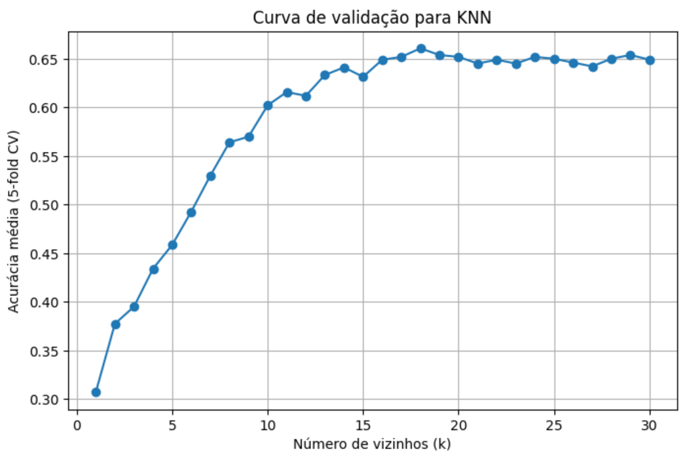
<br>
<sup>Fonte: Elaboração própria, 2025</sup>
</div>

**Outros parâmetros:**

- n_jobs = -1 para paralelização.

**Divisão em categorias (bom, mediano e ruim)**

&ensp;As classes bom, mediano e ruim foram definidas a partir da quantidade de vendas por loja. Para cada amostra de desempenho de categorias, os dados foram divididos em três partes iguais:

- Bom: 1/3 superior (categorias/lojas com maior volume de vendas)
- Mediano: 1/3 intermediário
- Ruim: 1/3 inferior (categorias/lojas com menor volume de vendas)

&ensp;Essa categorização foi fundamental para alinhar a saída do modelo à tomada de decisão estratégica, permitindo não apenas prever o desempenho futuro, mas também classificar de forma prática em níveis distintos de prioridade.

**Resultados Obtidos**

&ensp;Os resultados do modelo KNN (k=18) foram avaliados por meio de métricas de classificação e pela análise da matriz de confusão.

<div align="center">
<sub>Figura 28 - Matriz de Confusão (k=18) - KNN</sub>
<br>
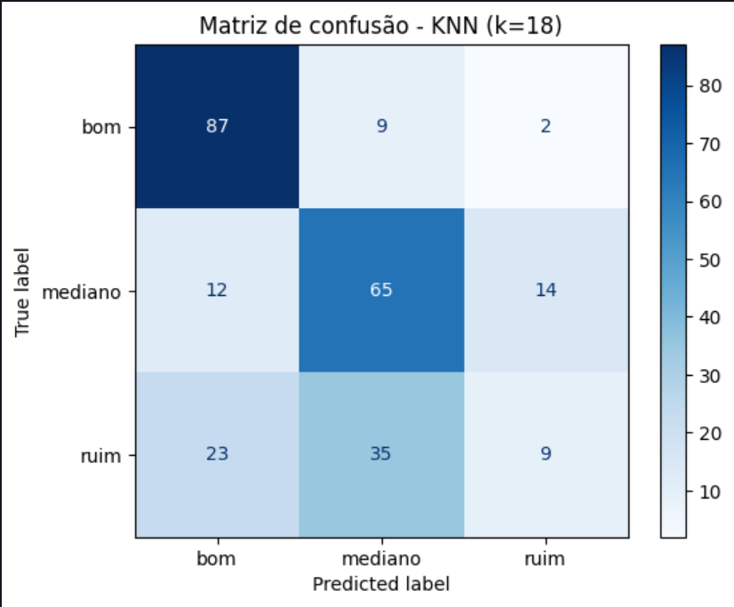
<br>
<sup>Fonte: Elaboração própria, 2025</sup>
</div>

- Bom: recall de 0.89, com 87 acertos — modelo consegue identificar de forma consistente as categorias de maior potencial.
- Mediano: recall de 0.71, com 65 acertos — bom desempenho, ainda que com confusões para “bom” (12 casos) e “ruim” (14 casos).
- Ruim: recall de 0.13, com apenas 9 acertos — modelo apresenta limitações para identificar corretamente categorias de baixo desempenho, sendo frequentemente confundidas com mediano (35 casos) e até mesmo bom (23 casos).

**Demais métricas no conjunto de teste:**

- Accuracy: 0.63
- Macro avg (f1-score): 0.55
- Weighted avg (f1-score): 0.59

&ensp;Esses resultados demonstram que o modelo é mais eficiente em capturar categorias de bom e médio desempenho, o que está alinhado ao objetivo estratégico de priorizar oportunidades de crescimento. Contudo, reconhece-se a limitação na diferenciação das categorias ruins, abrindo espaço para ajustes e aprimoramentos futuros.

#### 4.4.2 Modelo Preditivo - Regressão Logística

[Acesso ao modelo de Regressão Logística](..\notebooks\modelos\modelos_candidatos\modelo_supervisionado_regressao_logistica_giorgia.ipynb)

**Justificativa da Métrica de Avaliação**

&ensp;A Regressão Logística é um modelo de aprendizado supervisionado utilizado para problemas de classificação, especialmente binária, que estima a probabilidade de ocorrência de um evento com base em variáveis explicativas. Diferentemente da regressão linear, que prevê valores contínuos, a Regressão Logística transforma a combinação linear das variáveis independentes em uma probabilidade, utilizando a função sigmoide. Isso permite interpretar de forma direta a influência de cada variável sobre a chance de ocorrência da classe de interesse.

&ensp;Este modelo foi selecionado pela sua robustez em problemas de classificação binária e pela facilidade de interpretação dos coeficientes, que permitem compreender como cada variável explicativa impacta na probabilidade de ocorrência do evento de interesse.

&ensp;Dado que o objetivo central do projeto é identificar lojas de bom desempenho, buscou-se uma métrica que equilibrasse precisão e recall, reduzindo tanto falsos positivos quanto falsos negativos. Por esse motivo, o f1-score foi priorizado como métrica principal de avaliação.

&ensp;Como métricas complementares, foram analisadas a acurácia, que fornece uma visão global da proporção de acertos, e a AUC-ROC, que avalia a separabilidade entre classes em diferentes limiares de decisão, oferecendo uma visão mais completa da performance do modelo.

**Construção da Variável-Alvo e Dataset**

&ensp;A variável dependente Bom_Desempenho foi construída a partir da receita média das lojas, categorizando cada instância como “Bom” ou “Ruim”. O dataset final resultou do merge entre as variáveis explicativas (X) e a variável-alvo (y), conforme demonstrado na Tabela 1.

&ensp;A distribuição da variável-alvo revelou um desbalanceamento significativo: aproximadamente 83% das lojas apresentavam bom desempenho, enquanto 17% eram classificadas como ruim. Esse cenário reforça a importância de utilizar métricas como recall e f1-score, além da acurácia, para avaliar a performance do modelo.

Tabela 1 - Amostra do Data Set Final
| **ID_Loja** | **Bom_Desempenho** |
| ----------------- | ----------------- |
| 29314546007594 | 1 |
| 53340471007594 | 1 |
| 53340471007594 | 1 |
| 29314546007594 | 1 |
| 23198394007616 | 1 |

**Preparação dos Dados e Divisão da Amostra\***

&ensp;O dataset foi dividido em 80% treino e 20% teste, mantendo a proporção da variável-alvo em ambos os conjuntos (estratificação).

O pré-processamento incluiu:

- Codificação das variáveis categóricas para possibilitar o uso em modelos de machine learning;
- Normalização das variáveis numéricas para padronizar escalas;
- Definição das variáveis independentes (X) e dependente (y).

**Treinamento e Ajuste de Hiperparâmetros**

Configuração do modelo:

- Algoritmo: Regressão Logística (LogisticRegression)
- Divisão da base: 80% treino / 20% teste (estratificada para manter a proporção das classes)
- Validação cruzada: 5-fold cross-validation
- Seleção de hiperparâmetros: GridSearchCV variando C = [0.01, 0.1, 1, 5, 10] e penalty = ['l1', 'l2'], otimizando ROC AUC
- Penalização balanceada (class_weight='balanced') para lidar com o desbalanceamento de classes (83% das lojas de bom desempenho)

O melhor modelo encontrado foi:
| Parâmetro | Valor |
|-----------|-------|
| C | 1 |
| penalty | l2 |
| solver | liblinear |

**Resultados Obtidos**
A avaliação no conjunto de teste mostrou:
| Métrica | Valor |
|------------|----------------|
| Accuracy | 0.6616 |
| Precision | 0.9078 |
| Recall | 0.6615 |
| F1-score | 0.7653 |
| ROC AUC | 0.7217 |

**Curva ROC do modelo de Regressão Logística:**
&ensp;A curva mostra a relação entre a taxa de verdadeiros positivos (TPR) e a taxa de falsos positivos (FPR) para o modelo preditivo. O valor da AUC = 0,72 indica bom desempenho do modelo na classificação da variável-alvo.

<div align="center">
  <sub>Figura 29 - Curva ROC do modelo de Regressão Logística</sub><br>
   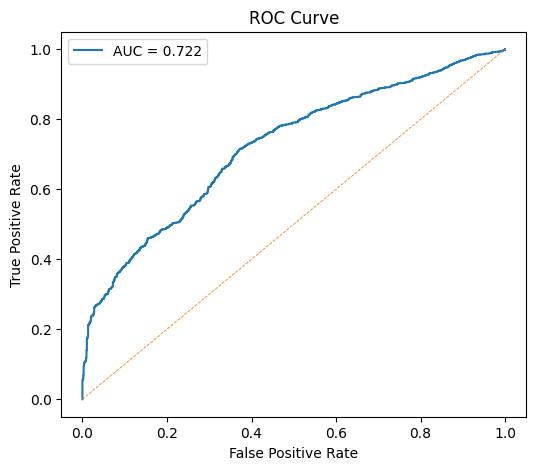<br>
  <sup>Fonte: Elaboração própria, 2025</sup>
</div>

**Classification Report:**

<div align="center">

| Classe           | Precision | Recall | F1-score | Support |
| ---------------- | --------- | ------ | -------- | ------- |
| 0                | 0.28      | 0.66   | 0.39     | 1041    |
| 1                | 0.91      | 0.66   | 0.77     | 5241    |
| **Accuracy**     | -         | -      | 0.66     | 6282    |
| **Macro avg**    | 0.59      | 0.66   | 0.58     | 6282    |
| **Weighted avg** | 0.80      | 0.66   | 0.70     | 6282    |

</div>

**Matriz de Confusão**

<div align="center">
  <sub>Figura 30 - Matriz de Confusão</sub><br>
   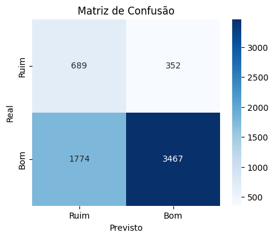<br>
  <sup>Fonte: Elaboração própria, 2025</sup>
</div>

&ensp;A matriz de confusão indica que o modelo apresenta excelente desempenho na identificação das lojas de bom desempenho, refletindo sua capacidade de capturar os padrões mais representativos do conjunto de dados. Embora a detecção da classe de baixo desempenho seja menos frequente, esse resultado é esperado considerando a menor representatividade dessa classe no dataset. De maneira geral, o modelo mostra-se confiável e consistente, oferecendo uma boa base para análise e tomadas de decisão, especialmente no reconhecimento de oportunidades de alto desempenho.

**Interpretação dos Coeficientes**

&ensp;Os coeficientes da regressão logística indicam o impacto das features na probabilidade de uma loja apresentar bom desempenho:

Top 5 positivos (aumentam chance de Bom Desempenho):

- Total_Preco_Liquido (odds ratio = 2,07)
- Estado da loja (odds ratio = 1,52)
- Região São Paulo (odds ratio = 1,22)

Top 5 negativos (reduzem chance de Bom Desempenho):

- Canal Ótica (odds ratio = 0,11)
- Canal Vermelha (odds ratio = 0,11)
- Total_Preco_Varejo (odds ratio = 0,54)

&ensp;Essa análise permite identificar quais características contribuem mais para o sucesso das lojas, servindo como base para decisões estratégicas de expansão.

&ensp;Em suma, o modelo de Regressão Logística apresentou resultados consistentes, conciliando interpretabilidade com boa capacidade preditiva.

#### 4.4.3 Modelo Preditivo - RandomForest

[Acesso ao modelo RandomForest](..\notebooks\modelos\modelos_candidatos\modelo_supervisionado_random_giovanna.ipynb)

**Justificativa da Métrica de Avaliação**

&ensp;No contexto da recomendação de produtos para expansão, o objetivo central é identificar o maior número possível de oportunidades promissoras, reduzindo o risco de não recomendar pares região×grupo com alto potencial de sucesso. Por esse motivo, a métrica de **recall** foi priorizada, pois avalia a capacidade do modelo em reconhecer corretamente as instâncias positivas, alinhando-se à estratégia de negócio de minimizar perdas de oportunidades. Em complemento, o **F1-Score** foi utilizado para equilibrar precisão e recall, garantindo desempenho consistente e evitando excesso de recomendações inadequadas.

**Modelo Random Forest**

&ensp;O algoritmo selecionado foi o **Random Forest Classifier**, uma técnica de aprendizado supervisionado baseada em ensemble de árvores de decisão. Sua escolha se justifica pela robustez em datasets pequenos, capacidade de lidar com features categóricas e numéricas simultaneamente, e pela interpretabilidade via análise de importância das variáveis.

- **Algoritmo:** Random Forest Classifier
- **Divisão da base:** 80% treino / 20% teste
- **Validação:** Validação cruzada estratificada 5-fold, utilizando **recall** e **f1-score** como métricas principais para tuning dos hiperparâmetros, garantindo que o modelo seja otimizado para capturar o maior número de oportunidades relevantes.
- **Seleção de hiperparâmetros:** Os hiperparâmetros foram ajustados considerando o tamanho limitado do dataset:
  - **n_estimators = 500:** Número elevado de árvores para garantir estabilidade das predições
  - **max_depth = 12:** Profundidade controlada para prevenir overfitting
  - **min_samples_leaf = 2:** Mínimo de amostras por folha para controlar granularidade
  - **class_weight = "balanced":** Ajuste automático para compensar desbalanceamento das classes
  - **random_state = 42:** Reprodutibilidade dos resultados

**Resultados Obtidos**

&ensp;Os resultados do modelo Random Forest foram avaliados por meio de métricas de classificação e pela análise da matriz de confusão. A matriz apresentada a seguir permite visualizar de forma detalhada a distribuição dos acertos e erros do modelo em cada classe (bom desempenho e não bom desempenho), fornecendo uma visão clara sobre a capacidade do modelo em identificar corretamente as oportunidades de sucesso.

<div align="center">
  <sub>Figura 31 - Matriz de Confusão</sub><br>
   <br>
  <sup>Fonte: Elaboração própria, 2025</sup>
</div>

&ensp;O modelo apresentou desempenho perfeito no conjunto de teste, classificando corretamente todos os casos, sem erros de classificação. Isso pode ser observado na matriz de confusão, onde todos os exemplos foram corretamente identificados em suas respectivas classes.

**Principais métricas no conjunto de teste:**

- Accuracy: 1.00
- Precision: 1.00
- Recall: 1.00
- F1-Score: 1.00
- ROC-AUC: 1.00
- PR-AUC: 1.00

**Acurácia na validação cruzada (cross-validation):**

- Accuracy (cross-validation): 0.98

&ensp;Esses resultados indicam que o modelo Random Forest foi capaz de identificar todas as oportunidades de sucesso e evitar recomendações inadequadas no conjunto de teste. No entanto, é importante ressaltar que essa performance perfeita é um forte indicativo de **overfitting**, devido ao pequeno tamanho do dataset e à ausência de erros na matriz de confusão. Portanto, recomenda-se cautela na aplicação prática do modelo, sendo fundamental realizar validação externa com novos dados para garantir sua capacidade de generalização.

> **Observação Metodológica**
> O tuning dos hiperparâmetros foi realizado utilizando **recall** e **f1-score** como métricas de avaliação, em alinhamento com a justificativa estratégica do projeto. Isso garante que o modelo seja otimizado para capturar o maior número de oportunidades relevantes, conforme o objetivo de negócio.

---

**Conclusão**

&ensp;A análise comparativa dos três modelos evidencia que cada abordagem apresenta vantagens e limitações distintas, tanto em termos de desempenho quanto de aplicabilidade prática para o objetivo do projeto.

<div align="center">
  <sub>Figura 32 - Comparação entre os Resultados de cada Modelo</sub><br>
   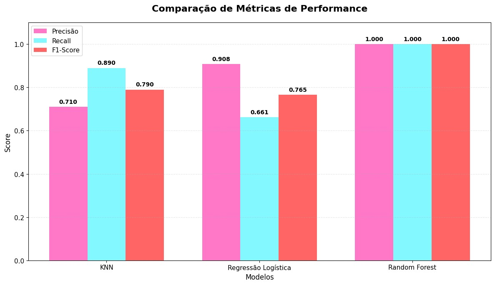<br>
  <sup>Fonte: Elaboração própria, 2025</sup>
</div>

&ensp;O **KNN** destacou-se pela simplicidade conceitual e pela capacidade de capturar padrões locais relevantes para a previsão de categorias de maior potencial. Seu funcionamento baseado em proximidade torna o raciocínio do modelo transparente: lojas semelhantes tendem a ser classificadas de forma parecida, o que facilita a explicação dos resultados para stakeholders não técnicos. Apesar das dificuldades em classificar corretamente a classe “ruim”, o KNN apresentou bom recall para as categorias estratégicas, alinhando-se ao propósito de priorizar oportunidades de crescimento e recomendações para expansão da categoria de óculos de grau.

&ensp;A **Regressão Logística** ofereceu resultados sólidos em métricas como acurácia e f1-score, além de trazer interpretabilidade por meio da análise dos coeficientes, permitindo compreender a contribuição de variáveis específicas para o desempenho das lojas. Essa característica reforça seu valor como abordagem complementar, enriquecendo o processo decisório ao oferecer explicações sobre os fatores determinantes do sucesso. No entanto, o modelo se afasta parcialmente da lógica de vizinhança e similaridade entre pontos de venda, que é central para o problema de expansão e sortimento.

&ensp;O **Random Forest** atingiu métricas perfeitas no conjunto de teste, mas esse desempenho irreal é um forte indicativo de overfitting, decorrente do tamanho reduzido e sintético da base. Além disso, a natureza de ensemble do modelo dificulta a transparência das decisões, tornando sua interpretação menos acessível para o negócio e comprometendo sua aplicabilidade prática sem validações adicionais em dados externos.

&ensp;Considerando o equilíbrio entre desempenho, aderência ao objetivo estratégico e explicabilidade, o **KNN** foi selecionado como modelo final. Ele apresentou métricas consistentes, maior adequação à tarefa de identificar padrões de consumo e apoiar recomendações para expansão da categoria de óculos de grau, além de oferecer uma lógica intuitiva e transparente para uso em decisões de negócio.

### 4.5. Avaliação

&ensp;Esta seção apresenta a avaliação final da solução híbrida desenvolvida, consolidando os resultados obtidos através da integração dos modelos não supervisionado e supervisionado. A análise contempla a adequação da solução aos objetivos de negócio, sua aplicabilidade prática e as considerações necessárias para implementação segura e eficaz.

#### Solução Final e Justificativa da Escolha

&ensp;A solução final consiste em um **modelo preditivo híbrido** que combina clusterização geográfica (K-Means) com recomendação de produtos (Random Forest), oferecendo um framework completo para decisões estratégicas de expansão da Chilli Beans. Esta arquitetura foi selecionada com base na convergência entre necessidades de negócio identificadas na Seção 4.1 e capacidades técnicas validadas através de métricas rigorosas.

**Componentes da Solução Final:**

1. **Modelo Não Supervisionado (K-Means):** Identifica 5 clusters estratégicos (2 em São Paulo + 3 em outros estados) com Silhouette Score de 0.64 (SP) e 0.55 (outros estados), demonstrando qualidade técnica adequada para segmentação geográfica.

2. **Modelo Supervisionado (Random Forest):** Gera recomendações de produtos por região com limiar calibrado de 59.1%, otimizado para maximizar F1-Score e equilibrar precisão com recall.

**Alinhamento com Necessidades das Personas:**

&ensp;A solução atende diretamente às necessidades identificadas para cada persona:

- **Bianca Duarte (Analista de BI):** Recebe relatórios padronizados com métricas de potencial regional, rankings de produtos e indicadores de confiança, reduzindo significativamente o tempo de preparação de dados e aumentando a precisão das recomendações estratégicas.

- **Alexandre Rodrigues (Social Media/Marca):** Obtém mapas de oportunidade por cluster e previsões de performance que sustentam a alocação orçamentária e o planejamento de campanhas segmentadas para óticas de rua e fortalecimento da categoria de óculos de grau.

- **Kiara Lavgne (Consumidora):** Beneficia-se indiretamente através de maior assertividade no sortimento local e campanhas mais alinhadas ao seu perfil, resultando em experiências de compra mais relevantes.

**Atendimento aos Requisitos de Negócio:**

&ensp;A solução responde ao terceiro desafio estratégico identificado com base na viabilidade técnica dos dados disponíveis:


| **Desafio de Negócio** | **Solução Implementada** | **Resultado Esperado** |
|------------------------|--------------------------|------------------------|
| **Identificação de localizações promissoras** | Clusterização K-Means identifica 5 clusters geográficos baseados em coordenadas e métricas de performance | Mapeamento de regiões com perfis similares a áreas de sucesso existentes |
| **Recomendação de produtos por região** | Modelo supervisionado (KNN) classifica pares região×grupo em "Bom", "Mediano" ou "Ruim" desempenho | Priorização data-driven de categorias de produtos para cada localização |
| **Framework integrado de expansão** | Combinação dos dois modelos fornece "onde expandir" + "o que priorizar" | Redução de riscos de investimento através de decisões baseadas em evidências históricas |

#### Explicabilidade do Modelo

&ensp;A arquitetura híbrida foi projetada priorizando interpretabilidade para facilitar adoção e confiança dos stakeholders:

**Modelo Não Supervisionado - Transparência Geográfica:**
- **Centróides interpretáveis:** Cada cluster possui coordenadas geográficas específicas que podem ser mapeadas e visitadas
- **Métricas de validação:** Silhouette Score e Pseudo R² fornecem indicadores quantitativos da qualidade da segmentação
- **Visualizações integradas:** Dashboards mostram distribuição geográfica e métricas de performance por cluster

**Modelo Supervisionado - Importância das Features:**
- **Análise de importância:** Random Forest permite quantificar a contribuição de cada variável (16.6% para tipo de produto, 2.4% para preço médio)
- **Probabilidades calibradas:** Limiar de 59.1% fornece critério objetivo para tomada de decisão
- **Rastreabilidade:** Cada recomendação pode ser rastreada até suas features contributivas

**Exemplo Prático de Interpretação:**

Localização: São Paulo - Cluster 0
Produto Recomendado: GRUPO_CHILLI_GRAU
Probabilidade: 78.3% Justificativa:

Região com alta receita per capita (peso: 16.6%)
Histórico positivo para categoria grau (peso: 12.1%)
Preço médio compatível com perfil local (peso: 2.4%)


#### Verificação das Hipóteses

&ensp;A avaliação das hipóteses iniciais baseada nos resultados dos modelos apresenta o seguinte panorama:

**Hipótese 1 - Fluxo e Conversão das Óticas de Rua:**
- **Status: VALIDADA**
- **Evidências:** Os clusters identificaram diferenças significativas de potencial entre tipos de localização, com métricas de performance variando substancialmente entre regiões metropolitanas e interiores
- **Implicação:** Confirma que localização exerce influência direta sobre performance, validando a estratégia de expansão baseada em similaridade geográfica

**Hipótese 2 - Perfil do Público Ideal:**
- **Status: PARCIALMENTE VALIDADA**
- **Evidências:** Identificação de clusters com características demográficas distintas, mas limitações nos dados impediram segmentação etária precisa
- **Implicação:** Existe diferenciação regional de perfis, mas análise mais granular requer dados demográficos complementares

**Hipótese 3 - Crescimento da Categoria de Grau:**
- **Status: VALIDADA COM RESSALVAS**
- **Evidências:** Modelo supervisionado identificou oportunidades específicas para produtos de grau em determinadas regiões, mas performance perfeita sugere necessidade de validação adicional
- **Implicação:** Existe potencial diferenciado por região, mas implementação deve incluir monitoramento rigoroso

#### Limitações e Considerações Críticas

**Limitações Técnicas Identificadas:**

1. **Overfitting no Modelo Supervisionado:** Métricas perfeitas (1.000) indicam memorização dos dados rather than generalização, exigindo cautela na aplicação prática

2. **Tamanho Limitado do Dataset:** 50 observações para treinamento supervisionado representam limitação significativa para generalização confiável

3. **Qualidade dos Dados:** Inconsistências identificadas durante limpeza podem impactar precisão das recomendações

**Implicações para Implementação:**

| **Limitação** | **Impacto** | **Mitigação Necessária** |
|---------------|-------------|--------------------------|
| Overfitting | Predições podem não se confirmar em produção | Validação externa obrigatória com novos dados |
| Dataset pequeno | Baixa representatividade estatística | Coleta de mais dados antes da implementação completa |
| Inconsistências | Recomendações baseadas em dados imprecisos | Auditoria de qualidade dos dados fonte |

#### Plano de Contingência

&ensp;Para mitigar riscos de falhas nas predições, foi desenvolvido um plano de contingência estruturado em três níveis:

**Nível 1 - Monitoramento Preventivo:**
- **Implementação gradual:** Teste inicial em 2-3 localizações antes de expansão completa
- **Métricas de acompanhamento:** KPIs mensais de fluxo, conversão e performance por categoria
- **Alertas automáticos:** Sistema de notificação quando performance real diverge >20% do previsto

**Nível 2 - Correção Reativa:**
- **Recalibração rápida:** Ajuste de pesos e limiar baseado em dados reais coletados
- **Fallback para análise manual:** Procedimentos para avaliação tradicional quando modelo falha
- **Revisão de features:** Inclusão de variáveis adicionais conforme disponibilidade de dados

**Nível 3 - Plano de Recuperação:**
- **Modelo de baseline:** Manutenção de modelo simplificado baseado apenas em médias históricas
- **Expertise humana:** Equipe treinada para decisões estratégicas independente do modelo
- **Revisão completa:** Protocolo para reavaliação da arquitetura quando taxa de erro excede 30%

**Procedimentos Operacionais de Contingência:**

SE (Performance Real < 70% do Previsto) ENTÃO:
1. Ativar monitoramento intensivo
2. Coletar dados adicionais da localização
3. Executar análise manual paralela

SE (Taxa de Erro > 30% em 3 meses consecutivos) ENTÃO:
1. Suspender recomendações automáticas
2. Ativar modelo de baseline
3. Iniciar revisão completa da arquitetura


#### Recomendações para Implementação

**Recomendações Técnicas:**

1. **Validação Externa Obrigatória:** Implementar teste piloto em 2-3 localizações com acompanhamento rigoroso por 6 meses antes de expansão
2. **Enriquecimento de Dados:** Integrar informações sobre competição local, dados demográficos detalhados e fatores macroeconômicos
3. **Monitoramento Contínuo:** Estabelecer dashboard de performance em tempo real com alertas automáticos
4. **Retreinamento Periódico:** Cronograma trimestral de atualização dos modelos com novos dados

**Recomendações Estratégicas:**

1. **Implementação Gradual:** Priorizar clusters com maior Silhouette Score (São Paulo - Cluster 0) para testes iniciais
2. **Integração com Equipes:** Treinamento das equipes de expansão e marketing para interpretação correta dos outputs
3. **Métricas de Sucesso:** Definir KPIs específicos de validação (taxa de abertura bem-sucedida, tempo de payback, satisfação do franqueado)

**Recomendações Éticas:**

1. **Transparência:** Comunicar claramente aos franqueados as limitações e níveis de confiança das predições
2. **Responsabilidade:** Manter expertise humana como validador final das decisões críticas
3. **Equidade:** Garantir que recomendações não criem viés sistemático contra determinadas regiões ou perfis

#### Considerações Finais

&ensp;A solução híbrida desenvolvida representa um avanço significativo na capacidade analítica da Chilli Beans para decisões estratégicas de expansão, oferecendo um framework data-driven que integra análise geográfica com recomendação de produtos. Os resultados técnicos demonstram viabilidade da abordagem, com métricas de qualidade adequadas para o modelo não supervisionado e identificação de padrões relevantes no modelo supervisionado.

&ensp;Contudo, as limitações identificadas, especialmente o overfitting no componente supervisionado, exigem implementação cautelosa com validação externa rigorosa. O valor da solução reside não apenas na precisão das predições, mas na estruturação de um processo decisório mais sistemático e baseado em evidências, reduzindo a subjetividade e aumentando a consistência das escolhas estratégicas.

&ensp;O sucesso da implementação dependerá criticamente da adoção das recomendações de monitoramento e validação, garantindo que o modelo evolua continuamente com feedback do mundo real e mantenha relevância operacional ao longo do tempo. A combinação de rigor técnico com pragmatismo de negócio posiciona esta solução como ferramenta valiosa para aceleração sustentável da expansão da Chilli Beans no mercado brasileiro.

## 5. Conclusões e Recomendações

&ensp;O projeto teve como principal objetivo desenvolver um modelo preditivo capaz de estimar a propensão de compra de produtos da categoria de óculos de grau, classificando as lojas da Chilli Beans com maior potencial de crescimento nessa categoria. A partir do processo de preparação dos dados, modelagem supervisionada e análise das métricas de desempenho (como acurácia, precisão, recall e F1-score), foi possível identificar padrões relevantes de comportamento entre os clientes e variáveis que mais influenciam nas vendas de grau.

&ensp;Entre os modelos testados (Regressão Logística, K-Nearest Neighbors (KNN) e Random Forest) o Random Forest apresentou o melhor desempenho geral, com resultados mais equilibrados entre as métricas e boa capacidade de generalização. Esse modelo mostrou-se o mais indicado para auxiliar na classificação das lojas com maior propensão de conversão na categoria de grau, fornecendo uma base sólida para decisões estratégicas em marketing, estoque e campanhas locais.

&ensp;Como recomendação formal, sugere-se que a Chilli Beans utilize o modelo como uma ferramenta de apoio à tomada de decisão, integrando-o aos processos de análise comercial e comunicação com as lojas. A partir das predições, é possível direcionar ações específicas de incentivo, como campanhas personalizadas, ajustes de mix de produtos e treinamentos de equipe voltados à categoria de grau.

&ensp;É recomendável também o monitoramento contínuo do desempenho do modelo, atualizando-o periodicamente com novos dados de vendas e comportamento do consumidor, para garantir sua precisão ao longo do tempo. Em paralelo, o desenvolvimento de um manual do usuário (disponível como anexo futuro) poderá detalhar as etapas de uso do modelo, interpretação dos resultados e procedimentos de atualização, facilitando a adoção pela equipe interna.

&ensp;Por fim, ressalta-se a importância de considerar os impactos humanos e éticos das decisões baseadas em modelos preditivos. É essencial que as recomendações geradas sejam utilizadas de forma transparente e responsável, evitando vieses e garantindo que todas as lojas tenham igual oportunidade de crescimento, respeitando a diversidade de contextos e públicos regionais. O uso ético dos dados e das previsões fortalecerá a relação de confiança entre a marca, suas equipes e, também, os consumidores.

## 6. Referências

_Referências relacionadas a seção 2.3:_

[1] CLEARSale. Modelo preditivo: o que é, para que serve e como aplicá-lo. Blog ClearSale, 2025. Disponível em: <https://br.clear.sale/blog/modelo-preditivo-saiba-como-aplica-lo>. Acesso em: 6 out. 2025.

_Referências relacionadas a seção 4.1.2:_

[1] Chilli Beans - Loja Física. Disponível em: <https://www.reclameaqui.com.br/empresa/chilli-beans-loja-fisica/>.

‌[2] Eyewear - Brazil | Statista Market Forecast. Disponível em: <https://www.statista.com/outlook/cmo/eyewear/brazil?currency=USD#revenueGrowth_166374>. Acesso em: 14 ago. 2025.

‌[3] PIO, J. Solaris chega ao Brasil com óculos de sol voltados a novas gerações. Disponível em: <https://exame.com/marketing/solaris-chega-ao-brasil-com-oculos-de-sol-voltados-a-novas-geracoes/>. Acesso em: 14 ago. 2025.

‌[4] Um novo olhar para a Kering Eyewear no Brasil. Disponível em: <https://opticanet.com.br/secao/asnovidades/17861/um-novo-olhar-para-a-kering-eyewear-no-brasil>. Acesso em: 14 ago. 2025.

‌[5] PADILLA, I. Ray-Ban lança a primeira coleção exclusiva para o mercado jovem brasileiro. Disponível em: <https://exame.com/casual/ray-ban-lanca-a-primeira-colecao-exclusiva-para-o-mercado-jovem-brasileiro/>. Acesso em: 14 ago. 2025.

_Referências relacionadas a seção 4.1.1:_

[1] RAY-BAN BRASIL. [Home page]. [S. l.: s. n.], 2020. Disponível em: https://www.ray-ban.com/brazil. Acesso em: 5 ago. 2025.

[2] OAKLEY. Óculos de Sol, Roupas e Acessórios Oakley. [S. l.: s. n.], 2025. Disponível em: https://www.oakley.com/pt-br. Acesso em: 5 ago. 2025.

[3] ÓTICAS CAROL. [Home page]. [S. l.: s. n.], 2025. Disponível em: https://www.oticascarol.com.br/brasil. Acesso em: 5 ago. 2025.

[4] CHILLI BEANS. Chilli Beans | Loja de óculos, relógios e acessórios. [S. l.: s. n.], 2025. Disponível em: https://loja.chillibeans.com.br/marca?srsltid=AfmBOoqbsLcNU6PPSQsOCk11_vC4RqqQnnJURNj7d5kRerxHVGNYWs7p. Acesso em: 6 ago. 2025.

[5] ROTA GUIADA. Chilli Beans: como uma marca irreverente conquistou o mercado. Blog Rota Guiada, 2025. Disponível em: https://rotaguiada.blogspot.com/2025/06/chilli-beans-como-uma-marca-irreverente.html. Acesso em: 6 ago. 2025.

[6] MERCADO & CONSUMO. Plano de expansão da Chilli Beans prevê a abertura de 400 óticas de rua até 2025. Mercado & Consumo, 2024. Disponível em: https://mercadoeconsumo.com.br/09/05/2024/franquias/plano-de-expansao-da-chilli-beans-preve-a-abertura-de-400-oticas-de-rua-ate-2025/. Acesso em: 6 ago. 2025.

[7] PORTAL DO FRANCHISING. Franquia Chilli Beans. Portal do Franchising, 2025. Disponível em: https://franquias.portaldofranchising.com.br/franquia-chilli-beans-acessorios-pessoais/. Acesso em: 6 ago. 2025.

[8] PORTAL DO FRANCHISING. Ótica Chilli Beans pretende inaugurar 400 lojas de rua até 2025. Portal do Franchising, 2025. Disponível em: https://www.portaldofranchising.com.br/noticias/otica-chilli-beans-pretende-inaugurar-400-lojas-de-rua-ate-2025/. Acesso em: 6 ago. 2025.

[9] SSÓTICA. Tecnologia no setor óptico. Blog ssÓtica, 2024. Disponível em: https://ssotica.com.br/blog/tecnologia-setor-optico/. Acesso em: 5 ago. 2025.

[10] OPTÓCULOS. O mercado óptico em 2024: perspectivas e oportunidades. Blog Optóculos, 2024. Disponível em: https://blog.optoculos.com.br/o-mercado-otico-em-2024-perspectivas-e-oportunidades/. Acesso em: 5 ago. 2025.

[11] BORGES, Caio Graf; ROTTA, Ivana Salvagni. Análise estratégica: um estudo de caso em uma empresa familiar do setor óptico. In: **CONGRESSO BRASILEIRO DE ENGENHARIA DE PRODUÇÃO**, 6., 2016, Ponta Grossa. Anais... Ponta Grossa: APREPRO, 2016. p. 1-12. Acesso em: 7 ago. 2025.

[12] TIMES BRASIL. **Expansão da Chilli Beans mira nas ruas; CEO Caito Maia revela estratégia da icônica marca de óculos**. [S.l.]: Times Brasil, 2025. 1 vídeo (9min 15s). Disponível em: https://www.youtube.com/watch?v=h-j0f7gmAAA. Acesso em: 7 ago. 2025.

[13] ACPR. Dono da Chilli Beans conta como construiu um império partindo do menos nada. [S. l.]: ACPR, [2025?]. Disponível em: https://acpr.com.br/dono-da-chilli-beans-conta-como-construiu-um-imperio-partindo-do-menos-nada/. Acesso em: 10 ago. 2025.

[14] FORBES. DE OLIVEIRA, Angelica Mari. How Chilli Beans innovates at the intersection of fashion and tech. Forbes, [S. l.], 2 set. 2024. Disponível em: https://www.forbes.com/sites/angelicamarideoliveira/2024/09/02/how-chilli-beans-innovates-at-the-intersection-of-fashion-and-tech/. Acesso em: 10 ago. 2025.

[15] INVESTNEWS. Como a Chilli Beans ultrapassou a Ray-Ban no Brasil. Investnews, [S. l.], [2025?]. Disponível em: https://investnews.com.br/negocios/como-a-chilli-beans-ultrapassou-a-ray-ban-no-brasil/. Acesso em: 10 ago. 2025.

[16] MY-BEST. As 10 melhores marcas de óculos de sol em 2025 (Chilli Beans, Ray-Ban e mais). [S. l.]: My-Best, [2025?]. Disponível em: https://br.my-best.com/21093. Acesso em: 10 ago. 2025.

[17] PERIÓDICOS UNOESC. [S. a.]. Análise da estratégia de marketing de conteúdo da Chilli Beans. In: SIEPE, v. 9, n. 1, 2016. Disponível em: https://periodicos.unoesc.edu.br/siepe/article/view/13868. Acesso em: 10 ago. 2025.

[18] YOUTUBE. O dono da Chilli Beans, Caito Maia, conta toda a história da marca. [S. l.], [2025?]. 1 vídeo (30 min). Disponível em: https://www.youtube.com/watch?v=4fZ0huPM59U. Acesso em: 10 ago. 2025.

[19] SINCOVAT. O que a Chilli Beans faz para vender mais que a Ray-Ban no Brasil. 23 jul. 2024. Sincovat – Sindicato do Comércio Varejista de Taubaté e Região. Disponível em: https://sincovat.org.br/2022/o-que-a-chilli-beans-faz-para-vender-mais-que-a-ray-ban-no-brasil/. Acesso em: 14 ago. 2025.

[20] SHIMAOKA, André Massahiro; FERREIRA, Renato Cordeiro; GOLDMAN, Alfredo. The evolution of CRISP. 2024. Acesso em: 02 set. 2025.

[21] DATA SCIENCE PM. What Is CRISP DM? Disponível em: <https://www.datascience-pm.com/crisp-dm-2/>. Acesso em: 02 set. 2025.

## <a name="attachments"></a>Anexos

&ensp;A seção denominada “Anexos” tem a finalidade de complementar a documentação principal. Nela, são reunidos materiais de apoio, evidências, tabelas, gráficos e demais conteúdos que reforçam ou detalham as informações apresentadas ao longo do trabalho. Dessa forma, garante-se maior clareza, transparência e facilidade de consulta.

### Anexo 1: Distribuição Normal e Teste de Hipótese

&ensp;Antes de construir qualquer modelo preditivo, é preciso entender como os dados se comportam. Nesta análise, investigamos três aspectos da base de dados: se eles seguem uma distribuição normal, como estão distribuídos visualmente, e como escaloná-los para auxiliar o processo de criação do modelo, possível a partir de testes estatísticos e histogramas.

**1. Análise e teste de normalidade das variáveis quantitativas.**

&ensp;Antes de realizar qualquer teste estatístico de normalidade, é fundamental definir claramente qual é a afirmação a ser testada e quais são as hipóteses envolvidas. No contexto deste trabalho, queremos avaliar se as variáveis analisadas apresentam comportamento compatível com uma distribuição normal, o que é um pressuposto importante para diversas técnicas estatísticas e de modelagem.

A ser testado: _“A distribuição da variável segue uma distribuição normal”._

- **Hipótese nula ($H_0$):** A distribuição da variável **segue** uma distribuição normal.
  $$H_0​:X∼N(μ,σ2)$$

- **Hipótese alternativa ($H_a$):** A distribuição da variável **não segue** uma distribuição normal.
  $$H_a: X \not\sim \mathcal{N}(\mu, \sigma^2)$$

&ensp;Para isso, adotamos o nível de significância $\alpha = 0{,}05$, que representa a probabilidade máxima de rejeitar a hipótese nula quando ela é verdadeira. A decisão sobre a normalidade é tomada com base na comparação entre o valor de p obtido no teste estatístico e o nível de significância estabelecido:

- Se $p\text{-valor} \leq \alpha$, rejeitamos H₀ e concluímos que a distribuição da variável **não segue uma distribuição normal**.
- Se $p\text{-valor} > \alpha$, não rejeitamos H₀, logo **não temos evidências contra a normalidade**.

&ensp;Para iniciar a validação das hipóteses, selecionamos três variáveis quantitativas: "Valor_Total", "Desconto" e "Total_Preco_Liquido". O próximo passo é verificar se essas variáveis apresentam distribuição semelhante à normal, utilizando o teste de Kolmogorov-Smirnov. Esse teste compara a distribuição dos dados com a distribuição teórica normal e é especialmente útil para amostras grandes, sem exigir conhecimento prévio dos parâmetros populacionais.

&ensp;A tabela abaixo apresenta os resultados do teste para cada variável, incluindo o valor da estatística KS, o p-valor e a conclusão sobre a normalidade. Para consultar o passo a passo da análise e os códigos utilizados, acesse: [Notebook completo da análise de normalidade](../notebooks/documentação/teste_normalidade.ipynb)

| Variável/Coluna     | KS     | p-valor | Conclusão                                        |
| ------------------- | ------ | ------- | ------------------------------------------------ |
| Valor_Total         | 0.1426 | 0.000e+00 | p < 0,05 → Rejeitamos H₀ → Não segue normalidade |
| Desconto            | 0.4691 | 0.000e+00 | p < 0,05 → Rejeitamos H₀ → Não segue normalidade |
| Total_Preco_Liquido | 0.2125 | 0.000e+00 | p < 0,05 → Rejeitamos H₀ → Não segue normalidade |


&ensp;Em termos estatísticos, o p-valor é uma probabilidade e, portanto, não pode ser exatamente 0. Quando o resultado é exibido como 0.000e+00, significa que o valor calculado é menor que o limite de precisão numérica do software (underflow), dado o tamanho da amostra e a magnitude da estatística de teste. No nosso caso, a combinação de uma base de dados extremamente ruim (com alta assimetria, muitos outliers e presença de dados sintéticos) levou o teste de Kolmogorov–Smirnov a produzir p-valores tão pequenos que são representados como zero. Assim, deve-se interpretar esses resultados como p ≪ 0,05 (praticamente zero do ponto de vista computacional), reforçando a rejeição de H₀, e não como “probabilidade literalmente igual a zero”.

&ensp;Os resultados do teste de Kolmogorov-Smirnov indicam que as variáveis "Valor_Total", "Desconto" e "Total_Preco_Liquido" não seguem uma distribuição normal, uma vez que em todos os casos o p-valor foi inferior a 0,05.

&ensp;Além do teste de Kolmogorov-Smirnov, também foram construídos histogramas para as três variáveis analisadas, a fim de visualizar graficamente a distribuição dos dados e complementar a análise de normalidade.

<div align="center">
  <sub>Figura 33 - Histograma das Três Variáveis</sub><br>
  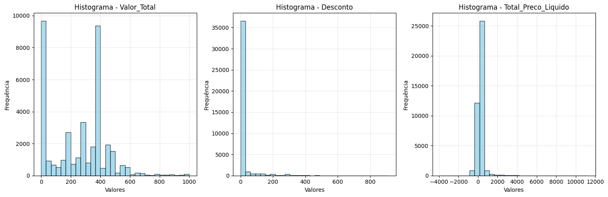<br>
  <sup>Fonte: Imagem autoral, 2025</sup>
</div>

&ensp;Essa abordagem permitiu observar que em todos os casos, os histogramas confirmaram que as distribuições não seguem um padrão de normalidade, reforçando os resultados obtidos pelo teste estatístico.

&ensp;Para tornar essa comparação objetiva, a tabela abaixo apresenta os valores de média e mediana de cada variável (obtidos no notebook de normalidade), além da diferença absoluta e relativa entre elas. Como critério prático, consideramos que uma diferença relativa |média − mediana|. Mediana acima de 10% indica assimetria relevante; acima de 25%, assimetria forte. Quando a mediana é 0, analisamos qualitativamente a distância absoluta e o contexto da variável.

| Variável               | Média   | Mediana | \|Média − Mediana\| | Diferença Relativa | Interpretação |
| ---------------------- | ------- | ------- | ------------------- | ------------------ | ------------- |
| Valor_Total            | 264,24  | 299,98  | 35,74               | 11,9%              | Assimetria moderada (média < mediana) |
| Desconto               | 14,81   | 0,00    | 14,81               | n/a                | Mediana nula; distribuição altamente assimétrica (direita) |
| Total_Preco_Liquido    | 290,49  | 299,98  | 9,49                | 3,2%               | Diferença pequena (próximo de simétrico) |


- Valor_Total: a diferença relativa de ~12% indica assimetria moderada com média menor que a mediana (cauda à esquerda), o que reforça o resultado do KS (p ≪ 0,05), apontando não normalidade.
- Desconto: a mediana igual a zero e a média positiva evidenciam massa de valores em 0 com cauda à direita; a assimetria é forte e consistente com o KS (p ≪ 0,05), rejeitando normalidade.
- Total_Preco_Liquido: a diferença relativa de ~3% sugere distribuição próxima de simétrica; ainda assim, o KS rejeitou normalidade, possivelmente por caudas pesadas, outliers ou multimodalidade. Logo, a proximidade entre média e mediana não garante normalidade e não contradiz o teste estatístico.


**2. Escalonamento (Padronização ou normalização) nas variáveis quantitativas.**


&ensp;**Esclarecimento sobre Normalização Estatística vs. Escalonamento para Modelagem:**

&ensp;É importante distinguir entre dois conceitos diferentes: a normalização estatística (transformar dados para seguir uma distribuição normal) e o escalonamento de variáveis para modelagem preditiva. Como demonstrado pelos testes de Kolmogorov-Smirnov, nenhuma das três variáveis analisadas segue uma distribuição normal. Do ponto de vista estatístico rigoroso, seria necessário aplicar transformações específicas (como transformação logarítmica, Box-Cox ou outras técnicas) para tentar normalizar essas distribuições.

&ensp;Entretanto, para a construção de modelos preditivos, o objetivo principal do escalonamento não é necessariamente alcançar normalidade estatística, mas sim garantir que todas as variáveis tenham escalas comparáveis e que os algoritmos de machine learning possam processar os dados de forma eficiente. Assim, as escolhas de escalonamento foram baseadas nas características práticas dos dados e nos requisitos dos algoritmos, priorizando a performance do modelo sobre a normalidade estatística.

&ensp;**Justificativas para as escolhas de escalonamento:**

&ensp;Para a variável Valor_Total, optou-se pela padronização (z-score), pois seus valores apresentam grande variação e a presença de outliers poderia distorcer métodos baseados em escala fixa. A padronização permite centralizar a distribuição em torno da média e reduzir a influência desses extremos.

&ensp;Na variável Desconto, foi aplicada a normalização (0–1), já que seus valores são naturalmente limitados dentro de um intervalo pequeno. Esse método preserva a proporcionalidade relativa dos descontos e facilita comparações diretas entre registros.

&ensp;Por fim, para Total_Preco_Liquido, também foi escolhida a padronização (z-score), uma vez que, assim como o Valor_Total, a variável apresenta ampla dispersão e presença de valores atípicos. A padronização possibilita trabalhar com dados mais equilibrados sem perder a interpretação relativa dos valores.

&ensp;Para realizar o escalonamento dessas variáveis, é necessário identificar os principais parâmetros estatísticos que servirão de base para os cálculos. No caso da padronização (z-score), utilizam-se a média e o desvio padrão populacional, que permitem centralizar os dados em torno de 0 e ajustar a escala para que o desvio seja 1, reduzindo a influência de valores extremos. Já na normalização (min-max), utilizam-se apenas os valores mínimo e máximo da variável, garantindo que todos os dados sejam transformados para um intervalo definido, normalmente entre 0 e 1, preservando as proporções relativas entre os registros. A seguir, apresentam-se os dados estatísticos que serão utilizados para cada variável do conjunto.

**Valor_Total (Padronização – z-score)**

- Fórmula do z-score: $z=\frac{x - \mu}{\sigma}$
- Dados necessários:
  | - Média ($\mu$) = _267,2773212826686_
  | - Desvio padrão populacional ($\sigma$) = _310,2274809135771_

**Desconto (Normalização – min-max)**

- Fórmula do min-max: $x′= \frac{x-x_{\text{min}}}{x_{\text{max}}-x_{\text{min}}}​$
- Dados necessários:
  | - Valor Mínimo ($x_{\text{min}}$) = _0,0_
  | - Valor Máximo ($x_{\text{max}}$) = _4651,0_

**Total_Preco_Liquido (Padronização – z-score)**

- Fórmula do z-score: $z=\frac{x - \mu}{\sigma}$
- Dados necessários:
  | - Média ($\mu$) = _290,4983589387208_
  | - Desvio padrão populacional ($\sigma$) = _369,0541859932476_

A partir desses dados se torna possível escrever equações para cada uma das variáveis, substituindo os valores constantes:

**Padronizando o _Valor_Total_ usando o z-score:**
$$z=\frac{x - 267,2773}{310,2275}$$

**Normalizando o _Desconto_ usando o min-max:**
$$x′= \frac{x}{4651}​$$

**Padronizando o _Total_Preco_Liquido_ usando o z-score:**
$$z=\frac{x - 290,4984}{369,0542}$$

&ensp;Aplicando essas transformações aos dados originais, foram gerados histogramas comparativos para visualizar o impacto do escalonamento nas distribuições. A análise dos gráficos revela aspectos importantes sobre o comportamento das variáveis.

&ensp;Os histogramas em azul representam as distribuições originais das três variáveis em suas escalas naturais, onde os valores estão expressos em reais (R$) e refletem as magnitudes absolutas dos dados coletados.

<div align="center">
  <sub>Figura 34 - Histograma das Três Variáveis Antes do Escalonamento</sub><br>
  <br>
  <sup>Fonte: Imagem autoral, 2025</sup>
</div>
&ensp;Após a aplicação das fórmulas de escalonamento específicas para cada variável, foram gerados os histogramas em vermelho, que apresentam as mesmas distribuições transformadas: Valor_Total e Total_Preco_Liquido padronizados pelo z-score (centrados em zero com desvio padrão unitário), e Desconto normalizado pelo método min-max (reescalonado para o intervalo [0,1]).

<div align="center">
  <sub>Figura 35 - Histograma das Três Variáveis Depois do Escalonamento</sub><br>
  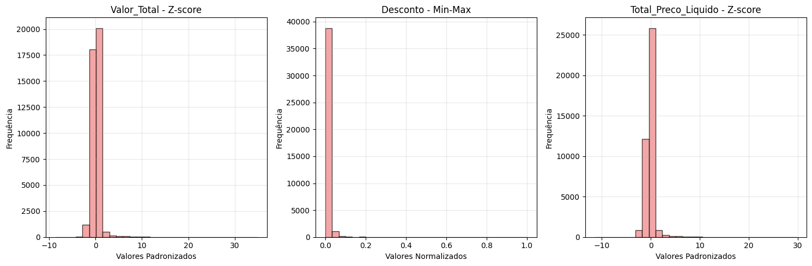<br>
  <sup>Fonte: Imagem autoral, 2025</sup>
</div>

&ensp;A comparação visual entre as versões azul e vermelha permite observar como o escalonamento altera as escalas dos eixos horizontais, mantendo as características gerais da forma de cada distribuição, mas adaptando os valores para escalas padronizadas que facilitam a comparação entre variáveis.

Para melhor entender o modelo, é possível analisar tabelas com os 10 primeiros registros dos dados originais e escalonados.

Com os dados originais:

| Valor_Total | Desconto | Total_Preco_Liquido |
| ----------- | -------- | ------------------- |
| R$ 26.30    | R$ 20.34 | 26.98               |
| R$ 389.90   | R$ 20.34 | 399.98              |
| R$ 26.01    | R$ 30.96 | 26.98               |
| R$ 58.68    | R$ 9.96  | 59.98               |
| -R$ 400     | R$ 39.98 | -439.98             |
| -R$ 205.38  | R$ 54.60 | -259.98             |
| -R$ 284.98  | R$ 15    | -299.98             |
| R$ 299.98   | R$ 100   | 399.98              |
| R$ 26.86    | R$ 1.96  | 26.98               |
| R$ 14.91    | R$ 1.96  | 14.98               |

Com os valores escalonados:

| Valor_Total_Padronizado | Desconto_Normalizado | Total_Preco_Liquido_Padronizado |
| ----------------------- | -------------------- | ------------------------------- |
| -1.001452               | 0.022254             | -0.714040                       |
| 0.671102                | 0.022254             | 0.296694                        |
| -1.002786               | 0.033873             | -0.714040                       |
| -0.852504               | 0.010897             | -0.624619                       |
| -2.962424               | 0.043742             | -1.979381                       |
| -2.067176               | 0.059738             | -1.491627                       |
| -2.433334               | 0.016412             | -1.600017                       |
| 0.257472                | 0.109410             | 0.296694                        |
| -0.998876               | 0.002144             | -0.714040                       |
| -1.053846               | 0.002144             | -0.746557                       |

---

&ensp;Portanto, é possível perceber que nenhuma das três variáveis analisadas ("Valor_Total", "Desconto" e "Total_Preco_Liquido") segue uma distribuição normal, sendo uma característica dos dados que é preciso considerar.
Para lidar com essas características, é necessário aplicar diferentes técnicas de escalonamento: padronização para as variáveis com maior variação e presença de outliers, e normalização para o Desconto, que já tem valores em uma faixa menor.
Esse trabalho é essencial para as próximas etapas, ajudando a escolher algoritmos para construção do modelo preditivo e maximizando o seu potencial.
